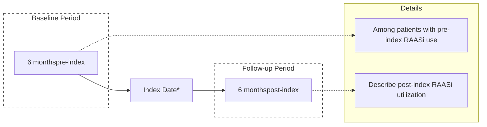

# Patiromer and Maintenance of RAASi Therapy in Hyperkalemic Medicare Patients

Nihar R. Desai1, Christopher G. Rowan2, Paula J. Alvarez3, Jeanene Fogli3, Robert D. Toto4

Logo

1Yale University, Center for Outcomes Research and Evaluation, New Haven, CT; 2COHRDATA, Santa Monica, CA; 3Relypsa, Inc., a Vifor Pharma Group Company, Redwood City, CA; 4University of Texas Southwestern Medical Center, Dallas, TX

## BACKGROUND

* Renin-angiotensin-aldosterone system inhibitor (RAASi) therapy is critical for patients with high cardiovascular risk.

* Hyperkalemia (HK) in this population often results in dose down-titration and/or discontinuation of RAASi therapy.

* Patiromer is a sodium-free, non-absorbed, potassium (K+)-binding polymer approved for the treatment of HK, including in the United States,1 European Union,2 Switzerland,3 and Australia.4

* Patiromer reduced recurrent HK, allowing patients to maintain RAASi therapy.5,6

## OBJECTIVE

* This retrospective cohort study evaluated RAASi utilization among Medicare Advantage patients with HK defined as serum K+ ≥5.0 mEq/L.

## METHODS

* RAASi utilization was evaluated from Optum Clinformatics Datamart, a large, de-identified national health insurance claims database from 1/1/16 to 12/31/17.

* Three HK cohorts were identified based on dispensing for a K+ binder, either:
    1) Patiromer (PAT) cohort

    2) Sodium polystyrene sulfonate (SPS) cohort

    3) No K+-binder cohort

## FIGURE 1. STUDY SCHEMA

\*The index date is the date of the first pharmacy dispensing claim for PAT cohort or SPS cohort during the study period. For the no K+-binder cohort, the index date is the date of first diagnosis code during the study period. The index date may occur anytime between 1/1/16 and 12/31/17.

* We included patients that were both continuously exposed to RAASi for ≥6 months and had serum K+ ≥5.0 mEq/L pre-index (**Figure 1**).

* We evaluated RAASi continuation and down-titration (the latter assessed for lisinopril [LIS], losartan [LOS], and valsartan [VAL]) at 6 months post-index.

* We evaluated two exposure classification groups:

    - Intent-to-treat (ITT) – Patients in all three cohorts started in their assigned cohort as of index date, but their exposure status may have changed during the 6 months post-index.

    - Continuous exposure (CE) – Patients in PAT and SPS cohorts were continuously exposed through the 6 months post-index. CE was defined as <30 days of a gap in exposure to patiromer/SPS therapy. The no K+-binder cohort had no patiromer or SPS dispensed during the 6 months post-index.

## RESULTS

## TABLE 1. INCLUSION/EXCLUSION

| Treatment Cohort                                                   | PAT N | SPS N  | No K⁺ Binder N |
| ------------------------------------------------------------------ | ----- | ------ | -------------- |
| ≥1 dispensing or diagnosis code during study period                | 1723  | 20,642 | 169,337        |
| AND: K⁺ ≥5.0 mEq/L 3 months before index date                      | 855   | 7666   | 35,782         |
| AND: Medicare insurance                                            | 723   | 6722   | 26,313         |
| AND: 6 months of continuous insurance enrollment before index date | 610   | 5556   | 21,282         |
| AND: 6 months of continuous RAASi use before index date            | 214   | 2371   | 8531           |

* A total of 214, 2371, and 8531 patients received PAT, SPS, or no K+ binder, respectively (**Table 1**).

## TABLE 2. BASELINE DEMOGRAPHICS AND COMORBIDITIES (6 MONTHS PRE-INDEX)

|                           | PAT N=214 | SPS N=2371 | No K⁺ Binder N=8531 |
| ------------------------- | --------- | ---------- | ------------------- |
| Demographics              |           |            |                     |
| Mean age, years (SD)      | 73 (9)    | 75 (9)     | 75 (8)              |
| Female, n (%)             | 90 (42)   | 1106 (49)  | 4273 (50)           |
| Low-income subsidy, n (%) | 85 (40)   | 920 (39)   | 2604 (31)           |
| Comorbidities, n (%)      |           |            |                     |
| Chronic kidney disease    | 137 (64)  | 1142 (48)  | 4008 (47)           |
| End-stage renal disease   | 2 (1)     | 31 (1)     | 106 (1)             |
| Congestive heart failure  | 35 (16)   | 483 (20)   | 2015 (24)           |
| Cancer                    | 15 (7)    | 212 (9)    | 1019 (12)           |
| Diabetes mellitus         | 108 (50)  | 863 (36)   | 3191 (37)           |
| Cerebrovascular disease   | 22 (10)   | 240 (10)   | 971 (11)            |
| Myocardial infarction     | 17 (8)    | 249 (11)   | 1068 (13)           |
| Cardiac dysrhythmias      | 30 (14)   | 479 (20)   | 2153 (25)           |
| Coronary artery disease   | 59 (28)   | 670 (28)   | 2860 (34)           |

* Patient demographics: Greater number of males and low-income subsidy patients in the PAT cohort (**Table 2**).

* Comorbidities: Higher proportion of chronic kidney disease and diabetes mellitus diagnosed patients in PAT cohort vs other cohorts (**Table 2**).

* Baseline medications: PAT cohort observed a higher proportion of angiotensin receptor blockers (ARBs), diuretic, SPS, and insulin use while a lower use of mineralocorticoid receptor antagonists (MRAs) (**Table 3**).

## RESULTS (CONT.)

## TABLE 3. BASELINE MEDICATIONS (6 MONTHS PRE-INDEX)

| Baseline Medications, n (%) | PAT N=214 | SPS N=2371 | No K⁺ Binder N=8531 |
| --------------------------- | --------- | ---------- | ------------------- |
| SPS                         | 85 (40)   | 120 (5)    | 466 (5)             |
| RAASi therapy               | 214 (100) | 2371 (100) | 8531 (100)          |
| ACEi                        | 113 (53)  | 1549 (65)  | 5627 (66)           |
| ARB                         | 112 (52)  | 909 (38)   | 3075 (36)           |
| MRA                         | 25 (12)   | 383 (16)   | 1446 (17)           |
| Loop diuretic               | 136 (64)  | 972 (41)   | 3039 (36)           |
| Thiazide                    | 64 (30)   | 601 (25)   | 2237 (26)           |
| Insulin                     | 101 (47)  | 759 (32)   | 2087 (24)           |

ACEi, angiotensin-converting enzyme inhibitor; ARB, angiotensin receptor blocker; MRA, mineralocorticoid receptor antagonist.

## TABLE 4. LABORATORY DATA (3 MONTHS PRE-INDEX)

|               | N    | Mean | SD   | Median | p25  | p75  |
| ------------- | ---- | ---- | ---- | ------ | ---- | ---- |
| Baseline K⁺   |      |      |      |        |      |      |
| PAT           | 214  | 5.6  | 0.4  | 5.5    | 5.3  | 5.8  |
| SPS           | 2371 | 5.8  | 0.4  | 5.8    | 5.5  | 6.1  |
| No K⁺ Binder  | 8531 | 5.6  | 0.5  | 5.5    | 5.3  | 5.7  |
| Baseline eGFR |      |      |      |        |      |      |
| PAT           | 212  | 34.7 | 18.9 | 30.2   | 21.3 | 45.9 |
| SPS           | 2270 | 46.6 | 24.8 | 41.7   | 26.8 | 64.1 |
| No K⁺ Binder  | 7999 | 56.2 | 26.5 | 54.4   | 34.5 | 78.5 |

* Labs: SPS cohort had higher mean baseline K+ than other cohorts while PAT cohort had the lowest mean estimated glomerular filtration rate (eGFR) (**Table 4**).

* Percentage of patients continuing on RAASi therapy (6 months post-index) (**Figure 2**):

    - PAT showed the highest rates of RAASi continuation in both CE and ITT exposure (78% and 63%, respectively), and CE to binder therapy (PAT and SPS) showed better continuation of RAASi therapy than the ITT exposure groups (78% and 57% vs 63% and 52%, respectively).

* Percentage of patients with down-titration of top 3 RAASi used (LIS/LOS/VAL):

    - Percentage of patients with down-titration of therapy was low across all CE/ITT cohorts (PAT 13/9%, SPS 6/7%, no K+ binder 7/8%).

    - PAT cohort had approximately 1/3 of the patients on guideline recommended doses, and the majority of those who remained in the CE cohort at 6 months maintained their dose.

## RESULTS (CONT.)

## FIGURE 2. MAINTENANCE OF RAASI* THERAPY: BY TREATMENT GROUP AND EXPOSURE CLASSIFICATION (CE, ITT)

| Treatment Group & Exposure | % of patients |
| -------------------------- | ------------- |
| PAT CE (n=36)              | 77.8          |
| PAT ITT (n=102)            | 62.7          |
| SPS CE (n=35)              | 57.1          |
| SPS ITT (n=1627)           | 52.3          |
| No K⁺ Binder CE (n=5127)   | 56.7          |
| No K⁺ Binder ITT (n=5543)  | 56.2          |

\*RAASi included: ACEis, ARBs, MRAs, and direct renin inhibitors.

## LIMITATIONS

* This is a descriptive observational study and therefore no causal or comparative claims can be derived.

* We have assumed that patients are taking medications that are dispensed.

* Small sample size (large 95% CI) for PAT and SPS (CE) cohorts observed vs no K+-binder (CE) cohort.

## CONCLUSIONS

* Patiromer cohort showed the highest percentage of patients continuing on RAASi therapy over a 6-month period.

* Down-titration of RAASi dose in all three cohorts was low (~10%).

## REFERENCES

1. Veltassa® (patiromer) for oral suspension [package insert]. Redwood City, CA: Relypsa, Inc. 2018.
2. Veltassa® (patiromer): European public assessment report. European Medicines Agency.
3. Swissmedic. https://www.swissmedic.ch/swissmedic/en/home/humanarzneimittel/authorisations/authorised-medicinal-products-with-new-active-substances/veltassa_pulver_fuer_orale_suspension_patiromer.html. Accessed Sept 23, 2018.
4. Australian Government Department of Health: Therapeutic Goods Administration. https://www.tga.gov.au/sites/default/files/delegates-final-decisions-jan-2018.pdf. Accessed Sept 23, 2018.
5. Weir MR, et al. N Engl J Med. 2015;372:211-221;
6. Bakris GL, et al. JAMA. 2015;314:151-161.

## ACKNOWLEDGEMENTS

Editorial support was provided by Impact Communication Partners, Inc., and funded by Relypsa, Inc., a Vifor Pharma Group Company.

Presented at the National Association of Specialty Pharmacy 2019 Annual Meeting & Expo, September 9–12, 2019, Washington, DC
Supported by Relypsa, Inc., a Vifor Pharma Group Company

