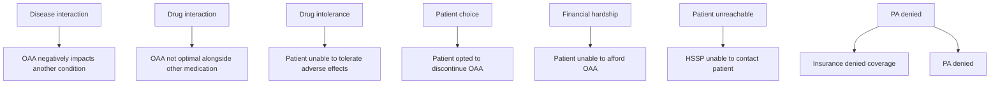

# Comparison of Discontinuation Rates in Patients Receiving an Oral Anticancer Agent Before and After Implementation of a 14-day Pharmacist Check-in Protocol

Kristin Hutchinson, PharmD, BCOP, CSP, Jasmine King, PharmD Candidate, Jessica Mourani, PharmD, Angie Wood, PharmD, BCPS, BCOP, CSP, Mike Latran, PharmD, MPH

Trellis now part of CPS logo

## BACKGROUND

Due to their many adverse effects, oral anticancer agents (OAAs) result in high discontinuation rates and low adherence. While evidence exists that mitigating these adverse effects improves adherence, there is a lack of data demonstrating the impact health system specialty pharmacy (HSSP) pharmacists have on improving discontinuation rates.

## OBJECTIVES

Compare discontinuation rates in patients on oral anticancer medication before and after a pharmacist-led check-in protocol is put in place to contact patients within 14 days from therapy start.

## METHODS

A retrospective, multicenter, observational study comparing discontinuation rates and reasons of patients across Trellis Rx partner health systems receiving oral anticancer agents, before and after implementing a technology-facilitated protocol requiring a pharmacist to contact patients within 14 days of therapy initiation.

* Patients were stratified into 2 groups: pre-protocol (March 2020-December 2020) and post-protocol (March 2021-December 2021) and evaluated for discontinuation rates and reasons as reported by the clinical pharmacist in the Arbor® specialty pharmacy technology platform.

* During this follow up, adverse effect management and mitigation strategies, additional counseling, and question assistance were provided. Providers were contacted when additional supportive care medication was required to mitigate the side effects patients reported.

* Discontinuation reasons cited for endpoints were those most directly impacted by pharmacist intervention.

## DATA COLLECTION AND ENDPOINTS

* **Primary endpoints**: discontinuation rates in patients receiving oral oncolytics for overall and for reasons of drug intolerance, patient choice, and patient being unreachable

* **Secondary endpoints**: discontinuation rates in patients receiving oral anticancer treatment due to disease interaction, drug interaction, financial hardship, prior authorization (PA) denial, or changes in therapy.

## RESULTS

### Comparison of the pre-protocol and post-protocol groups for the primary endpoint

* 9,414 therapies evaluated overall.

* The pre-protocol group encompassing 4,060 therapies had an overall therapy discontinuation rate of 40.4% or 1,641 therapies discontinued overall, of which 513 were discontinued for intolerance, choice, or patient unreachable.

* The post-protocol group encompassing 5,354 therapies had an overall therapy discontinuation rate of 29% or 1,557 therapies discontinued overall, of which 220 were discontinued for intolerance, choice, or patient unreachable.

* Overall, there was approximately an 11% decrease in discontinuations following implementation of a pharmacist-led check-in protocol.

* 6.8% of discontinuations in the pre-group were due to drug intolerance versus 2.8% in the post-group.

### Discontinuations rates pre-protocol (n=1,641)

| Category            | Value |
| ------------------- | ----- |
| Drug intolerance    | 276   |
| Patient choice      | 195   |
| Patient unreachable | 42    |
| Secondary endpoints | 11    |
| Other               | 1117  |

### Discontinuation rates post-protocol (n=1,557)

| Category            | Value |
| ------------------- | ----- |
| Drug intolerance    | 151   |
| Patient choice      | 54    |
| Patient unreachable | 15    |
| Secondary endpoints | 25    |
| Other               | 1337  |

### Comparison of the pre-protocol and post-protocol groups for secondary endpoints

#### Pre-and Post-protocol secondary endpoint breakdown

| Reason              | 2020 (%) | 2021 (%) |
| ------------------- | -------- | -------- |
| Drug interaction    | 10       | 12       |
| Disease interaction | 11       | 28       |
| Financial hardship  | 1        | 1        |
| PA denial           | 1        | 3        |

## DISCUSSION AND CONCLUSIONS

### Discussion

* Pharmacist Impact icon **Pharmacist Impact**
    - Overall, patients who received follow-up with a HSSP pharmacist within 14 days following initiation of an oral anticancer agent had lower overall discontinuation rates than patients prior to the implementation of the check-in protocol.
    - When a check-in protocol was implemented, a significant drop in discontinuations due to drug intolerance, patient choice, and patient being unreachable occurred.

* HSSP Impact icon **HSSP Impact**
    - Secondary endpoints impacted discontinuation less directly overall; however, the increase in discontinuations due to interactions between OAAs and medications, as well as OAAs and disease interactions illustrate additional points of impact on patient care.
    - HSSPs are uniquely positioned to limit financial barriers to therapy with resources to facilitate rapid insurance approval with availability of comprehensive medical records, contacts with manufacturers to maximize patient assistance programs, as well as full access to health system departments and grants designed to provide help to patients with otherwise insurmountable financial challenges.

* Implications icon **Implications**
    - HSSP pharmacists can effectively mitigate discontinuations due to side effects, recommend supportive care measures to encourage adherence, and offer readily available contact- both proactively and passively – that directly impact compliance with oral oncolytic therapy, optimizing outcomes.
    - Further study is warranted to continue advancing HSSP and pharmacists' impact. While many discontinuations are due to therapy completion, for cancer patients, this number remains far too low.

### Conclusions

The high rate of oral anticancer agent discontinuations leads to poor outcomes for patients, including increased incidence of mortality. HSSP pharmacists play a pivotal role in decreasing oral anticancer discontinuation. We have demonstrated this can be done effectively by incorporating a 14-day check-in providing targeted counseling and side effect mitigation strategies.

### REFERENCES

1. Dürr P, Schlichtig K, Kelz C, et al. The Randomized AMBORA Trial: Impact of Pharmacological/Pharmaceutical Care on Medication Safety and Patient-Reported Outcomes During Treatment With New Oral Anticancer Agents. JCO. 2021;39(18):1983-1994.

2. Hershman DL, Shao T, Kushi LH, et al. Early discontinuation and non-adherence to adjuvant hormonal therapy are associated with increased mortality in women with breast cancer. Breast Cancer Res Treat. 2011;126(2):529-537. doi:10.1007/s10549-010-1132-4.

3. Simons S, Ringsdorf S, Braun M, et al. Enhancing adherence to capecitabine chemotherapy by means of multidisciplinary pharmaceutical care. Support Care Cancer. 2011;19(7):1009-1018. doi:10.1007/s00520-010-0927-5

4. Arthurs G, Simpson J, Brown A, Kyaw O, Shyrier S, Concert CM. The effectiveness of therapeutic patient education on adherence to oral anti-cancer medicines in adult cancer patients in ambulatory care settings: a systematic review. JBI Database System Rev Implement Rep. 2015;13(5):244-292. Published 2015 Jun 12. doi:10.11124/jbisrir-2015-2057

5. Stokes M, Reyes C, Xia Y, Alas V, Goertz HP, Boulanger L. Impact of pharmacy channel on adherence to oral oncolytics. BMC Health Serv Res. 2017;17(1):414. Published 2017 Jun 19. doi:10.1186/s12913-017-2373-2

6. McCabe CC, Barbee MS, Watson ML, et al. Comparison of rates of adherence to oral chemotherapy medications filled through an internal health-system specialty pharmacy vs external specialty pharmacies. Am J Health Syst Pharm. 2020;77(14):1118-1127.

\* https://doi.org/10.1093/ajhp/zxaa135. Accessed 1/26/2022. doi:10.1093/ajhp/zxaa135.

7. Khandelwal N, Duncan I, Ahmed T, Rubinstein E, Pegus C. Impact of clinical oral chemotherapy program on wastage and hospitalizations. J Oncol Pract. 2011;7(3 Suppl):e25s-9s. doi:10.1200/JOP.2011.000301

8. Rosenberg SM, Petrie KJ, Stanton AL, Ngo L, Finnerty E, Partridge AH. Interventions to Enhance Adherence to Oral Antineoplastic Agents: A Scoping Review. J Natl Cancer Inst. 2020;112(5):443-465. doi:10.1093/jnci/djz244.

9. Lam MS, Cheung N. Impact of oncology pharmacist-managed oral anticancer therapy in patients with chronic myelogenous leukemia. J Oncol Pharm Pract. 2016;22(6):741-748. doi:10.1177/1078155215608523

10. Jacobs JM, Pensak NA, Sporn NJ, et al. Treatment Satisfaction and Adherence to Oral Chemotherapy in Patients with Cancer. J Oncol Pract. 2017;13(5):e474-e485. doi:10.1200/JOP.2016.019729.

11. Dürr P, Schlichtig K, Krebs S, et al. Ökonomische Aspekte bei der Versorgung von Patient\*innen mit neuen oralen Tumortherapeutika: Erkenntnisse aus der AMBORA-Studie [Economic aspects in the care of patients with new oral anticancer drugs: Findings from the AMBORA trial] [published online ahead of print, 2022 Mar 3]. Z Evid Fortbild Qual Gesundhwes. 2022;S1865-9217(22)00003-4. doi:10.1016/j.zefq.2022.01.002

® 2022 Trellis Rx

