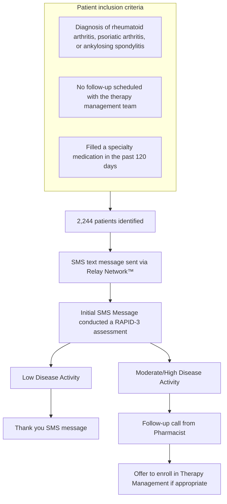

# Use of Texting to Re-engage Specialty Patients

Fairview logo

Jenna Boudreau, PharmD; Jennifer Bulin, PharmD; Amanda Robinson, BA, CPhT; Melissa Nelson, PharmD, CSP; Jake Hansen, PharmD, MS; Ann McNamara, PharmD; Dana Simonson, PharmD, BCPS; Marj Wittenborg, RPh

Fairview Pharmacy Services, Minneapolis, MN

## BACKGROUND

Medications filled by specialty pharmacies can be costly to both patients and third-party payers. They rely on adequate adherence to maximize therapeutic benefit. It is important for patients to remain engaged with specialty pharmacists to identify adherence gaps and assess therapeutic benefit.

## OBJECTIVE

Re-engage patients who were not currently enrolled in the therapy management program which provides ongoing follow up per patient need or request.

## RESULTS

2,244 text messages were sent; 1,698 texts were successfully delivered. Over 5 days, 891 patients clicked on the message notification, 490 patients clicked on the link to the RAPID-3 assessment, and 342 patients completed the assessment, which yielded a response rate of 20% for the patients who received the text. The average RAPID-3 score was 7.76 out of 30 total points, indicating a patient is currently experiencing moderate disease severity. 32% of patients who responded were near remission (RAPID-3 score 0-3), 20% were experiencing low disease severity (RAPID-3 score 4-6), 27% were experiencing moderate disease severity (RAPID-3 score 7-12), and 21% were experiencing high disease severity (RAPID-3 score ≥13). 13 out of 163 (8%) of the patients in the moderate to high intensity group had a Proportion of Days Covered (PDC) <0.8, indicating potential adherence issues. 51 out of 81 patients (63%) with moderate/high disease severity who received a call from the pharmacy in round 1 of follow-up were reached. Of these 51 patients reached for a follow-up assessment, 19 individuals enrolled in Therapy Management (37%). Calls to the second group of 80 patients with moderate/high disease activity are ongoing.

## DISCUSSION

The goal of this study was to re-engage patients who have opted out of the therapy management program. A response rate of 20% among patients to whom the text was successfully delivered allowed the pharmacy to re-engage with 342 patients. The 342 patients who re-engaged with the specialty pharmacy were stratified into two groups based on disease activity. We focused our efforts within the moderate/high disease activity group. While the efforts are ongoing, 19 patients have enrolled in Therapy Management based on this communication and follow up. This allows our pharmacists to help optimize therapy by discussing adherence, lifestyle changes, or communicate with the clinic if needed.

## METHODS

### Response Rate (N=2244)

| Metric                                     | Percent (%) |
| ------------------------------------------ | ----------- |
| % Patients Received Text                   | 76          |
| % Patients Clicked on Message Notification | 40          |
| % Patients Completing Survey               | 15          |

### Patients with Moderate/High Disease Activity: Enrollement in Therapy Management (N=162)

| Enrollment Status                                     | Percent (%) |
| ----------------------------------------------------- | ----------- |
| Patients that enrolled in Therapy Management          | 12          |
| Patients that have not enrolled in Therapy Management | 88          |

## CONCLUSION

Offering patients an alternative method of follow-up via Relay text allowed pharmacists in our specialty pharmacy the ability to re-engage patients who had previously opted out of our therapy management program.

A future consideration of this study is to operationalize an alternative follow-up method for patients in other disease states followed within the specialty pharmacy such as atopic dermatitis, Crohn’s Disease, and ulcerative colitis.

## REFERENCES

Qorolli M, Rexhepi B, Rexhepi S, Mustapić M, Doko I, Grazio S. Association between disease activity measured by RAPID3 and health-related quality of life in patients with rheumatoid arthritis. Rheumatol Int. 2019 May;39(5):827-834. doi: 10.1007/s00296-019-04258-z. Epub 2019 Mar 7. PMID: 30847560.

Amado AY, Frye C, Holland W, Holland CR, Rhodes LA, Marciniak MW. Development of a process to improve medication adherence in patients with rheumatoid arthritis in the specialty pharmacy setting. J Am Pharm Assoc (2003). 2020 May Jun;60(3S):S61-S64.e1. doi: 10.1016/j.japh.2020.03.022. Epub 2020 May 20. PMID: 32446651.

**Fairview**

