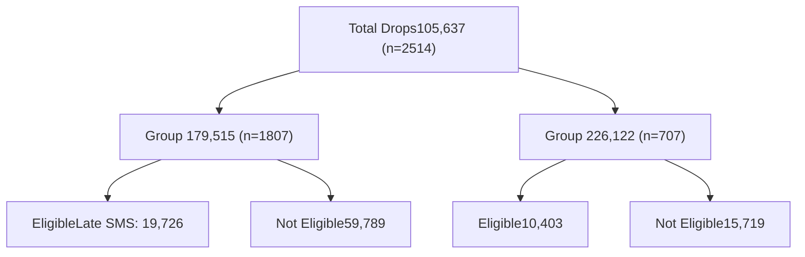

HEALTHBEACON logo

# HealthBeacon: Smart Reminders Improve Adherence

NASP NATIONAL ASSOCIATION OF SPECIALTY PHARMACY logo

Sharifah Sarhan, MB BCH BAO, Rohit Chougule, MSc, Nilesh Aher, MSc, Sean McWhinney, PhD.

## INTRODUCTION

HealthBeacon’s Injection Care Management System (ICMS) includes a Smart Sharps Bin and SMS reminders to support patient adherence to self-administered injections. By monitoring used injections dropped into the bin (drops), the ICMS can detect if a patient is likely to miss their injection and provide dose reminders. The bin’s blue light illuminates when a dose is due and patients may opt to receive smart SMS reminders, including a Late SMS after 24 hours, if they have not dropped their scheduled dose.

HealthBeacon ICMS Diagram showing System Wide Real-Time Data Insights, HealthBeacon Smart Sharps Bin, Patient Engagement, Real-Time Patient Monitoring, and Smart Reminders

Figure 1: HealthBeacon Injection Care Management System (ICMS)

1. Personalized smart reminders alert patients when their medication is due

2. Patients’ medication schedules automatically update when a drop is made

3. A real-time record of adherence is created for physicians to review remotely

4. HealthBeacon Support monitors adherence and provide intervention calls, as needed

Photograph of HealthBeacon Smart Sharps Bin

Figure 2: HealthBeacon Smart Sharps Bin

5. Hazardous sharps waste is safely stored within the internal sharps bin

6. Discreet yet user-friendly design allows for ease of use and incorporation into the home environment

## AIM AND METHODS

**Aim:**

To investigate the impact of the smart Late SMS on medication adherence.

**Methods:**

HealthBeacon monitored 30,129 drops eligible for a Late SMS from 2,514 patients using the ICMS between January 2018 and March 2022. These patients were on therapy for Gastroenterological, Dermatological and Rheumatological conditions.

Each drop recorded by the ICMS contributes to a patient’s adherence score. In this analysis, patient data was organized into two groups. Eligible drops were those not disposed of 24 hours following their scheduled time. Patients in Group 1 received a smart Late SMS for these drops, whereas those in Group 2 did not (Figure 3).

Figure 3: Breakdown of Drops by Patient Group

There were 19,726 eligible drops (from a total of 79,515) from 1,807 patients in Group 1, and 10,403 eligible drops (total 26,122) from 707 patients in Group 2. Patients' adherence to late drops in each Group was compared, to determine the impact of the Late SMS on compliance (Figure 3).

**Statistical Modeling:**

A mixed effects logisitic regression was used to model the effects of the Late SMS reminder, age, gender, drop status, and therapeutic area on whether an eligible drop was recorded by the ICMS.

**Assumptions**

1. For eligible drops for patients in Group 1, we assumed that drops made into the HealthBeacon bin after the Late SMS reminder were attributed to the Late SMS.

2. We assumed that a drop made into the bin was an indicator a patient took that dose of medication.

## RESULTS

Patients in Group 1 dropped 26% of their late doses whereas those in Group 2 dropped 11% (Table 1). This difference of 15% was significant ($\chi^2=409.09, p< 0.001$), highlighting the impact of the Late SMS on patients’ drop behaviour; those who receive the smart reminder appear to take more doses of medication than those who do not.

Compared to the other variables measured, i.e. patient age and gender, the Late SMS had a significant impact on drop status ($p<0.001$).

Differences in adherence to late drops across the 3 therapeutic areas (Rheum 23%, Gastro 19%, Derm 20%) were also significant ($\chi^2=20.18, p< 0.001$), while controlling for age and gender. For patients in Group 2, 40% of their total drops were eligible for a Late SMS, compared to 25% of total drops in Group 1. Hence, patients were more likely not to drop their dose in the 24-hour period after its scheduled time without the additional reminder.

With an odds ratio of 8.3 however, patients who received the Late SMS reminder were over 8 times more likely to make a drop (Table 2).

Table 1: Sample characteristics for each group, with group differences tested for significance.

|                            | Group 1      | Group 2      | Significance              |
| -------------------------- | ------------ | ------------ | ------------------------- |
| Size                       | 1807         | 707          |                           |
| Total Drops                | 79,515       | 26,122       |                           |
| Eligible Drops             | 19,726       | 10,403       | $\chi^2=2174.94, p<0.001$ |
| Gender                     |              |              |                           |
| Female (%)                 | 942 (52.13%) | 377 (53.32%) | $\chi^2=0.29, p=0.901$    |
| Therapeutic Area           |              |              |                           |
| Dermatology                | 278 (15.38%) | 93 (13.15%)  |                           |
| Gastroenterology           | 694 (38.41%) | 275 (38.90%) | $\chi^2=2.07, p=0.354$    |
| Rheumatology               | 835 (46.21%) | 339 (47.95%) |                           |
| Age Group                  |              |              |                           |
| 18-29                      | 311 (17.21%) | 98 (13.86%)  |                           |
| 30-44                      | 509 (28.17%) | 192 (27.16%) | $\chi^2=9.66, p=0.021$    |
| 45-59                      | 618 (34.20%) | 237 (33.52%) |                           |
| 60-79                      | 369 (20.42%) | 180 (25.46%) |                           |
| Adherence (Eligible Drops) | 26.09%       | 11.09%       |                           |

## RESULTS

Table 2: Significance within the categorical variables

|                               | Estimate | OR   | OR 2.5 CI | OR 97.5 CI | z-stat | p-val  |
| ----------------------------- | -------- | ---- | --------- | ---------- | ------ | ------ |
| Dermatology-Gastroenterology  | 0.42     | 1.52 | 1.18      | 1.98       | 3.22   | 0.004  |
| Rheumatology-Dermatology      | -0.02    | 0.98 | 0.76      | 1.26       | -0.16  | 0.986  |
| Rheumatology-Gastroenterology | 0.40     | 1.5  | 1.24      | 1.82       | 4.13   | <0.001 |
| SMS 1 - SMS 0                 | 2.12     | 8.32 | 6.78      | 10.23      | 20.24  | <0.001 |
| Male vs Female                | 0.22     | 1.25 | 1.05      | 1.48       | 2.59   | 0.010  |

## CONCLUSION AND DISCUSSION

This analysis indicates that smart late SMS reminders can have a significant impact on adherence to late doses of medication, which may otherwise be missed. Although additional factors may contribute, this smart intervention should be considered when offering adgerance support to patients on injectable medication.

**Key Findings:**

* Adherence to eligable drops was higher for patients who received a Late SMS reminder.

* Patients who received a Late SMS reminder were 8 times more likely to make a drop than those without the reminder.

* Patients benefit from adherance reminders.

