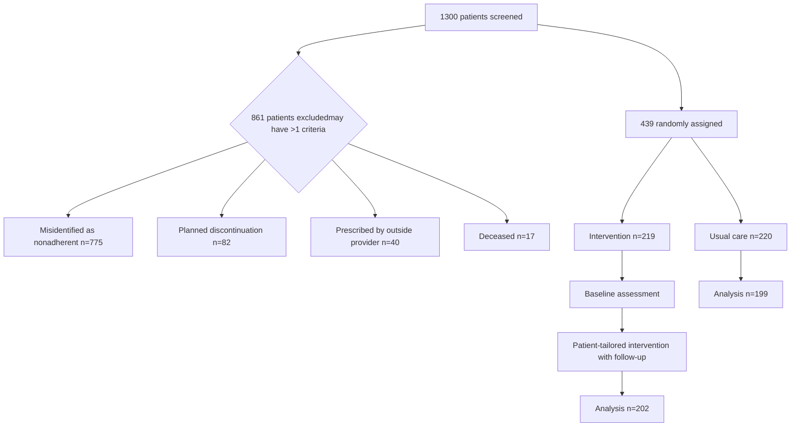

VANDERBILT UNIVERSITY MEDICAL CENTER logo

# Patient-Tailored Pharmacist Interventions to Improve Specialty Medication Adherence: A Randomized Controlled Trial

Amanda M. Kibbons1, Ryan Moore2, Leena Choi2, Autumn D. Zuckerman1

1Specialty Pharmacy, Vanderbilt University Medical Center; 2Department of Biostatistics, Vanderbilt University Medical Center

QR Code

## Conclusion

Patient-tailored interventions to address poor adherence to specialty medications resulted in significant adherence improvement compared to usual care:
8-month PDC 94% (intervention) vs. 88% (usual care), p<0.001

Specialty pharmacies should target nonadherent patients for adherence interventions.

## Purpose

## Setting and Patient Sample

## Results

Evaluate the impact of patient-tailored complex interventions on adherence to specialty medications as compared to usual care.

Single-center, pragmatic, randomized controlled trial at an integrated health-system specialty pharmacy

Patients included for pharmacist review:
1) PDC <0.9 over the previous 4 and 12 months and
2) filled a specialty medication at least 4 times in the previous 12 months from select specialty clinics

## Figure 1. Study Methods

Primary outcome: 8-month post-enrollment PDC
Exploratory outcomes: 6, 12-month post-enrollment PDC

## Table 1. Baseline Characteristics

|                                         | N=439            |
| --------------------------------------- | ---------------- |
| Age- mean (±SD)                         | 51 (±18)         |
| Female                                  | 299 (68%)        |
| White                                   | 360 (82%)        |
| Commercial Insurance                    | 255 (58%)        |
| Duration of Therapy ≥ 1 year            | 292 (67%)        |
| Clinic                                  |                  |
| Adult Miscellaneous                     | 57 (13%)         |
| Lipids                                  | 75 (17%)         |
| Multiple Sclerosis                      | 86 (20%)         |
| Pediatric                               | 31 (7%)          |
| Pulmonary                               | 38 (9%)          |
| Rheumatology                            | 152 (35%)        |
| Baseline PDC at 12 months- median (IQR) | 0.87 (0.78, 0.9) |

## Figure 2. PDC by Treatment Group and Time

| PDC Timeframe          | Usual Care | Intervention |
| ---------------------- | ---------- | ------------ |
| Retrospective 12 month | 0.86       | 0.87         |
| Prospective 6 month    | 0.9        | 0.95         |
| Prospective 8 month    | 0.88       | 0.94         |
| Prospective 12 month   | 0.87       | 0.93         |

| PDC Timeframe        | Usual Care Median (IQR) | Intervention Median (IQR) | P-value |
| -------------------- | ----------------------- | ------------------------- | ------- |
| Baseline 12-Month    | 0.86 (0.78, 0.89)       | 0.87 (0.78, 0.9)          | 0.21    |
| Prospective 6-Month  | 0.9 (0.76, 0.98)        | 0.95 (0.84, 1)            | 0.003   |
| Prospective 8-Month  | 0.88 (0.75, 0.97)       | 0.94 (0.84, 0.99)         | <0.001  |
| Prospective 12-Month | 0.87 (0.72, 0.95)       | 0.93 (0.82, 0.98)         | <0.001  |

## Figure 3. Reason for Nonadherence by Clinic

| Clinic              | Financial | Memory | Health Literacy | Clinical | Unreachable | Unresponsive | Pharmacy Error | Social Issues | Unknown |
| ------------------- | --------- | ------ | --------------- | -------- | ----------- | ------------ | -------------- | ------------- | ------- |
| Adult Miscellaneous | 2         | 10     | 2               | 2        | 5           | 2            | 0              | 2             | 0       |
| Lipids              | 2         | 15     | 5               | 5        | 10          | 5            | 2              | 2             | 0       |
| Multiple Sclerosis  | 2         | 25     | 5               | 5        | 15          | 10           | 5              | 5             | 5       |
| Pediatric           | 0         | 5      | 2               | 2        | 5           | 2            | 0              | 0             | 0       |
| Pulmonary           | 0         | 10     | 2               | 2        | 5           | 2            | 0              | 0             | 0       |
| Rheumatology        | 2         | 30     | 5               | 10       | 20          | 15           | 8              | 10            | 5       |

## Figure 4. Patient-tailored Interventions

### Baseline Assessment

* Can you tell me how you take [med]?
* What concerns do you have about [med]
* Have you experienced any side effects?
* How do you remember to take [med]?
* How many doses have you missed in last 30 days?
* Can you tell me why you take [med]?

Arrow icon

| Nonadherence Reason            | Count |
| ------------------------------ | ----- |
| Memory                         | 82    |
| Unreachable                    | 60    |
| No known reason                | 35    |
| Unresponsive\*                 | 32    |
| Clinical                       | 25    |
| Social issues                  | 23    |
| Health Literacy                | 19    |
| Health-system determinants\*\* | 15    |
| Financial                      | 8     |

\*Unresponsive = patient who did not comply with the necessary requirements for continuing treatment
\*\*Health-system determinant = clinic or pharmacy error resulting in refill delays

Arrow icon

### Most Common Interventions

* Sent instructions for smartphone reminders
* Mailed daily pill boxes
* Created unreachable action plans
* Recommended follow up
* Addressed clinic or pharmacy errors
* Provided encouragement
* Discussed financial assistance

Abbreviations: PDC = proportion of days covered
Acknowledgements: Vanderbilt University Learning Health System Committee; Jacob Bell, CPhT, Traci Smith, PharmD

