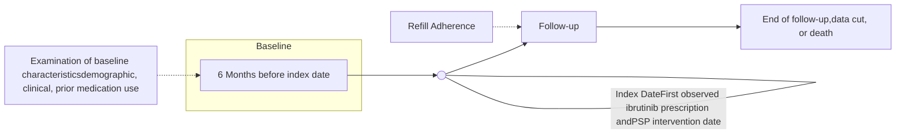

# Patient Support Program and Ibrutinib Adherence

Swetha Challagulla, MS1; Piya Debnath, PharmD, CSP, CPGP2; Ruchit Shah, PhD3; Sanika Rege, MS, PhD3; Raisa R. Volodarsky, PharmD, RPh1; Alex Young, PharmD1; Reethi Iyengar, PhD, MBA, MHM1
1Pharmacyclics LLC, an AbbVie Company, Sunnyvale, CA, USA; 2Optum Specialty Pharmacy, Phoenix, AZ, USA; 3OPEN Health Evidence and Access, Bethesda, MD, USA

# INTRODUCTION

* Ibrutinib, a once-daily Bruton’s tyrosine kinase (BTK) inhibitor, is the only targeted therapy to demonstrate both a significant progression-free survival (PFS)1-6 and overall survival (OS)1,2,5,6 benefit in multiple randomized phase 3 studies in both previously untreated and relapsed/refractory chronic lymphocytic leukemia/small lymphocytic lymphoma (CLL/SLL).

— Ibrutinib has demonstrated sustained efficacy and safety, with up to 8 years of long-term follow-up in clinical studies.1,2,7

* Oral oncolytics such as ibrutinib offer several advantages over intravenously administered chemotherapy, including convenience and ease of administration, and are most effective when adherence is optimized.8

* Evidence suggests that nonadherence to oral medications such as oncolytics may result in suboptimal patient outcomes.9

* Patient Support Programs (PSPs) can help patients better manage chronic diseases and optimize complex treatment by filling gaps in services that are not provided by the current healthcare system.

— For example, PSPs may improve refill adherence to oral therapies,10 although data quantifying the impact of PSPs on adherence are limited. As patients enrolled in PSPs may have behavioral challenges such as a history of nonadherence, understanding how these programs affect adherence is critical in ensuring continuous treatment.

# OBJECTIVE

* To assess the impact of a bi-directional text-messaging PSP implemented by a specialty pharmacy on ibrutinib refill adherence among patients with CLL/SLL

# METHODS

## Study Design

* Retrospective cohort study design (Figure 1)

## Figure 1. Schematic Representation of the Study Design

## Data Source:

* De-identified data from 1 November 2016 to 31 December 2018 obtained from Avella of Deer Valley, Inc., a specialty pharmacy, were used to conduct the analysis.

## Study Population

### Inclusion criteria:

* ≥ 1 pharmacy (Rx) claim indicating ibrutinib use for CLL/SLL

* ≥ 18 years of age

* No exclusion criteria

## Study Exposure and Outcomes

* The exposure of interest was enrollment in a text-based PSP that provided timely dosing and refill reminders.

* Patients on ibrutinib learned about the bi-directional texting program from their clinicians (via outbound calls) or through flyers distributed with initial medication shipments. Patients were on-boarded by answering a few simple questions to set up their messaging preferences.

* Index date for PSP enrollees was the first ibrutinib Rx claim date after PSP enrollment, and for non-enrollees, it was the first observed ibrutinib Rx claim date.

# METHODS (CONT.)

* The outcome of interest was ibrutinib refill adherence, as measured by proportion of days covered (PDC), a well-established measure of medication adherence.11

— PDC measured refill adherence in fixed 3-month intervals from 1-9 months among patients with an applicable minimum follow-up period.

## Statistical Analysis

* Descriptive statistics were used to characterize the study cohort. To control for differences in sociodemographic and clinical characteristics between PSP enrollees and non-enrollees, 1:1 propensity score matching was used.

— Patient characteristics are considered balanced between two cohorts if the standardized difference is <10%.

* PDC was calculated by dividing the total number of days covered for ibrutinib by the total number of days in the treatment period. Patients with a PDC >0.8 were considered adherent.

# RESULTS

## Sociodemographic and Clinical Characteristics

Table 1. Comparable Sociodemographic and Clinical Characteristics in Patients with CLL/SLL Among PSP Enrollees Versus Non-Enrollees Before and After Propensity Score Matching

| Variable                                                                | Before Matching Non-Enrollees (N=3345) | Before Matching PSP Enrollees (N=200) | Before Matching P-value | After Matching Non-Enrollees (N=200) | After Matching PSP Enrollees (N=200) | After Matching P-value | After Matching Standardized Difference |
| ----------------------------------------------------------------------- | ------------------------------------------ | ----------------------------------------- | --------------------------- | ---------------------------------------- | ---------------------------------------- | -------------------------- | ------------------------------------------ |
| Sociodemographic Characteristics                                        |                                            |                                           |                             |                                          |                                          |                            |                                            |
| Age, years, mean (SD)                                                   |                                            |                                           |                             |                                          |                                          |                            |                                            |
| Mean (SD)                                                               | 73.2 (10.7)                                | 66.7 (9.2)                                | <0.001                      | 66.9 (9.2)                               | 66.7 (9.2)                               | 0.754                      | -0.029                                     |
| Median (Q1 to Q3)                                                       | 74.0 (66.0 to 82.0)                        | 67.0 (61.0 to 71.0)                       |                             | 66.0 (62.0 to 71.0)                      | 67.0 (61.0 to 71.0)                      |                            |                                            |
| Range                                                                   | 22.0–90.0                                  | 40.0–90.0                                 |                             | 28.0–90.0                                | 40.0–90.0                                |                            |                                            |
| Age, n (%)                                                              |                                            |                                           |                             |                                          |                                          |                            |                                            |
| ≤40                                                                     | 12 (0.4)                                   | 1 (0.5)                                   | <0.001                      | 2 (1.0)                                  | 1 (0.5)                                  | 0.976                      | 0.104                                      |
| 41–50                                                                   | 62 (1.9)                                   | 3 (1.5)                                   |                             | 2 (1.0)                                  | 3 (1.5)                                  |                            |                                            |
| 51–60                                                                   | 352 (10.5)                                 | 41 (20.5)                                 |                             | 37 (18.5)                                | 41 (20.5)                                |                            |                                            |
| 61–70                                                                   | 896 (26.8)                                 | 104 (52.0)                                |                             | 108 (54.0)                               | 104 (52.0)                               |                            |                                            |
| 71–80                                                                   | 1,068 (31.9)                               | 33 (16.5)                                 |                             | 33 (16.5)                                | 33 (16.5)                                |                            |                                            |
| 80+                                                                     | 955 (28.6)                                 | 18 (9.0)                                  |                             | 18 (9.0)                                 | 18 (9.0)                                 |                            |                                            |
| Gender, n (%)                                                           |                                            |                                           |                             |                                          |                                          |                            |                                            |
| Female                                                                  | 1,212 (36.2)                               | 60 (30.0)                                 | 0.133                       | 64 (32.0)                                | 60 (30.0)                                | 0.665                      | 0.043                                      |
| Male                                                                    | 2,132 (63.7)                               | 140 (70.0)                                |                             | 136 (68.0)                               | 140 (70.0)                               |                            |                                            |
| Census region, n (%)                                                    |                                            |                                           |                             |                                          |                                          |                            |                                            |
| Midwest                                                                 | 487 (14.6)                                 | 28 (14.0)                                 | 0.067                       | 29 (14.5)                                | 28 (14.0)                                | 0.997                      | 0.031                                      |
| Northeast                                                               | 373 (11.2)                                 | 34 (17.0)                                 |                             | 34 (17.0)                                | 34 (17.0)                                |                            |                                            |
| South                                                                   | 1,130 (33.8)                               | 72 (36.0)                                 |                             | 70 (35.0)                                | 72 (36.0)                                |                            |                                            |
| West                                                                    | 1,353 (40.4)                               | 66 (33.0)                                 |                             | 67 (33.5)                                | 66 (33.0)                                |                            |                                            |
| Plan type, n (%)                                                        |                                            |                                           |                             |                                          |                                          |                            |                                            |
| Medicare Part D                                                         | 1,826 (54.6)                               | 72 (36.0)                                 | <0.001                      | 66 (33.0)                                | 72 (36.0)                                | 0.851                      | 0.064                                      |
| Medicaid                                                                | 65 (1.9)                                   | 4 (2.0)                                   |                             | 4 (2.0)                                  | 4 (2.0)                                  |                            |                                            |
| Private                                                                 | 1,404 (42.0)                               | 123 (61.5)                                |                             | 130 (65.0)                               | 123 (61.5)                               |                            |                                            |
| Othersa                                                                 | 28 (0.8)                                   | 1 (0.5)                                   |                             | 0 (0.0)                                  | 1 (0.5)                                  |                            |                                            |
| Clinical characteristics                                                |                                            |                                           |                             |                                          |                                          |                            |                                            |
| Cancer medication drug burden (other dispensed medications)             |                                            |                                           |                             |                                          |                                          |                            |                                            |
| Mean (SD)                                                               | 0.4 (0.6)                                  | 0.5 (0.6)                                 | 0.464                       | 0.4 (0.6)                                | 0.5 (0.6)                                | 0.866                      | 0.008                                      |
| Median (Q1 to Q3)                                                       | 0.0 (0.0 to 1.0)                           | 0.0 (0.0 to 1.0)                          |                             | 0.0 (0.0 to 1.0)                         | 0.0 (0.0 to 1.0)                         |                            |                                            |
| Range                                                                   | 0.0–6.0                                    | 0.0–3.0                                   |                             | 0.0–3.0                                  | 0.0–3.0                                  |                            |                                            |
| Non-cancer medication drug burden (other dispensed medicationsb), n (%) |                                            |                                           |                             |                                          |                                          |                            |                                            |
| 0                                                                       | 1,064 (31.8)                               | 58 (29.0)                                 | 0.476                       | 51 (25.5)                                | 58 (29.0)                                | 0.41                       | 0.152                                      |
| 1                                                                       | 253 (7.6)                                  | 17 (8.5)                                  |                             | 26 (13.0)                                | 17 (8.5)                                 |                            |                                            |
| 2                                                                       | 203 (6.1)                                  | 17 (8.5)                                  |                             | 13 (6.5)                                 | 17 (8.5)                                 |                            |                                            |
| 3+                                                                      | 1,825 (54.6)                               | 108 (54.0)                                |                             | 110 (55.0)                               | 108 (54.0)                               |                            |                                            |
| Prior ibrutinib use through other specialty pharmacy,c n (%)            |                                            |                                           |                             |                                          |                                          |                            |                                            |
| No                                                                      | 2,944 (88.0)                               | 171 (85.5)                                | 0.291                       | 168 (84.0)                               | 171 (85.5)                               | 0.677                      | -0.042                                     |
| Yes                                                                     | 401 (12.0)                                 | 29 (14.5)                                 |                             | 32 (16.0)                                | 29 (14.5)                                |                            |                                            |

SD, standard deviation.
aIncludes cash, other federal plan, other state plan, and workers’ compensation.
bOther dispensed medications may have been underestimated, as patients may have filled medications at another pharmacy, information that may not have been available to Avella.
cNo information is available as to the date when the other medications were initiated (whether prior to ibrutinib initiation or given concomitantly).

# RESULTS (CONT.)

* The study cohort comprised 3,545 patients with CLL, 18 years of age or older.

* Prior to propensity score matching, 200 (5.6%) patients received the PSP intervention, and 3,345 (94.4%) did not.

* Gender and region distributions were similar between enrollees and non-enrollees, but enrollees were approximately 7 years younger and more likely to be insured in commercial plans (Table 1).

* After balancing the baseline covariates using 1:1 propensity score matching, there were 200 patients each in the PSP and non-PSP intervention groups (Table 1).

## Ibrutinib Refill Adherence

Figure 2. Improved Ibrutinib Refill Adherence Throughout 9-Month Follow-up Among Patients with CLL/SLL Enrolled in PSP

| Time     | Change in % Refill Adherence | P-value |
| -------- | ---------------------------- | ------- |
| 3 Months | +12%                         | P=0.007 |
| 6 Months | +13%                         | P=0.005 |
| 9 Months | +16%                         | P=0.001 |

* With a median follow-up of approximately 9 months, the proportion of patients adherent to ibrutinib was significantly higher in PSP enrollees versus non-enrollees at 3, 6, and 9 months (Figure 2).

Table 2. Higher Proportion of Days Covered for Ibrutinib Throughout 9-Month Follow-up Among Patients with CLL/SLL Enrolled in PSP

| Variable          | Non-Enrollees (N=200) | PSP Enrollees (N=200) | Mood's Median Test P-value |
| ----------------- | --------------------- | --------------------- | -------------------------- |
| PDC at 3 months   |                       |                       |                            |
| Median (Q1 to Q3) | 0.94 (0.67 to 1.00)   | 0.96 (0.82 to 1.00)   | 0.309                      |
| Range             | 0.31 to 1.00          | 0.31 to 1.00          |                            |
| PDC at 6 months   |                       |                       |                            |
| Median (Q1 to Q3) | 0.89 (0.41 to 0.99)   | 0.94 (0.78 to 0.99)   | 0.028                      |
| Range             | 0.16 to 1.00          | 0.16 to 1.00          |                            |
| PDC at 9 months   |                       |                       |                            |
| Median (Q1 to Q3) | 0.83 (0.31 to 0.97)   | 0.93 (0.66 to 0.98)   | 0.001                      |
| Range             | 0.10 to 1.00          | 0.10 to 1.00          |                            |

* The median PDC was significantly higher for PSP enrollees versus non-enrollees at 6 and 9 months; no statistically significant difference in median PDC was observed between the two groups at 3 months (Table 2).

## Strengths and Limitations

* Strengths:

— This study used claims data from a specialty pharmacy rather than self-reported adherence data from a survey-based study.

— Data from this specialty pharmacy include claims from a mix of commercial and Medicare Part D members; results are generalizable to multiple population types across ibrutinib indications.

* Limitations:

— The pharmacy claims data used in this study do not contain clinical information such as CLL Rai stage, time since diagnosis, prognosis factors, or the line of therapy in which ibrutinib is being used. Length of follow-up was limited, which may not accurately capture a patient’s adherence over the course of their treatment period.

— Data were limited to one specialty pharmacy, and the recorded rates of other medications and therapies may have been underestimated, as patients may have filled the medications at other pharmacies.

— Reasons for non-adherence could not be ascertained in this study and could include disease progression or other causes. Calculation of refill adherence assumes “a pill in hand is a pill taken.”

— Results from the study may not be generalized to all patients with CLL/SLL. PSP enrollees may have unique characteristics, and the non-enrollee cohort was matched to this unique cohort who may be more likely to be nonadherent than the general population.

# DISCUSSION & CONCLUSIONS

* The study demonstrated that enrollment in the PSP significantly improved ibrutinib refill adherence among 1:1 matched patients with CLL/SLL who might have had a pre-disposition to poor adherence.

* The refill adherence rates at 3, 6, and 9 months were significantly higher among PSP enrollees versus non-enrollees.

* These findings demonstrate that PSPs have the potential to address gaps in patient care and mitigate preventable discontinuations and/or non-adherence to optimize effectiveness.

* Additional studies evaluating other PSP programs with larger sample sizes and longer follow-up are needed to comprehensively understand the effects of a PSP on refill adherence.

# References
1. Munir T, et al. Am J Hematol. 2019;94(12):1353-63.
2. Burger JA, et al. Leukemia. 2020;34(3):787-98.
3. Moreno C, et al. Lancet Oncol. 2019;20(1):43-56.
4. Woyach JA, et al. N Engl J Med. 2018;379(26):2517-28.
5. Shanafelt TD, et al. N Engl J Med. 2019;381(5):432-43.
6. Fraser GAM, et al. Leuk Lymphoma. 2020;61(13):3188-97.
7. Byrd JC, et al. Clin Cancer Res. 2020;26(15):3918-27.
8. US Pharmacist. Challenges to Oral Chemotherapy Adherence. https://www.uspharmacist.com/article/challenges-to-oral-chemotherapy-adherence. Accessed October 13, 2020.
9. Partridge AH, et al. J Natl Cancer Inst. 2002;94(9):652-61.
10. Ganguli A, et al. Patient Prefer Adherence. 2016;10:711-25.
11. Pharmacy Quality Alliance. PQA Adherence Measures. https://www.pqaalliance.org/adherence-measures. Accessed August 20, 2021.

# Disclosures
SC, RV & AY: employment with Pharmacyclics LLC, an AbbVie Company; stock ownership in AbbVie; PD: employment with Optum Specialty Pharmacy; stock ownership in Bristol Myers Squibb, Celgene, Gilead, Intercept, Nektar, Reata, and United HealthGroup; RS & SR: consultancy/advisory role with Pharmacyclics LLC, an AbbVie Company, paid to institution; RI: employment with and stock ownership in AbbVie; patents, royalties, or other intellectual property with Express Scripts.

# Acknowledgments
This study was sponsored by Pharmacyclics LLC, an AbbVie Company. Editorial support was provided by Michelle Jones, PhD, MWC, and funded by Pharmacyclics LLC, an AbbVie Company.

To submit a medical question, please visit www.pharmacyclicsmedinfo.com

Poster prepared for the National Association of Specialty Pharmacy Annual Meeting & Expo; September 27–30, 2021; Washington, DC

