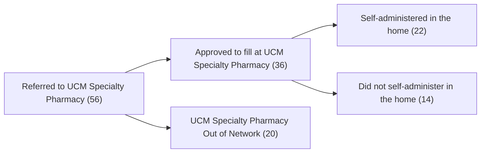

UChicago Medicine logo

# Health-System Specialty Pharmacy’s Impact on Self-Administration of Denosumab During COVID-19

Alisha Desai, PharmD Candidate1, Nadiyah Chaudhary, PharmD, BCPS2, Monika Lach, PharmD, MBI, BCPS2
1 University of Illinois at Chicago College of Pharmacy, 2 University of Chicago Medicine Specialty Pharmacy

## Background

* According to the CDC, osteoporosis affects 1 in 4 women aged 65 and over and about 1 in 20 men aged 65 and over.1

* Denosumab is a subcutaneous injection for osteoporosis. Due to the risk of adverse effects, denosumab must be administered by a healthcare provider once every six months.

* In March 2020, the World Health Organization declared the COVID-19 a global pandemic.2 In response to this declaration, the manufacturer of denosumab, Amgen, temporarily warranted self-administration of the medication.

* To support treatment adherence, University of Chicago Medicine (UCM) Specialty Pharmacy aimed to safely transition patients from in-clinic to at-home administration, thus reducing patient risk for contracting COVID-19.

* The purpose of this project was to highlight initiation rates and adverse events for patients who transitioned to self-administer denosumab in the home.

## Objectives

* <u>Primary objective</u>: Initiation rates for patients who self-administered denosumab in the home.

* <u>Secondary objective</u>: Adverse effects reported after self-administration in the home.

## Methods

* Single-center retrospective review

* Study Duration: March 1, 2020 - November 30, 2020

* Eligible patients for transition to self-administration in the home:

    - Previously received denosumab doses in Endocrinology clinic or deemed appropriate and safe per clinic team for first dose injection

    - No reported adverse effects with previous doses

    - Able and willing to self-inject in the home

* Initiation rates and safety data collected using Therigy® and Epic Hyperspace

## Results

Figure 2: Denosumab Self-Administration Rates Following Referral to UCM Specialty Pharmacy

Figure 3: Denosumab Self-Administration Rates Following Approval to Fill at UCM Specialty Pharmacy (n=36)

| Category                                     | Percentage |
| -------------------------------------------- | ---------- |
| Self-administered in the home                | 61         |
| Unable to self-administer due to high co-pay | 25         |
| Opted not to self-administer in the home     | 12         |
| Not ready to start medication                | 3          |

36 patients were approved to fill through UCM Specialty Pharmacy
* 22 patients completed injection trailing and had denosumab delivered to their home for self-administration
* 14 patients did not qualify for self-administration in the home
    - 9 patients had a high co-pay, 4 patients opted not to self-administer and 1 patient was not ready to start medication

Table 1: Adverse Effects Reported after Denosumab Self-Administration in the Home

| Outcome                  | Number of Patients |
| ------------------------ | ------------------ |
| No Adverse Events, n (%) | 11 (50)            |
| Arthralgia, n (%)        | 7 (32)             |
| Back Pain, n (%)         | 5 (23)             |

Zero patients experienced anaphylactic reactions, osteonecrosis of the jaw, hypocalcemia, atypical femur fractures, serious infections, or dermatologic reactions

Table 2: Turnaround Time for Patients who Self-Administered in the Home

| Outcome                                                            | Days, Median (IQR) |
| ------------------------------------------------------------------ | ------------------ |
| Time to insurance approval                                         | 0                  |
| Time from referral placed to medication arriving at patient’s home | 5 (4-8)            |

## Conclusions

* UCM Specialty Pharmacy was able to quickly and safely transition patients to self-administer denosumab in order to minimize the risks of potential COVID-19 exposure.

* Results show there were no serious adverse events in patients that self-administered denosumab in the home.

* The most common barrier to self-administration was a high co-pay.

* This review showcases the ability for a health-system specialty pharmacy to identify and execute a workflow that addressed a need within the community during a pandemic

## References

1. CDC –2021, March 3. Does Osteoporosis Run in Your Family? Retrieved from https://www.cdc.gov/genomics/disease/osteoporosis.htm?CDCAArefVal=https%3A%2F%2Fwww.cdc.gov%2Ffeatures%2Fosteoporosis%2Findex.html

2. World Health Organization (2021, January 29). Listings of WHO’s response to COVID-19. https://www.who.int/news/item/29-06-2020-covidtimeline

## Disclosures

The authors of this presentation have no financial interests with commercial entities that may have a direct or indirect interest in the subject matter of this presentation

Figure 1: Referral Workflow between Endocrinology Clinic and UCM Specialty Pharmacy

Referral Workflow diagram

