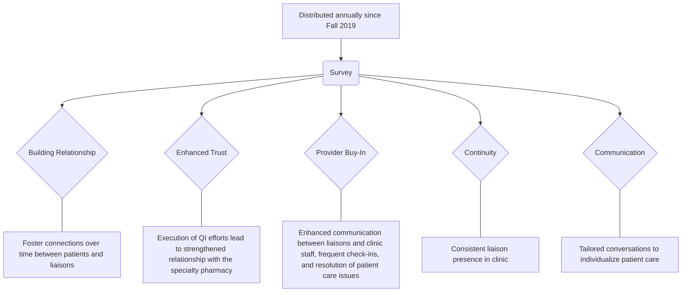

Spartanburg Regional Healthcare System logo

SHIELDS HEALTH SOLUTIONS logo

# Net Promoter Scores Demonstrate Value of Integrated Health System Specialty Pharmacy Services

Sandra Rivera, CPhT; Channing Garrett, PharmD; Katrina Meadows; Dylan Collins, PharmD; Martha Stutsky, PharmD, BCPS

# BACKGROUND

Patient satisfaction scores are a key driver of the integrated health system specialty pharmacy (HSSP) model, as they can demonstrate capabilities, allow for expanded accreditations, and drive quality improvement. The Net Promoter Score (NPS) is a standardized index measured by a single question on the 33-question survey (**Figure 1**), ranging from -100 to 100 (**Figure 2**). Specialty pharmacy (SP) industry benchmarks for NPS scores are published by the National Association of Specialty Pharmacies (NASP), with an overall score of 80.0 for participants in 2022. Our objective was to describe the impact of a quality improvement (QI) effort within a single HSSP on NPS scores.

## Figure 1: NPS Survey Question1

**LIKELIHOOD OF RECOMMENDING OUR PHARMACY TO FAMILY AND FRIENDS?**

| 0                 | 1 | 2 | 3 | 4 | 5                   | 6 | 7 | 8 | 9 | 10               |
| ----------------- | - | - | - | - | ------------------- | - | - | - | - | ---------------- |
| NOT AT ALL LIKELY |   |   |   |   | (Please Choose One) |   |   |   |   | EXTREMELY LIKELY |

## Figure 2: NPS Score Range1

**WHAT IS A GOOD NPS SCORE?**

| Needs Improvement | Good    | Great    | Excellent |
| ----------------- | ------- | -------- | --------- |
| -100 to 0         | 0 to 30 | 30 to 70 | 70 to 100 |

# DESCRIPTION

SP services were established in August 2019 at Spartanburg Regional Health System (SRHS), with embedded liaisons in four clinics including oncology, HIV, and hepatitis C. After the initial patient satisfaction survey results in the fall of 2019, several QI efforts were undertaken to improve the patient experience with the SRHS pharmacy (**Figure 3**). Exceptional customer service, including delivery coordination and reliable phone access, ensured patient satisfaction when interacting with the pharmacy. One patient satisfaction example cited the financial assistance process: the liaison was able to obtain approval for a high-cost medication within a one-day timeframe.

## Figure 3: Focused QI efforts

# EVALUATION

The NPS scores for the SRHS SP from the initial date to the most recent result in 2023 are outlined in Table 1. Figure 4 compares the SRHS SP score trends to NASP averages.

### Table 1: Spartanburg Regional Health System NPS Response Rate and Scores

| Survey Date | Surveys Distributed (N) | Survey Responses (n) | Response Rate | Net Promoter Score (NPS) |
| ----------- | ----------------------- | -------------------- | ------------- | ------------------------ |
| Fall 2019   | 324                     | 50                   | 15.4%         | 66.7                     |
| Fall 2020   | 399                     | 76                   | 19.0%         | 75.3                     |
| Fall 2021   | 805                     | 102                  | 12.7%         | 80.2                     |
| Fall 2022   | 935                     | 120                  | 12.8%         | 82.2                     |
| Fall 2023   | 1041                    | 129                  | 12.4%         | 82.5                     |

## Figure 4: NPS Score Trend

| Year | SRHS | NASP |
| ---- | ---- | ---- |
| 2019 | 66.7 | 77   |
| 2020 | 75.3 | 80   |
| 2021 | 80.2 | 79   |
| 2022 | 82.2 | 80   |
| 2023 | 82.5 |      |

# CONCLUSION

The continuous increase over time of NPS scores from inception of a HSSP to its current state highlights the impact of focused quality improvement efforts on patient engagement and satisfaction. Scores in this case exceeded the NPS national benchmark for specialty pharmacy, demonstrating the potential benefits of the HSSP model on patient engagement.

Shields Health Solutions icon

SCAN ME QR Code
SCAN ME text

**DISCLOSURES**
The authors of this presentation have nothing to disclose concerning possible financial or personal relationships with commercial entities that may have a direct or indirect interest in the subject matter of this presentation.

Reference:
1 National Association of Specialty Pharmacy. Patient Satisfaction Survey Results. 2022. <u>https://a8af0b.p3cdn2.secureserver.net/wp-content/uploads/2023/09/NASP-2022-Patient-Survey-White-Paper.pdf</u>. Accessed August 5, 2024.

