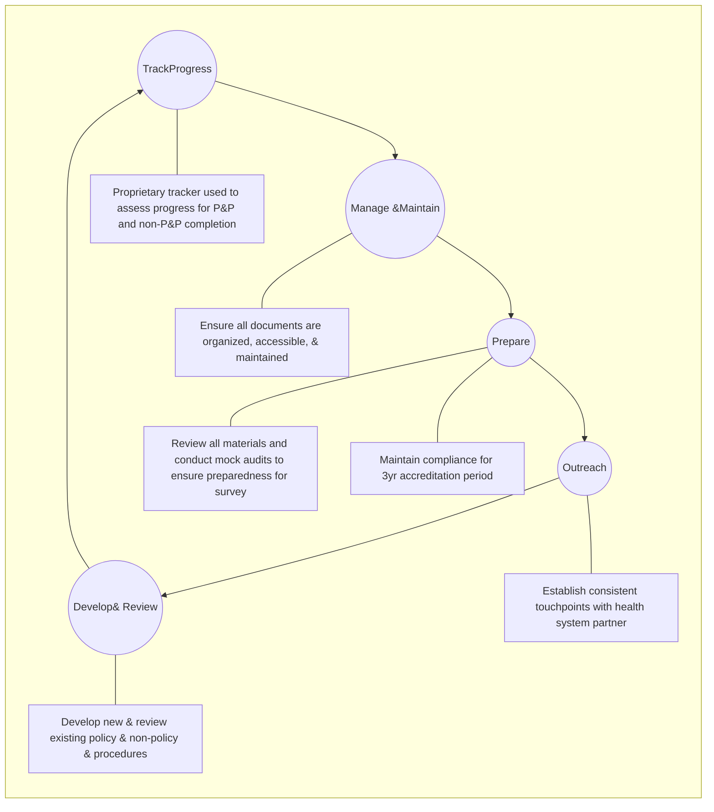

SHIELDS HEALTH SOLUTIONS logo

# Achieving Accreditation of Health System Specialty Pharmacies Through a Standardized Method

Patrick Ryan, PharmD, BCCCP, Lauren Mills; Danielle Rand, PharmD; Kate Campagnola, PharmD

QR code for more information

2023 NASP Annual Meeting & Expo

## Background

* Specialty pharmacy accreditation is a complex process that can provide several benefits to health systems, including expanded access to select payor networks and medications, improved patient care, and enhanced clinical outcomes.1,2

* Shields Health Solutions (Shields) developed a standardized method for achieving specialty pharmacy dual accreditation and reaccreditation. This method consists of five core categories: outreach, develop and review, track progress, manage and maintain, and prepare.

* The objective was to evaluate and analyze the standardized method, as well as foster dialogue for a more comprehensive understanding of the many ways of attaining specialty pharmacy accreditation.

## Methods

* A review of organizational data points related to specialty pharmacy accreditation was conducted, and a set of metrics was selected for analysis:
    

    - Median time to dual initial accreditation for partners with and without an operational pharmacy at time zero
    

    - Successful dual full accreditation and successful reaccreditation on the first attempt
    

    - Percent of partners who were due and applied for reaccreditation

* **Time Frame:** January 1, 2018 to January 31, 2023

* Health system partners were excluded from the initial accreditation group if they had already achieved at least one accreditation, and those who had not yet reached their reaccreditation date or were pursuing accreditation independently were excluded from the reaccreditation group.

# Results

**Figure 1.** Illustration of the standardized method used to achieve dual specialty pharmacy accreditation. **Figure 2.** Analysis of initial and reaccreditation success and application rates. **Figure 3.** Box plot representing in days the time to dual full accreditation of health system partners with an operational pharmacy or non-operational pharmacy at time zero (median, 25th to 75th percentile interquartile range, and minimum and maximum values excluding outliers).

Figure 1: Standard Process for Specialty Pharmacy Accreditation

Figure 2: Accreditation Success Rates

* 100% icon **Successful dual full accreditation on first attempt (n=32)**
* Partners that are due for reaccreditation and that apply: ACHC (n=15) and URAC (n=19)
* Successful full reaccreditation on first attempt: ACHC (n=15) and URAC (n=19)

Figure 3: Time to Dual Accreditation (Days)

| Category              | Min | 25th Percentile | Median | 75th Percentile | Max |
| --------------------- | --- | --------------- | ------ | --------------- | --- |
| Operational (n=26)    | 335 | 382             | 438    | 472             | 486 |
| Non-Operational (n=6) | 449 | 469             | 571    | 595             | 626 |

## Conclusions

* The results demonstrate that the implementation of a standardized, collaborative method resulted in 100% of health system partners obtaining full dual specialty pharmacy initial accreditation within 2 years and when applicable, achieving reaccreditation on the first attempt.

* The initial dual accreditation timeline was consistent year over year despite changes in accreditation standards and COVID-19 during the selected time frame.

* This standardized method can be adapted by health systems to achieve specialty pharmacy accreditation and reaccreditation.

### DISCLOSURES

The authors of this presentation have nothing to disclose concerning possible financial or personal relationships with commercial entities that may have a direct or indirect interest in the subject matter of this presentation

### REFERENCES

1 Alkhenizan A, Shaw C. Impact of accreditation on the quality of healthcare services: a systematic review of the literature. Ann Saudi Med. 2011; 31(4): 407-416. doi: 10.4103/0256-4947.83204

2 Rough S, Shane R, Armitstead JA, et al. The high-value pharmacy enterprise framework: Advancing pharmacy practice in health systems through a consensus-based, strategic approach. Am J Health Syst Pharm. 2021; 78(6): 498-510. doi: 10.1093/ajhp/zxaa431

