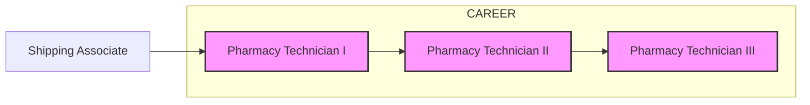

Yale New Haven Health logo

# Technician Enhancement Within Specialty Pharmacy

Alijah Kosarko, BA, CPhT; Vanessa Batista, CPhT; Terri Sue Rubino, Pharm D, CSP; Vinay Sawant, RPh, MPH, MBA
Yale New Haven Health, Department of Pharmacy, New Haven, CT

NASP National Association of Specialty Pharmacy logo

## Background

* High engagement has been shown to improve employee satisfaction.

* A trend identified through an annual health system employee engagement survey was lack of career growth for specialty pharmacy technicians (SPTs). This gap complemented the growing volume and diversity of patients managed by the health system specialty pharmacy (HSSP) requiring SPTs with specialized skills.

* Our approach to increase satisfaction, while meeting the expanding demand was to implement a career ladder and create new opportunities for career growth for SPTs.

## Objectives

* To create career growth and additional career pathways for SPTs to help improve employee engagement and job retention.

* To turn our opportunity of career development, identified on our annual health system employee engagement survey, into a strength.

## Methods

Promotion icon
SPT career ladder allowed for promotion within certain roles. Advancement as a SPT required competency in current role and completion of two projects around personal and professional growth. Advancement to the highest step of the career ladder required five professional and personal growth projects to demonstrate leadership and expertise. Similar career ladders were created for Med B and MAP.

Evaluation icon
Evaluation of the career ladder spanned from implementation in November 2019-June 2022. The number of employees who transitioned/advanced into new roles were collected. Employee engagement scores were collected in 2020 and 2021 for comparison.

New roles icon
New advanced roles were introduced to support operations and infrastructure, including medication assistance (MAP), financial clearance (PA), billing (Med B), customer service, staff educator, regulatory, purchasing, and leadership. New non-SPT roles (shipping) were created for entry-level candidates.

## Results

### Key Employee Engagement Survey Results

| Opportunities 2019               | Opportunities 2020                          | Opportunities 2021 |
| ------------------------------------ | ----------------------------------------------- | ---------------------- |
| My work is adequately staffed        | Career Development                              | Accountability         |
| Job Stress                           | Environment makes employees go above and beyond | Action Taking          |
| Sufficient time to provide best care | Recognition                                     | Recognition            |

| Strengths 2019              | Strengths 2020                       | Strengths 2021   |
| ------------------------------- | ---------------------------------------- | -------------------- |
| Patient safety is high priority | High quality care                        | Patient care quality |
| Work is meaningful              | Conducts business in ethical manner      | Career               |
| I care for all patients equally | Diversity and Inclusion related coaching | Growth               |

### Career Advancement Redesign

### Action Taking

| Employee Engagement Survey October 2020 Results Opportunities | Employee Engagement Survey October 2020 Results Actions                                                                                                                                         |
| ----------------------------------------------------------------- | --------------------------------------------------------------------------------------------------------------------------------------------------------------------------------------------------- |
| This organization provides career development opportunities.      | - Successful implementation of Career Ladder - New Roles (Tech Supervisor, Inventory & Training Coordinator etc.) - Individualized development plan - Planned Self Development sessions |

### New Roles Introduced to Support Operations

#### SPT Roles
* Medication assistance (MAP)
* Financial clearance (PA)
* Billing (Med B)
* Customer service
* Staff educator
* Regulatory
* Business Implementation
* Purchasing
* Leadership

#### Non SPT Roles
* Shipping (for entry level positions)

### Career Pathways

Specialty Pharmacy Technician Career Ladder Applicants

| Fiscal Year | SPL I to II | MAP I to II | MED B I to II | SPL II to III | MAP II to III | MED B II to III |
| ----------- | ----------- | ----------- | ------------- | ------------- | ------------- | --------------- |
| FY 2020     | 15          | 4           | 4             | 0             | 0             | 0               |
| FY 2021     | 10          | 0           | 0             | 1             | 1             | 2               |
| FY 2022     | 5           | 0           | 0             | 1             | 0             | 0               |

| Category                                                          | Number of Technicians |
| ----------------------------------------------------------------- | --------------------- |
| Technicians advanced their career utilizing the Career Ladder     | 13                    |
| Technicians Advanced their careers by utilizing both.             | 23                    |
| Technicians advanced their career utilizing New Positions created | 11                    |

### New Positions Created

| Position                    | Count |
| --------------------------- | ----- |
| Technician Supervisor       | 4     |
| Education Coordinator       | 4     |
| Purchasing                  | 2     |
| Regulatory                  | 1     |
| Business Development        | 1     |
| Customer Service            | 2     |
| Financial Clearance(PA)     | 9     |
| Billing (Med B)             | 5     |
| Medication Assistance (MAP) | 6     |
| Shipping                    | 1     |

## Discussion

* The following specialty positions have been created since 2019: Technician Supervisor, Customer Service Analyst, MAP Supervisor, Education Coordinator, PA Specialist, Business Implementation liaison, Safety/regulatory liaison, Shipping Associate, Purchasing/Inventory Specialist, and Ambulatory care technician. These new roles totaled 29 additional positions to support specialty pharmacy growth.

* Since implementation, 30 SPTs have advanced from SPT I to II. Two SPTs have advanced to the SPT III. Four SPTs were promoted to MAP coordinators, including one coordinator who achieved MAP III. Four billing analysts were promoted from Med B I to II, and two were promoted to III status. One shipping associate advanced to SPT I.

* Employee satisfaction scores increased from 68 to 83 in 2020 and 2021, respectively.

## Conclusions

* Expanding opportunities for pharmacy technicians, via career ladder or new career pathway opportunities, can improve employee engagement while supporting specialty pharmacy operations and growth.

## Barriers / Limitations

* Back filling positions

* Delay of releasing budget to hire additional staff

* Training staff in new roles

* Expectations for new roles

* Positions unique to each pharmacy model.

## Future Directions

* Continue to support the growth and development of existing SPTs through the career ladder and via new career pathway opportunities.

**Disclosure**: The authors of this presentation have the following to disclose concerning possible financial or personal relationships with commercial entities that may have a direct or indirect interest in the subject matter of this presentation: Alijah Kosarko, CPhT, BA; Vanessa Batista, CPhT; Terri Sue Rubino, Pharm D, CSP; Vinay Sawant, RPh, MPH, MBA : nothing to disclose.

NASP Annual Meeting & Expo 2022. September 19-22, 2022

