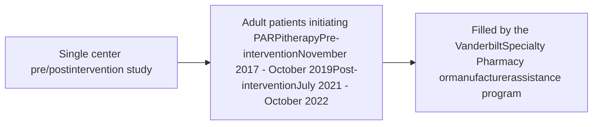

# PHARMACIST - LED MONITORING FOR PATIENTS INITIATING PARP INHIBITOR THERAPY

Brooke D. Looney, PharmD1 | Stephanie G. White, PharmD1 | Ryan Moore, MS2 | Autumn D. Zuckerman, PharmD, BCPS, AAHIVP, CSP1 | Leena Choi, PhD2 | Paul Hueseman, PharmD, MS3 | Kristen W. Whelchel, PharmD1
1Vanderbilt Specialty Pharmacy, Vanderbilt University Medical Center 2Department of Biostatistics, Vanderbilt University Medical Center 3AstraZeneca, Inc.

QR Code Vanderbilt University Medical Center logo

## CONCLUSIONS

* Patients receiving pharmacist-led monitoring had fewer and shorter dose interruptions during the first 90 days of poly (ADP-ribose) polymerase inhibitors (PARPi) therapy

* Fewer hospitalizations occurred during the first 90 days of PARPi therapy in patients receiving pharmacist-led monitoring

## PURPOSE

To evaluate the impact of pharmacist-led tailored monitoring on medication interruptions, dose reductions, discontinuations, and ER visits/hospitalizations over the first 90 days of treatment in patients initiating PARP inhibitor therapy.

## METHODS

### FIGURE 1. MONITORING SCHEDULE*

**Pre-Intervention Cohort**
Initial Counseling → Day 30 (refill call) → Day 60 (refill call) → Day 90 (refill call)

**Post-Intervention Cohort**
Initial → Day 5 → Day 14 → Day 21 → Day 28 (refill call) → Day 35 → Day 42 → Day 60 → Day 90

\*Refill calls were completed by the pharmacy technician. All other monitoring was completed by the pharmacist.

### FIGURE 2. MONITORING TOPICS

* How is the medicine being taken? How many missed doses?
* What side effects?
* Mitigating strategies offered if side effects reported.
* Remind patient of next call date.
* Report call to physician if needed.

## RESULTS

### TABLE 1. COHORT CHARACTERISTICS

| Characteristic                       | Pre-Intervention n (%) n=28 | Post-Intervention n (%) n=29 |
| ------------------------------------ | --------------------------- | ---------------------------- |
| Age, years-median (IQR)              | 62 (53-72)                  | 63 (56-69)                   |
| Gender, female                       | 27 (96)                     | 26 (90)                      |
| Race                                 |                             |                              |
| White                                | 23 (82)                     | 26 (90)                      |
| Black                                | 4 (14)                      | 2 (7)                        |
| Other                                | 1 (4)                       | 1 (3)                        |
| Disease duration, years-median (IQR) | 1.8 (1.4-3.6)               | 1.1 (0.6-3.3)                |
| Cancer type                          |                             |                              |
| Ovarian\*                            | 23 (82)                     | 20 (69)                      |
| Breast                               | 3 (11)                      | 6 (21)                       |
| Prostate                             | 1 (4)                       | 1 (3)                        |
| Pancreatic                           | 1 (4)                       | 2 (7)                        |
| PARP inhibitor                       |                             |                              |
| olaparib                             | 25 (89)                     | 26 (90)                      |
| niraparib                            | 0 (0)                       | 3 (10)                       |
| rucaparib                            | 2 (7)                       | 0 (0)                        |
| talazoparib                          | 1 (4)                       | 0 (0)                        |

\* Ovarian included ovarian, fallopian tube, or primary peritoneal

### FIGURE 3. ADVERSE EVENTS

| AE                  | Week 1 Pre | Week 1 Post | Week 2 Pre | Week 2 Post | Week 3 Pre | Week 3 Post | Week 4 Pre | Week 4 Post | Week 5 Pre | Week 5 Post | Week 6 Pre | Week 6 Post | Day 60 Pre | Day 60 Post | Day 90 Pre | Day 90 Post | Total Pre | Total Post |
| ------------------- | -------------- | --------------- | -------------- | --------------- | -------------- | --------------- | -------------- | --------------- | -------------- | --------------- | -------------- | --------------- | -------------- | --------------- | -------------- | --------------- | ------------- | -------------- |
| Fatigue             | 3              | 7               | 1              | 16              | 2              | 11              | 6              | 3               | 1              | 11              | 4              | 9               | 4              | 10              | 4              | 9               | 25            | 76             |
| Nausea              | 4              | 15              | 3              | 13              | 3              | 9               | 4              | 2               | 2              | 9               | 3              | 5               | 4              | 3               | 1              | 2               | 24            | 58             |
| Arthralgia/myalgia  | 1              | 3               |                | 2               |                | 1               |                |                 | 2              | 3               | 1              | 2               | 2              | 1               | 3              | 3               | 9             | 15             |
| Diarrhea            |                | 4               |                | 3               | 2              | 2               |                | 1               |                |                 |                | 1               |                | 2               |                |                 | 2             | 13             |
| Dyspepsia           |                | 1               |                | 2               |                |                 |                |                 | 2              |                 |                | 1               |                |                 |                | 2               | 2             | 6              |
| Headache            |                | 5               |                | 3               | 1              |                 |                |                 |                | 1               |                |                 |                |                 |                |                 | 1             | 9              |
| Vomiting            | 1              | 1               | 1              | 3               | 2              | 1               | 1              |                 | 1              |                 | 1              | 1               | 3              | 1               |                |                 | 10            | 7              |
| Constipation        | 1              | 2               |                | 1               |                | 1               |                | 1               |                | 1               |                |                 | 1              | 1               | 2              |                 | 5             | 7              |
| Edema               |                | 1               |                | 1               | 1              | 2               | 1              | 1               |                |                 |                | 2               | 1              |                 |                |                 | 3             | 7              |
| Dizziness           |                | 1               |                | 3               |                | 2               | 1              |                 |                |                 |                | 1               |                |                 |                |                 | 1             | 7              |
| Dysgeusia           |                | 1               |                |                 |                |                 |                | 1               | 1              |                 |                |                 |                |                 |                |                 | 1             | 2              |
| Stomatitis          |                |                 |                |                 |                |                 | 1              | 1               |                |                 |                |                 |                |                 |                |                 | 1             | 1              |
| Anemia              |                | 2               |                |                 |                | 1               | 4              |                 | 3              |                 | 1              | 1               | 4              | 1               | 3              |                 | 15            | 5              |
| Bloating            |                |                 |                |                 |                |                 |                |                 |                | 1               |                | 1               |                |                 |                | 1               |               | 3              |
| Cough               |                |                 | 1              | 1               |                |                 |                |                 |                |                 | 1              | 1               |                |                 |                |                 | 2             | 3              |
| Dyspnea             |                |                 |                | 1               |                |                 |                |                 |                |                 | 1              | 1               | 2              |                 | 2              |                 | 5             | 3              |
| Thrombocytopenia    |                |                 |                |                 | 1              |                 | 1              | 2               |                |                 | 2              | 1               | 2              |                 |                |                 | 6             | 3              |
| Decreased appetite  | 1              |                 |                | 1               |                |                 |                | 1               | 1              |                 | 1              |                 |                | 1               | 1              |                 | 4             | 3              |
| Elevated creatinine | 1              |                 | 1              |                 | 1              |                 | 1              |                 | 4              |                 |                |                 |                |                 | 2              |                 | 10            | 0              |
| Weakness            |                | 1               |                |                 |                |                 |                |                 |                | 1               |                | 1               |                |                 |                | 1               |               | 4              |
| Other\*             | 1              |                 | 2              |                 | 4              | 3               | 2              | 3               | 1              | 3               | 6              | 1               |                | 1               | 2              | 1               | 18            | 12             |
| Total               | 15             | 39              | 13             | 55              | 15             | 41              | 28             | 19              | 18             | 38              | 22             | 29              | 29             | 24              | 24             | 23              | 164           | 258            |

\*Other AE were reported <3 times in both cohorts

### TABLE 2. PHARMACIST INTERVENTIONS (PIs)

| Intervention           | Total PIs Performed n (%) (n=181) | Patients Receiving PI n (%) (n=28) |
| ---------------------- | --------------------------------- | ---------------------------------- |
| Patient education\*    | 123 (68)                          | 27 (93)                            |
| Supportive therapy     | 29 (16)                           | 18 (62)                            |
| Care coordination      | 8 (4)                             | 7 (24)                             |
| Dose reduction         | 7 (4)                             | 7 (24)                             |
| Lab monitoring         | 6 (3)                             | 5 (17)                             |
| Treatment interruption | 6 (3)                             | 5 (16)                             |
| Contact manufacturer   | 1 (1)                             | 1 (3)                              |
| ER/hospitalization     | 1 (1)                             | 1 (3)                              |

\*Patient education included active listening, review/optimization of therapies, review of side effect management, counseling on new dosing, financial counseling, and drug interaction screening

### FIGURE 4. PATIENT JOURNEY

Patient Journey Charts

* **Post-intervention**
  * Fewer therapy interruptions
  * Fewer hospitalizations

**Reason for Discontinuation**
* Disease progression (80% Pre vs 89% Post)
* Adverse events (20% Pre vs 11% Post)

80% of patients with a dose reduction also had a corresponding dose interruption VS 50% of patients with a dose reduction also had a corresponding dose interruption

### FIGURE 5. SUMMARY OF THERAPY CHANGES, HOSPITALIZATIONS, and ER VISITS

| Category             | Pre-intervention (n=28) (%) | Post-intervention (n=29) (%) |
| -------------------- | --------------------------- | ---------------------------- |
| Dose reduction       | 36                          | 34                           |
| Therapy interruption | 54                          | 31                           |
| Discontinuation      | 18                          | 31                           |
| Hospitalization      | 25                          | 7                            |
| ER visits            | 7                           | 10                           |

### FIGURE 6. MEDIAN LENGTH (DAYS) of TREATMENT INTERRUPTIONS

| Cohort                   | Median Length (Days) |
| ------------------------ | -------------------- |
| Pre-Intervention (n=28)  | 17 days              |
| Post-Intervention (n=29) | 7 days               |

### FIGURE 7. PERCENT OF PATIENTS MAINTAINING THERAPY IN THE FIRST 90 DAYS OF TREATMENT

| Days of therapy | Pre-intervention discontinuation (%) | Post-intervention discontinuation (%) | Pre-intervention dose reduction (%) | Post-intervention dose reduction (%) |
| --------------- | ------------------------------------ | ------------------------------------- | ----------------------------------- | ------------------------------------ |
| 0               | 100                                  | 100                                   | 100                                 | 100                                  |
| 30              | 95                                   | 90                                    | 80                                  | 85                                   |
| 60              | 85                                   | 75                                    | 70                                  | 70                                   |
| 90              | 82                                   | 69                                    | 64                                  | 66                                   |

This study was supported by AstraZeneca and Merck Sharp & Dohme Corop., a subsidiary of Merk & Co., Inc., Kenilworth, NJ, USA, who are codeveloping olaparib

