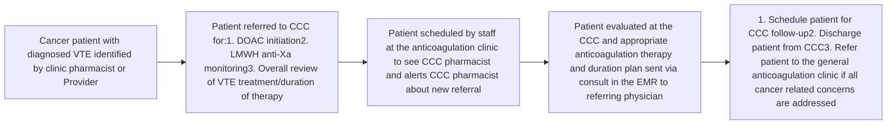

Atrium Health logo

# A Review of Direct Oral Anticoagulant Management Among Cancer Patients and Subsequent Implementation of a Pharmacist-driven Coagulation and Cancer Clinic

Justin R. Arnall, PharmD, BCOP1; Kristyn Y. DiSogra, PharmD, BCOP1; Nicole Cowgill, PharmD, BCOP, CSP, DPLA1; Laura Skaff, PharmD, BCACP, CPP2; Donald C. Moore, PharmD, BCPS, BCOP, DPLA3; Chris Larck, PharmD, BCOP, CPP3; Jai Patel, PharmD, BCOP, CPP4
Atrium Health Specialty Pharmacy Service, Charlotte, NC1, Atrium Health Chronic Care Medication Management, Concord, NC2, Levine Cancer Institute, Concord, NC3, Levine Cancer Institute, Charlotte, NC4

## Background

* Venous thromboembolism (VTE) is the second leading cause of death with increased morbidity and mortality in cancer patients

* Cancer patients are at high risk of VTE due to risk factors related to their individual characteristics, diagnosis, prescribed treatment, and biomarkers/laboratory values

* Cancer patients have risk factors for both bleeding and recurrent thrombosis

* Cancer patients require longer duration of anticoagulation and may qualify for thromboprophylaxis due to the high risk of VTE

* Low molecular weight heparins (LMWH) have been the preferred therapy for treatment of cancer-related VTE

* Since 2018, updated guidelines include consideration of Direct Oral Anticoagulants (DOACs) for VTE treatment and thromboprophylaxis in high-risk cancer patients

## Significance

* Recent literature has shown DOACs to be safe and effective for cancer-related VTE and both LMWH and DOACs are preferred agents over warfarin

* There are several complexities with anticoagulation therapy selection in cancer patients:

    - High recurrence rate

    - Risk of bleeding

    - Transition of care from inpatient admission

    - Drug-disease interactions

    - Drug-drug interactions

    - Organ dysfunction

    - Thrombocytopenia

    - Complex selection of anticoagulant and oncolytic

    - Identification and evaluation of high-risk cancer patients for VTE prophylaxis

* We evaluated 40 cancer patients initiated on DOAC treatment and within 6 months we identified no recurrent thrombotic events and a 2.5% discontinuation rate

* We evaluated thromboprophylaxis in those at highest VTE risk based on tumor type (including pancreatic, stomach, lung, bladder, lymphoma, gynecologic, and genitourinary) and noted that 55% of patients were candidates for thromboprophylaxis with Khorana VTE Risk Score of $\ge 2$, but only 2.5% were initiated on thromboprophylaxis

* Our clinical experience suggests that the broad consideration of DOACs for cancer-related VTE treatment and slow adoption of thromboprophylaxis in practice offers an opportunity for pharmacy services to support this patient population

### Figure 1. Cancer and Coagulation Clinic (CCC) patient referral and clinic workflow

| Referral Statement                                                       | Referral Statement                                                                                                                                                                          |
| ------------------------------------------------------------------------ | ------------------------------------------------------------------------------------------------------------------------------------------------------------------------------------------- |
| Referral Statement                                                       | I am referring this patient for DOAC ("Direct Oral Anticoagulant") monitoring. This includes dosing guideline as approved by The Pharmacy and Therapeutics Committee. / Statement           |
| Appointment Location                                                     | (NAC-CCC) / OTHER                                                                                                                                                                           |
| \*Referring MD                                                           | PROVIDER / OTHER                                                                                                                                                                            |
| Primary MD                                                               | PROVIDER / OTHER                                                                                                                                                                            |
| Primary Care Practice Location                                           | OTHER                                                                                                                                                                                       |
| \*Med Prescribed                                                         | TBD / Apixaban (Eliquis) / Dabigatran (Pradaxa) / Edoxaban (Savaysa) / Rivaroxaban (Xarelto)                                                                                                |
| \*Indication                                                             | Include problem list All Problems (Selected) Bladder cancer / SNOMED CT 1774593018 / Confirmed Pulmonary embolus / SNOMED CT 98484016 / Confirmed / OTHER DIAGNOSIS / OTHER |
| \*Risk for Complications                                                 | Unknown / History of abnormal bleeding or clotting / History of stroke/TIA / History of falls / Alc HAS-BLED Score - bleeding risk: OTHER                                               |
| \*Planned Length of Therapy                                              | 3 months / 6 months / 12 months / Life / OTHER                                                                                                                                              |
| Date Started                                                             | Date / OTHER                                                                                                                                                                                |
| For new VTE as outpatient (only recommended for dabigatran and edoxaban) | Enoxaparin / Fondaparinux / Heparin / OTHER Dose: OTHER                                                                                                                                 |

## Objectives

<u>Goal of subspecialized clinic</u>

* To support the growing complexities of anticoagulation treatment and thromboprophylaxis in cancer patients through the optimization of anticoagulation and oncolytic therapy in cancer patients

## Methods

<u>Establishing an on-site clinic</u>

* We expanded protocols and practice models from our ambulatory care anticoagulation clinic services and telecommunication models from our specialty pharmacy service to provide location and infrastructure for this subspecialized clinic

* Cancer center pharmacy specialists that work with the multidisciplinary team and Hem/Onc providers identify clinic candidates and submit patient referrals

* Hematology/Oncology clinical pharmacists from the specialty pharmacy service work out of the anticoagulation clinic that was previously established (in the building next to the oncology clinic) and staff the clinic one day per week

* For patients who are stable and have had all cancer related concerns addressed by the CCC, a referral from the CCC is submitted to the general anticoagulation clinic for long-term management (same physical location)

## Results

* This unique clinic offers insight into methods of collaboration between common pharmacy groups and practices to support the launch of a novel service (Outpatient anticoagulation / Specialty Pharmacy / Hematology/Oncology)

* This clinic represents the first subspecialized clinic launch completed by our integrated specialty pharmacy service, demonstrating a shift towards a practice-based model and expansion of the integrative care provided by the institution to fulfill an unmet need

* With the recent data on DOAC use in cancer, updated guidelines encouraging thromboprophylaxis in high-risk patients, and the complexity of anticoagulation in malignancy there is opportunity for pharmacists to lead optimized practices

## Conclusions

* Future development plans include developing a periodic screening program to assess cancer patient risk of VTE and to recommend appropriate DOAC thromboprophylaxis for those identified candidates

* May also expand clinic availability to other sites

* Outcomes to be collected will include recurrent VTE, minor/ moderate/ major bleeds, hospitalization, and pharmacist intervention evaluations

**Note Template**:
Mr./Ms.      presents to the CCC clinic for      assessment of her cancer related thrombosis. (Insert other information from patient or noted since last visit here, including adherence, bleeding, hospitalizations, Rx/OTC/herbal med changes, falls, SOB/swelling, cost, upcoming procedures.)

Screenshot of DOAC Anticoag Outpatient Referral Order in EMR

**Measurements and Vitals**:
Wt:     
Ht:     
BMI:      (>40?)
Blood pressure today:     
Last SCr/date:     
Current SCr/date:     
Estimated Creatinine clearance:     
Last H&H/date:     
Current H&H/date:     
AST & ALT/date:     

**Assessment/Plan**:
(Pt stable/not stable; recommend continue therapy or changes; med rec performed; drug interaction assessment performed; fall risk education; education on bleeding precautions and monitoring for s/sx bleeding; recommendations for upcoming procedure if applicable)
Follow up: (Labs and appt)

## Resources

1. Eichinger S. Cancer associated thrombosis: risk factors and outcomes. Thromb Res. 2016 Apr;140 Suppl 1:S12-7.

2. Falanga A, et al. Cancer Tissue Procoagulant Mechanisms and the Hypercoagulable State of Patients with Cancer. Semin Thromb Hemost. 2015 Oct;41(7):756-64.

3. Khorana AA, et al. Development and validation of a predictive model for chemotherapy-associated thrombosis. Blood (2008) 111 (10): 4902-4907.

4. Key NS, et al. Venous Thromboembolism Prophylaxis and Treatment in Patients With Cancer: ASCO Clinical Practice Guideline Update. J Clin Oncol. 2020;38(5):496-520.

5. National Comprehensive Cancer Network clinical practice guidelines in oncology: Cancer-associated venous thromboembolic disease. ver1.2021. Accessed May 6, 2021. www.NCCN.org.

6. Lyman GH, et al. American Society of Hematology 2021 guidelines for management of venous thromboembolism: prevention and treatment in patients with cancer. Blood Adv. 2021;5(4):927-974.

7. Khorana AA, et al. Role of direct oral anticoagulants in the treatment od cancer-associated venous thromboembolism: guidance from the SSC of the ISTH. J Thromb Haemost. 2018;16:1891-4.

## Contact Info

Nicole.Cowgill@atriumhealth.org

## Acknowledgements

* Justin Arnall is a consultant / member of the advisory board and Speaker's bureau for Novo Nordisk and CSL Behring

* Donald Moore is a consultant / member of the advisory board for Oncopeptides

* Jai Patel is a consultant / member of the advisory board for VieCure and has received grant funding/research support from Bristol Myers Squibb

* Nicole Cowgill is a consultant of the advisory board for Novartis

Thank you to the following pharmacy student researchers who helped us evaluate our clinic site and collect data on this clinical care opportunity: Tamia Jones, Susan Ngo, Anna Brown, and Jessica Shue

