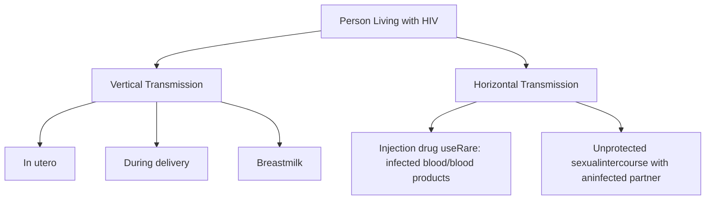

St. Jude Children's Research Hospital logo

# Effects of HIV Mode of Transmission on Medication Adherence in Children and Youth Using a Specialty Pharmacy

Timothy J. Howze, Pharm.D1; Christian J. Phillips, Pharm.D.1; Tiffany M. Nason, Pharm.D.1; Susan D. Carr, Pharm.D.1; Nehali D. Patel M.D.2
Departments of Pharmacy and Pharmaceutical Sciences1 & Infectious Diseases2, St. Jude Children's Research Hospital, Memphis, Tennessee

## BACKGROUND

* Adherence to oral antiretroviral therapy (ART) can be challenging for children and youth living with HIV.

* While demographic factors have been identified as influencing adherence, limited research has explored whether the mode of HIV transmission—vertically versus horizontally—affects adherence outcomes.

### <u>Modes of HIV Transmission</u>

## OBJECTIVE

To evaluate the impact of HIV mode of transmission and use of a specialty pharmacy on adherence to oral ART among patients under 24 years of age.

## METHODS

* A single-center, retrospective analysis was conducted on 38 patients (age 2 - 23 years) living with HIV, spanning the period from July 1, 2019, to July 1, 2021.

* All patients were transitioned to specialty pharmacy services in July 2020.

* Patients were grouped by mode of HIV transmission: vertically acquired (n = 20) and horizontally acquired (n = 18).

* Adherence was assessed using the proportion of days covered (PDC).

* HIV viral load data were obtained from routine laboratory monitoring as part of standard clinical care.

$$ PDC\% = \frac{\text{Total Days Patient Had ART Available}}{\text{Total Number of Days in Study Period}} \times 100 $$

## RESULTS

* Mean PDC increased after enrollment in specialty pharmacy services for both vertically (85.4% vs. 83.4%, P=0.09) and horizontally (78.8% vs. 76.8%, P=0.08) acquired patients.

* Mean viral loads decreased for all patients in the horizontal group with 88.9% having undetectable viral loads (<200 copies/mL) (p<0.001).

* Mean viral loads increased for patients in the vertical group with only 10.0% having undetectable viral load (p<0.001) over the two-year period.

## RESULTS (cont.)

### Mean PDC Pre- and Post- Specialty Pharmacy Enrollment

| Group                 | Pre (%) | Post (%) |
| --------------------- | ------- | -------- |
| Vertically Acquired   | 83.4    | 85.4     |
| Horizontally Acquired | 76.8    | 78.8     |

### Mean Viral Load Pre- and Post- Specialty Pharmacy Enrollment

| Group                 | Pre (copies/mL) | Post (copies/mL) |
| --------------------- | --------------- | ---------------- |
| Vertically Acquired   | 450             | 520              |
| Horizontally Acquired | 190             | 70               |

### Conversion to Undetectable Viral Load After Two-Year Period

| Group                 | Percentage (%) |
| --------------------- | -------------- |
| Vertically Acquired   | 10.0           |
| Horizontally Acquired | 88.9           |

## CONCLUSIONS

* Children and youth living with HIV may adhere better to ART when using a specialty pharmacy compared to a traditional outpatient pharmacy.

* The higher viral loads observed in patients with vertically acquired HIV, despite higher adherence, may suggest more complex treatment challenges in this population, potentially due to earlier ART exposure or other clinical factors.

