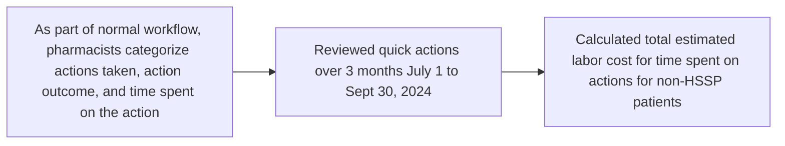

# QUANTIFYING HEALTH-SYSTEM SPECIALTY PHARMACISTS’ INTERVENTIONS FOR PATIENTS UTILIZING EXTERNAL PHARMACIES
QR Code VANDERBILT UNIVERSITY MEDICAL CENTER logo
**Total Cost > $3.25 Million**

Laura Petry, PharmD, CSP; Kristen Whelchel, PharmD, CSP; Amy Mitchell, PharmD, CSP; Ryan Moore, MS; Autumn Zuckerman, PharmD, BCPS, CSP

## CONCLUSIONS

* Health system specialty pharmacy (HSSP) pharmacists frequently assist non-HSSP patients to promote continuity of care and safe medication use

* An inability for the HSSP to dispense specialty medication results in significant uncompensated (> $3.25 million) workload for HSSPs

## BACKGROUND & PURPOSE

* Pharmacists at HSSPs are crucial in the complex coordination needed to ensure that patients receive their specialty medication safely and quickly.

* The purpose of this study was to quantify the time, intervention type, and labor costs related to HSSP pharmacists’ documented actions performed as part of clinical care for non-HSSP patients.

## METHODS

| Setting  | Academic medical center and health system specialty pharmacy (Vanderbilt Specialty Pharmacy)                                                                                                                       |
| -------- | ------------------------------------------------------------------------------------------------------------------------------------------------------------------------------------------------------------------ |
| Sample   | Patients not filling a prescription with the HSSP who had at least one “quick action” documented by HSSP pharmacists using a flowsheet in the electronic health record                                             |
| Outcomes | Descriptive analysis were performed to describe the number, type, and pharmacist time spent on actions taken on non-HSSP patients. Labor costs were calculated using an hourly rate including fringe of $71.43 |

EHR, electronic health record

## RESULTS

### Figure 1: Quick Action Categories Selected

| Category                        | Number of Quick Actions | Percentage |
| ------------------------------- | ----------------------- | ---------- |
| Med Review & Care Coordination  | 1945                    | 79%        |
| REMS                            | 300                     | 12%        |
| External Pharmacy Communication | 270                     | 11%        |
| Sample Management               | 30                      | 1%         |

REMS, risk evaluation and mitigation strategies

\*Multiple quick action categories could be selected per quick action; therefore, the quick actions total does not equal the number of quick action categories

### Table 1: Quick Actions Types Completed

| Category                                  | Subcategory                                 | Number |
| ----------------------------------------- | ------------------------------------------- | ------ |
| Medication Monitoring & Care Coordination | Med access coordination                     | 1063   |
|                                           | Therapy monitoring- intervention            | 375    |
|                                           | Rx Prep                                     | 282    |
|                                           | Clinic communication - intervention         | 220    |
|                                           | Counseling provided                         | 183    |
|                                           | Therapy monitoring - no intervention needed | 101    |
|                                           | Ancillary med education                     | 96     |
|                                           | Lab/Imaging coordination                    | 63     |
|                                           | Clinic communication - no intervention      | 57     |
|                                           | Appointment coordination                    | 34     |
|                                           | None selected                               | 9      |
|                                           | Counseling declined                         | 7      |
| External Pharmacy Communication           | Access issue                                | 142    |
|                                           | RX confirmation                             | 103    |
|                                           | Clinical info provided                      | 61     |
|                                           | RX transfer                                 | 9      |
|                                           | None selected                               | 1      |
| REMS Management                           | REMS Refill                                 | 279    |
|                                           | REMS Enrollment                             | 17     |
|                                           | External pharmacy communication             | 12     |
|                                           | REMS RX Triage                              | 7      |
| Sample Management                         | Sample Management                           | 17     |
|                                           | Rep Meeting                                 | 14     |
|                                           | None selected                               | 1      |
|                                           | Sample Inventory                            | 1      |

### Most Common Clinical Areas

| Clinic              | Number of Quick Actions |
| ------------------- | ----------------------- |
| Oncology/Hematology | 432                     |
| PAH/ILD\*           | 308                     |
| Neurology           | 285                     |
| IBD                 | 208                     |
| Pediatrics          | 202                     |
| Rheumatology        | 199                     |

\*PAH, pulmonary Arterial Hypertension; ILD, interstitial lung disease; IBD, inflammatory bowel disease

### Time Spent

**45,607**
**Total Hours Spent**

**Median Time / Quick Action**
**15 minutes (IQR 10-20)**

**Time / Quick Action Range**
**1-240 minutes**

IQR, interquartile range

### Costs

**$3,257,708**
**Total Pharmacists’ Labor Costs**

NASP 2025 logo

