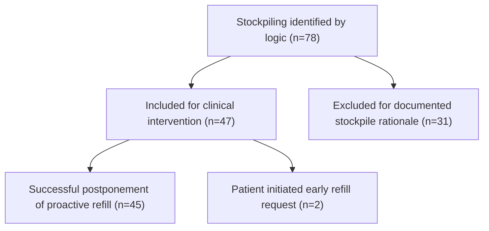

# Specialty Pharmacy-Driven Stockpiling Reduction Program Outcomes and Savings

William Trombatt, PharmD, CSP1; Rachel K. Anderson, PharmD, CSP1; John Koshan, RPh1; Cara Piaggesi, PharmD, CSP1
1Walgreen Co.

Walgreens logo

## BACKGROUND

Medication stockpiling refers to the practice of accumulating and storing a larger-than-necessary supply of medication(s) for future use.1 Patients may intentionally stockpile medication for many reasons including emergency preparedness, concerns about drug shortages, anticipated benefit changes, potential refill delays, or future financial concerns.1,2 Unintentional stockpiling can occur from proactive refill processes completed at the pharmacy.1 Refill-too-soon alert messages are often incorporated by payors and regulatory bodies to prevent early refills of certain medications.1 Most Pharmacy Benefit Managers (PBMs) utilize a refill-too-soon rejection, where a claim will not adjudicate until 75% of a prior dispense has been used.1 This equates to a dispense occurring with no more than 7 days remaining from a previous month's supply. However, this type of reject is not cumulative for all PBMs allowing a dispense 7 days early at each refill. If a patient refilled 7 days early every month, after a 6-month period, the patient would have a surplus of 42 days of medication on hand. Excess accumulation of medication(s) could have a harmful effect on individual patients, as well as the healthcare system as a whole, often resulting in potential waste and unnecessary costs.1-4 Successful interventions may deliver immediate, direct transactional savings for payors while reducing potential waste as well as provide data to support opportunities for modifications to utilization management strategies, including potential cumulative quantity level limit policies.1-4

## OBJECTIVE

To evaluate an existing stockpiling prevention program conducted by a specialty pharmacy including the potential cost avoidance.

## METHODS

Computational logic was employed to identify patients who might have accumulated an excess amount of medication between January 1, 2024 and December 31, 2024, for 12 select specialty medications. Cases were identified based on the previous 12 months of dispenses from the specialty pharmacy's central fill locations filled under a specified payor. A centralized specialty pharmacy model consolidates the distribution and management of high-cost, complex medications—often for chronic or rare conditions—into a limited number of strategically located hubs, equipped with advanced clinical expertise, cold-chain storage, and personalized patient support services. The 12 medications targeted for inclusion were the top 12 high-cost medications currently dispensed by the specialty pharmacy and filled under the specific payor (Table 1). The success of the program will determine if additional medications are included in the future.

A clinical pharmacist reviewed each patient's electronic medical record (EMR) to identify specific justifications, such as a dose change or a lost prescription, to account for the current quantity of medication on hand. Patients with valid explanations were excluded from the intervention. For those patients determined to have at least 28 days of potential excess medication, regardless of days' supply or number of dispenses, the specialty pharmacy's proactive refill process was postponed until approximately only two weeks' worth of the on-hand prescription was remaining based on data documented in the EMR. The proactive refill process ensures on-time refills but requires patient interaction prior to dispenses. This adjustment did not prevent any patients from requesting a refill. The specialty pharmacy collaborated with the payor to track and quantify these interventions.

The number of days saved and projected cost savings was calculated by determining the difference between the original proactive refill date, actual refill date, and the cost of the medication covering that timeframe. Essentially, savings were assessed based on both the cost of the medication per dose and the number of doses saved. These successful interventions provided immediate, direct transactional savings for the payor while reducing potential waste and provided data to support opportunities for modifications to utilization management strategies, including potential cumulative quantity limit policies.

## METHODS (CONTINUED)

### Table 1. Included Specialty Medications

| cabozantinib                     | ivacaftor            | tetrabenazine        |
| -------------------------------- | -------------------- | -------------------- |
| elexacaftor/tezacaftor/ivacaftor | lumacaftor/ivacaftor | tezacaftor/ivacaftor |
| eliglustat                       | ruxolitinib          | tolvaptan            |
| eltrombopag                      | tasimelteon          | vigabatrin           |

## RESULTS

Figure 1 illustrates the case inclusion process from identification to outcomes:

* 78 patients were identified as having a potential prescription surplus.

* 31 patients were excluded based on EMR documentation explaining quantities on hand. The majority of excluded patients were due to receiving new prescriptions with a change in dose or other exceptions not identified by the computational logic.

* 47 patients had their proactive refill process deferred. Of these patients, 2 contacted the pharmacy and self-requested early refills.

* 45 patients successfully had their proactive refill process and subsequent refill postponed.

### Figure 1. Case Inclusion Process

* Of the 12 medications included for monitoring, 5 were associated with successful interventions, while the other 7 medications did not have any cases that met criteria for the opportunity for intervention (Table 2).

### Table 2. Successful Interventions, Days Saved, and Savings Outcomes

| Medication                       | Interventions | Total Days Saved | Average Days Saved | Total Savings | Average Savings |
| -------------------------------- | ------------- | ---------------- | ------------------ | ------------- | --------------- |
| ruxolitinib                      | 5             | 97               | 19.4               | $32,902       | $6,580          |
| tolvaptan                        | 18            | 278              | 15.4               | $190,017      | $10,557         |
| ivacaftor                        | 1             | 12               | 12.0               | $11,076       | $11,076         |
| eltrombopag                      | 2             | 41               | 20.5               | $13,227       | $6,614          |
| elexacaftor/tezacaftor/ivacaftor | 19            | 368              | 19.4               | $342,855      | $18,045         |
| **Total**                        | **45**        | **796**          | **17.7**           | **$590,077**  | **$13,113**     |

* Proactive refills were subsequently rescheduled an average of 17.7 days into the future, reducing the potential for waste by over $590,000.

* Interventions reduced unnecessary spend by a total of 796 days, equating to over 2 patient-years' worth of medication.

## RESULTS (CONTINUED)

* Elexacaftor/tezacaftor/ivacaftor and tolvaptan represented the highest number of opportunities for intervention, making up 82.2% of all interventions. Compared to the other products, the pharmacy dispensed a much higher volume of elexacaftor/tezacaftor/ivacaftor and tolvaptan, which may explain the increased number of opportunities for those 2 products. The higher rate of intervention for those cases aligned with the number of total dispenses for the pharmacy.

* The 45 interventions made represent an average decrease of 4.5% of medication dispensed annually, which would equate to a reduction of potential unnecessary spend of the same amount. Eltrombopag interventions saved 20.5 days, or 5.6% of medication dispensed annually, the highest among medications included in the study.

* Savings per intervention averaged $13,113. The highest amount of average savings per intervention was elexacaftor/tezacaftor/ivacaftor at $18,045 per intervention, followed by ivacaftor at $11,076 per intervention and tolvaptan at $10,557 per intervention.

## CONCLUSIONS

Proactive refill processes are designed to help patients maintain consistent access to their medications, reducing the likelihood of missed doses and interruptions in treatment. By prompting timely refills, these systems support adherence, reduce the burden on patients or caregivers to remember to reorder medications, and ultimately promote better health outcomes. However, it is important to balance convenience with necessity. Unnecessary refills may lead to increased medication costs for patients and payors. Stockpiling medications may not only lead to waste, but also poses potential safety risks, such as accidental misuse or consumption of expired drugs. While proactive refill systems offer a number of clear benefits, they must be managed thoughtfully to avoid unintended financial and clinical consequences. Specialty pharmacies are uniquely poised to implement and maintain stockpiling reduction programs due to their close monitoring of complex therapies and individualized patient care. Through proactive communication, clinical oversight, and refill coordination, specialty pharmacies help reduce medication waste and control overall healthcare costs while ensuring patients receive the medications they need – when they need them.

This initiative was designed to ensure the most safe, effective, and proper use of specialty prescription medications by monitoring utilization patterns and attempting to intervene when appropriate. Specialty pharmacies are uniquely positioned to provide individualized patient care, and the objective of this stockpiling prevention program was not only met but exceeded expectations by carefully coordinating refills with patients and supplying the payor with significant cost-avoidance savings. In some cases, patients also recognized savings by eliminating unnecessary copays. Although proactive refill processes may be beneficial to patients, they can inadvertently contribute to medication stockpiling. Balancing these processes with measures to prevent amassing medication is critical for reducing potential waste and overall healthcare costs and this study demonstrates evidence as such.

## REFERENCES

1. Taking stock of medication wastage: Unused medications in US households - Scientific Figure on ResearchGate. Available from: https://www.researchgate.net/figure/Estimated-cost-of-unused-prescription-medications-in-US-population_tbl2_269413755 [accessed 25 Jun 2025]

2. Mhsa JZR. Contributor: Medication adherence is not a Zero-Sum game. AJMC.

https://www.ajmc.com/view/contributor-medication-adherence-is-not-a-zero-sum-game. Published April 4, 2022. [accessed 25 Jun 2025]

3. jbaldera@amcp.org. Medication Stockpiling | AMCP.org. www.amcp.org. Published July 18, 2019. https://www.amcp.org/concepts-managed-care-pharmacy/medication-stockpiling

4. Law AV, Sakharkar P, Zargarzadeh A, et al. Taking stock of medication wastage: Unused medications in US households. Research in Social and Administrative Pharmacy. 2014;11(4):571-578. doi:10.1016/j.sapharm.2014.10.003

3880531 ©2025 Walgreen Co. All rights reserved.

