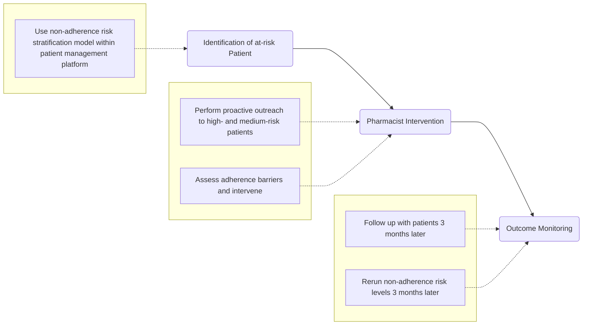
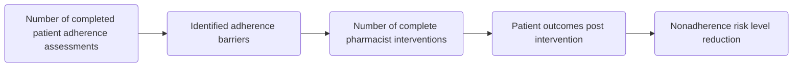

# Identifying and addressing nonadherence risk with a technology-supported pharmacist-led risk stratification process at a health-system specialty pharmacy

cps logo

Lily Duong, PharmD; Courtney Smith, PharmD; Abbas Dewji, PharmD; Joshua Bastian, MBA; Andrew Wash, PharmD; Casey Fitzpatrick, PharmD; James Steigerwalt, PharmD

## Background

* Health-system specialty pharmacy (HSSP) teams within specialty clinics are often responsible for providing care to high-volume patient populations.1-3

* Leveraging technology platforms and utilizing risk stratification models can allow HSSP teams to focus their time on supporting rheumatoid arthritis (RA) patients at risk of nonadherence.1-3

## Objective

To describe a technology-supported risk stratification model utilized by HSSP teams in providing targeted adherence support to patients with RA at risk of nonadherence, and to observe adherence risk barriers and outcomes.

## Methods

### Study Design

This prospective pilot study was conducted at Penn State Health Specialty Pharmacy from May 2024 to February 2025. A risk stratification model built into TherigySTM® patient management platform was used to identify and classify enrolled RA patients in specialty services as low, medium, or high risk of nonadherence.

### Study Protocols

### Endpoints

## Results

Table 1: High-Risk & Medium-Risk Patient Demographics

| Patient Cohort   | N=34 |
| ---------------- | ---- |
| Mean age (years) | 54.5 |
| Female           | 76%  |
| Male             | 24%  |

Figure 1: Changes in Nonadherence Risk After 3 Months

| START RISK      | END RISK                    |
| --------------- | --------------------------- |
| HIGH N=33 (97%) | HIGH N=9 (26%)              |
|                 | MED N=7 (21%)               |
|                 | LOW N=12 (35%)              |
|                 | LOST TO FOLLOW UP N=6 (18%) |
| MED N=1 (3%)    | MED N=1 (3%)                |

Figure 2: Identified Problems in High-Risk & Medium-Risk Patients

Proactive patient outreach by pharmacists provides targeted adherence support to patients with RA at risk of nonadherence.

| Category              | Percentage |
| --------------------- | ---------- |
| NONADHERENCE          | 33         |
| MEDICATION MONITORING | 14         |
| UNDER TREATMENT       | 10         |
| STRAIN                | 5          |
| TRANSPORTATION        | 38         |
| SUB-OPTIMAL REGIMEN   |            |

## Results Cont.

Figure 3: Nonadherence Management Outcomes

| Metric                                                                                               | Value |
| ---------------------------------------------------------------------------------------------------- | ----- |
| Patients who encountered adherence issues and connected with pharmacist for clinical interventions   | 56%   |
| Patients who reported adherence problems and resolved them three months post-pharmacist intervention | 80%   |
| Patients experienced a reduction in nonadherence risk level                                          | 59%   |
| - 24% of patients had a reduction of one risk level                                                  |       |
| - 35% of patients had a reduction of two risk levels                                                 |       |

## Discussion & Conclusion

* The technology-driven process for identifying patients at risk of nonadherence plays an important role in supporting pharmacists in triaging, assessing, and addressing barriers.

* The proactive pharmacist interventions for patients most at risk provided adherence support for specialty patients by reducing nonadherence risks and mitigating barriers.

* By providing tailored recommendations based on patient-specific factors, pharmacists can play a significant role in addressing and preventing nonadherence in RA patients, potentially before adherence drops significantly.

## Next Steps

* This model and process could benefit patients with other chronic conditions, including those receiving treatment for dermatologic conditions, inflammatory bowel diseases, or other inflammatory arthritis conditions.

## References

1 Maguire J. Specialty pharmacy workflow operations: technological considerations overview. Specialty Pharmacy Times. October 10, 2012;3(5). <u>https://www.pharmacytimes.com/view/specialty-pharmacy-work-flow-operations-technological-considerations-overview</u>

2 Kim J, Combs K, Downs J, Tillman F. Medication adherence: the elephant in the room. US Pharm. 2018;43(1)30-34.

3 Oshotse C, Zullig LL, Bosworth HB, Tu P, Lin C. Self-efficacy and adherence behaviors in rheumatoid arthritis patients. Prev Chronic Dis. 2018;15:e127. doi: 10.5888/pcd15.180218

