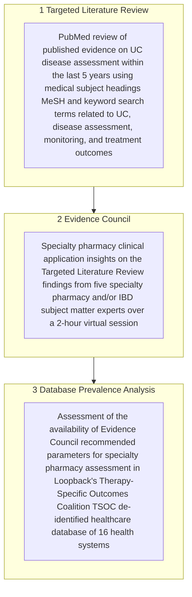

# Identification of a Feasible, Evidence-Based Approach to Ulcerative Colitis Disease Assessment by Specialty Pharmacies

OPR40-OR

Megan Rees,1 Samantha Mehta,2 Michael Gannon,1 Samuel Konstanty,1 Jason Lynn2
1Loopback Analytics, Dallas, TX, USA; 2Pfizer Medical Affairs, New York, NY, USA

## Introduction

* Ulcerative colitis (UC) is an inflammatory bowel disease (IBD) of the colon characterized by bloody diarrhea and abdominal pain1

* Treat-to-target recommendations provide a clinical framework to assess treatment goals by using patient-reported outcomes (PROs) and objective markers to monitor therapeutic response, guide treatment decisions, and promote shared decision making2–4

* Specialty pharmacies play a crucial role in managing UC by assessing disease activity through PROs that may be used to inform short-, intermediate-, and long-term treatment targets

* A standardized approach to UC disease assessment has not been widely adopted in clinical practice

## Objective

* This project aimed to identify and align on evidence-based clinical parameters for use by specialty pharmacies when assessing patients with UC, and to evaluate their real-world application

## Methods

* The project comprised three sequential phases (Figure 1)

### Figure 1. Project methodology overview

## Abbreviations

IBD, inflammatory bowel disease; MeSH, medical subject headings; PRO, patient-reported outcome; PRO2, patient-reported outcomes 2; TSOC, Therapy-Specific Outcomes Coalition; UC, ulcerative colitis.

## Results

### Targeted Literature Review

* Of 296 articles identified, 39 were included, comprising 18 clinical trials, 6 systematic reviews, 9 meta-analyses, and 6 review articles

* Mayo score and its variations were the most reported disease activity tools (n=33) to assess clinical response and remission

* Biomarkers, including fecal calprotectin and C-reactive protein, were each reported in 13 publications

* There was consensus in using Mayo endoscopic subscore to assess endoscopic improvement or healing (n=28)

* The IBD questionnaire was the most reported quality of life assessment (n=9)

### Evidence Council

* The Evidence Council agreed that standardizing disease assessments and implementing treat-to-target strategies should be a priority for clinical practice sites; see Figure 2 for a summary of the key takeaways

### Figure 2. Summary of Evidence Council key takeaways

1. There is **significant variability** in UC disease assessment tools used in clinical practice, most notably for **disease activity, PROs, and quality of life**
2. Current specialty pharmacy UC disease assessments are mostly **subjective and symptom-based**
3. Standardizing the use of simple UC disease assessment tools across clinical practice sites could lead to more **consistent and objective patient assessments, improved treatment monitoring, and better collaboration** among providers
4. Real-world **barriers to standardization** include provider education, patient responsiveness, and ease of implementation into electronic health record systems
5. **Easy-to-use platforms** such as a **clinical dashboard** are recommended to standardize tracking of disease activity and to incorporate treat-to-target strategies
6. Evidence Council members **recommend incorporating** the following parameters into the specialty pharmacy clinical dashboard to facilitate assessment of UC disease activity:a
    * **Modified Mayo score, patient-reported outcomes 2 (PRO2), and their rectal bleeding and stool frequency components**
    * **Fecal calprotectin and C-reactive protein**
    * **Healthcare resource utilization and steroid use**

Evidence Council participants were chosen based on their IBD/gastroenterology clinical expertise and backgrounds through Loopback’s network of health system specialty pharmacies.
aAssessment parameters were selected if ⩾3 Evidence Council members responded that the outcome should be included as part of the clinical dashboard to facilitate the assessment of disease activity and severity in patients with UC.

## Database Prevalence Analysis

* A total of 62,097 patients with UC were identified in the database

* Among parameters recommended by the Evidence Council, prevalence was highest for rectal bleeding (73%) and lowest for modified Mayo score (1%) (Figure 3)

* Disease assessment reporting was inconsistent between the 16 health systems (Figure 4)

### Figure 3. Prevalence of disease assessment parameters recommended by the Evidence Council among patients with UC in the TSOC database

| Parameter                    | Patients (%) |
| ---------------------------- | ------------ |
| Modified Mayo scorea         | 1            |
| PRO2 scorea                  | 12           |
| Stool frequency              | 20           |
| Rectal bleeding              | 73           |
| Fecal calprotectinb          | 21           |
| C-reactive protein           | 46           |
| Inpatient visits             | 30           |
| Emergency department visitsb | 36           |
| Inpatient steroid use        | 17           |
| Outpatient steroid use       | 33           |

aPresent or calculated.
bOne client was excluded due to absence of data availability.

Loopback’s TSOC data were extracted from electronic health records and pharmacy dispensing software, encompassing inpatient/outpatient clinical notes, laboratory results, and medication administrations, orders, and fills (as of January 3, 2025). Patients with UC were identified if they had any inpatient or outpatient encounter with a primary diagnosis code of K51. Disease assessments (modified Mayo score, PRO2, stool frequency, and rectal bleeding) were extracted from clinical notes using regular expressions for complex string-matching queries that searched for specific text patterns.

### Figure 4. Patients with available UC disease assessment parameter data across 16 health systems in the TSOC database

| Parameter                    | Average | Range (min–max) |
| ---------------------------- | ------- | --------------- |
| Modified Mayo scorea         | 4%      | (0–4%)          |
| PRO2 scorea                  | 35%     | (2–37%)         |
| Stool frequency              | 52%     | (2–55%)         |
| Rectal bleeding              | 84%     | (6–90%)         |
| Fecal calprotectinb          | 43%     | (8–51%)         |
| C-reactive protein           | 64%     | (5–68%)         |
| Inpatient visits             | 27%     | (15–42%)        |
| Emergency department visitsb | 51%     | (13–64%)        |
| Inpatient steroid use        | 29%     | (1–30%)         |
| Outpatient steroid use       | 28%     | (21–49%)        |

aPresent or calculated.
bOne client was excluded due to absence of data availability.

## Limitations

* Parameter data may be limited due to challenges in extracting PROs from clinical notes and the incomplete capture of external laboratory tests and/or procedures

* Evidence Council participant views may not be representative of all health systems and specialty pharmacy settings

## Conclusions

* This project highlights a need for standardizing UC disease activity assessments to enable specialty pharmacy practices to engage patients and address existing practice gaps

* Evidence-based approaches for UC disease assessment and treat-to-target are available, but are not being followed in clinical practice, limiting outcome analyses

* Specialty pharmacies have an important role in collecting PRO and quality of life data that are necessary to inform treatment decisions

* There is an opportunity for specialty pharmacies to align on disease-specific parameters to streamline UC patient management, facilitate population health approaches, and ultimately improve patient outcomes

## Electronic poster
https://scientificpubs.congressposter.com/p/hfy1q7dsh9vlbr4m
QR code

## References

1. Magro F et al. J Crohns Colitis 2017; 11: 649–670.
2. Turner D et al. Gastroenterology 2021; 160: 1570–1583.
3. Rubin DT et al. Am J Gastroenterol 2025; 120: 1187–1224.
4. Singh S et al. Gastroenterology 2024; 167: 1307–1343.
5. DeTora LM et al. Ann Intern Med 2022; 175: 1298–1304.

## Acknowledgments

This study was sponsored by Pfizer. Medical writing support, under the direction of the authors, was provided by Niall Tyrer, MBiolSci, CMC Connect, a division of IPG Health Medical Communications, and was funded by Pfizer, New York, NY, USA, in accordance with Good Publication Practice (GPP 2022) guidelines.5 During the preparation of this work, the authors used Pfizer’s generative artificial intelligence tool MAIA to assist with writing the poster first draft. After using this tool, the authors reviewed and edited the content as needed and take full responsibility for the content of the publication.

## Disclosure of interests

MR, MG, and SK have nothing to disclose. SM and JL are employees and shareholders of Pfizer Inc.

Poster presented at the National Association of Specialty Pharmacy 2025 Annual Meeting; September 14–17, 2025; Denver, CO, USA

