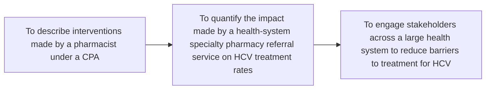
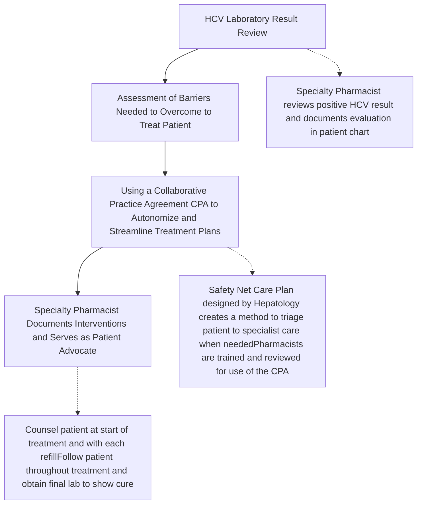

Cleveland Clinic logo

# Impact of a Health System Specialty Pharmacy Cascade of Care Referral Service for People Living with Hepatitis C

The investigators declare no conflicts of interest

Erika Harrington, RPH1, Chanda Mullen, PhD1, Kristel Geyer Pharm.D., BCOP, BCPS1

1Specialty Pharmacy, Cleveland Clinic

<u>Contact information:</u>
<u>Erika Harrington, RPH</u>
<u>9500 Euclid Ave. Cleveland, OH, 44195</u>
<u>Email: harrine3@ccf.org</u>

1

## Background

* Approximately 50 million people have chronic hepatitis C (HCV), with 1 million new infections occurring annually. Ohio has an estimated 89,000 people living with chronic HCV, which is likely underreported due to lack of awareness to screen.1

* Access to direct-acting medications (DAAs) remains low due to a multitude of barriers. Patient navigation programs run by a specialty pharmacy team improves access.2

* An evaluation of the current model of care for patients who test positive for HCV found that system and patient barriers prevented patients from getting treatment. Specialty pharmacists obtained a collaborative practice agreement (CPA), created an HCV Ambulatory service and gathered stakeholders to address each barrier.3

## Objectives

## Methods

**Study Design**: This was an observational quality improvement project of the impact of a Health System Specialty Pharmacy Cascade of Care Referral Service on HCV treatment rates between 10/1/2024 – 3/31/2025

**Data**: Data included patient demographics, prevalence of HCV infection, medication data, types of barriers removed, and ultimately treatment rate

**Patient Tracking**: Enrollment into a patient management system with the electronic chart system served to track patients eligible for HCV treatment and the barriers that were identified and attempts to remove those barriers. Patients were tracked starting with positive test result, throughout HCV treatment and until final documentation of cure

**Population**: This analysis included patients who had engaged in care at a Cleveland Clinic facility and had a blood test which was positive for Hepatitis C virus

## Definitions

### Specialty Pharmacy Workflow

### Barriers to Treatment

* Lack of awareness of HCV program
* Not connected to care (no primary care provider)
* Lack of access to a specialist
* Transportation
* Psychosocial
* Substance Use Disorder (SUD) or Alcohol Use Disorder (AUD)
* Cost or lack of insurance
* Copay assistance availability and eligibility
* Patient assistance availability and eligibility
* Low health literacy
* Patient lack of follow up with ordered testing or follow up visits

## Results

### Table 1. HCV Ambulatory Service Referrals

| Support Programs                                                        | n=1860    |
| ----------------------------------------------------------------------- | --------- |
| Unable to facilitate treatment (ineligible)                             | 613 (33%) |
| Pharmacist managed treatment via CPA                                    | 472 (25%) |
| Specialist provider prescribed and sent prescription to pharmacy        | 402 (22%) |
| Specialist provider managed / pharmacist intervention (barrier to care) | 373 (20%) |

### New Enrollments (Total = 1283)
Between 10/1/2024 and 3/31/2025 by month

| Month    | Enrollments |
| -------- | ----------- |
| Oct 2024 | 205         |
| Nov 2024 | 177         |
| Dec 2024 | 236         |
| Jan 2025 | 288         |
| Feb 2025 | 156         |
| Mar 2025 | 221         |

Description: Newly enrolled patients during the time period in respective support program. This report accounts for any duplicates from switching support programs (for example a patient starts in Bucket 2 but then switches to Bucket 4 this report only counts them ONCE).

### Total CPA Referrals Received (10/1/2024 – 3/31/2025)
**289**

### Overall Number of HCV Prescriptions Received
**31% increase**

| Q4 2023 – Q1 2024 | Q4 2024 – Q1 2025 |
| ----------------- | ----------------- |
| 305               | 399               |

### Overall Number of HCV Prescriptions Filled
**61% increase**

| \[tsv]            |                   |
| ----------------- | ----------------- |
| Q4 2023 – Q1 2024 | Q4 2024 – Q1 2025 |
| 374               | 602               |

## Results

### End of Treatment Testing

* 97% (125/128) patients successfully completed the cascade of care model

## Observations

* Care was taken to create a program that was sustainable
* HCV champions represented many sub-specialties
* Use of the referral service by specialists accounted for a large number of referrals
* Creation of the referral service led to additional care models within specialty pharmacy
* Active substance users need to commit to a treatment plan before starting
* Use of the CPA by trained specialty pharmacists took time to implement

## Conclusions

* Patients reviewed through the cascade of care referral model had high treatment rates

* The health-system specialty pharmacy experienced an increase in volume because of the referral service

* Specialty pharmacy services provided to patients can help to remove barriers to treatment and create easier access to care

## References

1. Mathews, P. C., Geretti, A. M., Goulder, P. J., & Klenerman, P. (2014). Epidemiology and impact of HIV coinfection with hepatitis B and hepatitis C viruses in Sub-Saharan Africa. *Journal of Clinical Virology, 61*(1), 20–33.
2. American Association for the Study of Liver Diseases. (2019). Practice guidelines. Updated December 2019. Retrieved July 11, 2025, from https://www.aasld.org/practice-guidelines
3. Fanizza, F. A., Loucks, J., Berni, A., Shah, M., Grauer, D., & Daniel, S. (2022). Patient access to hepatitis C treatment after incorporation of pharmacists in a hepatology clinic. *Hospital Pharmacy, 57*(3), 370–376. https://doi.org/10.1177/00185787211037540

