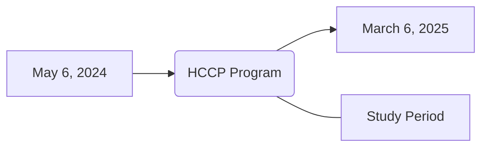
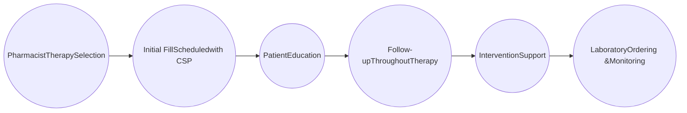
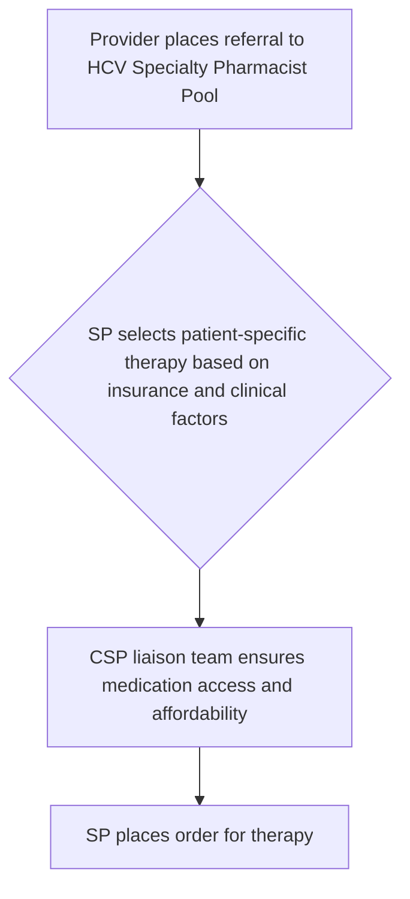

# Streamlining Hepatitis C Treatment: Implementation of a Specialty Pharmacist-Driven Clinical Program

CHRISTUS Health logo

Alexandra Ritenour, PharmD, CSP | Kiersi Harmon, PharmD, CSP

CHRISTUS Specialty Pharmacy – Tyler, Texas

## Background

**Chronic Hepatitis C (HCV) Diagnosis & Treatment**

* HCV impacts over 3.9 million people in the United States1

* Of the 50% of patients diagnosed and aware of their HCV infection, only 17% of patients have been prescribed HCV treatment2

* Direct-acting antiviral (DAA) agents are highly effective in treating chronic HCV, achieving a treatment response rate above 90%, even in patients with previous treatment failures3

**Pre-treatment Evaluation**

| Operational factors | Clinical factors |
| ------------------- | ---------------- |

* Clinical review of HCV treatment appropriateness, therapy selection, drug-drug interactions (DDIs) and navigation of medication access is a time-consuming process4

**Specialty Pharmacist (SP) Place in Care & Gap in Knowledge**

* SP may be the ideal provider to bridge gaps in HCV care through reducing time to therapy, selecting therapy, and insurance formulary and cost assistance navigation

* SP are often integrated within a specialty clinic as a member of the healthcare provider team

* Clinical benefits of SP in the HCV therapy selection process has been shown; however, impact on operational benefits and specifics on a SP workflow processes is limited2,5

## Objectives

This study aims to quantify and categorize SP-driven enrollments in a Hepatitis C Clinical Program (HCCP) and assess its impact on patient safety, operational, and clinical outcomes.

## Methods

**Study Design**

This retrospective descriptive study aimed to summarize patient characteristics and clinical, operational, and safety outcomes among patients enrolled in the Hepatitis C Clinical Program (HCCP) within CHRISTUS Gastroenterology Clinics or filling HCV prescriptions at CHRISTUS Specialty Pharmacy (CSP).

**Inclusion Criteria:**

1. Adults with diagnosis of chronic HCV (ICD-10 code, B18.2)

2. Dual or triple all-oral DAA treatment prescribed from a CHRISTUS Gastroenterology clinic or filled at the CSP

**Exclusion Criteria:** Did not initiate HCV therapy following referral

## Results

### Hepatitis C Clinical Program

Figure 1

Figure 2

### Patient Characteristics at Time of Enrollment

* 122 patients enrolled **122** patients enrolled
* 90% HCV Treatment Naive **90%** HCV Treatment Naive
* 79% Non-Cirrhotic **79%** Non-Cirrhotic
* 66% Medicare **66%** Medicare

Table 1

| HCV Therapy   | N (%)   |
| ------------- | ------- |
| SOF/VEL       | 65 (53) |
| G/P           | 45 (37) |
| SOF/VEL/VOX   | 9 (7)   |
| SOF/VEL + RBV | 2 (2)   |
| G/P + RBV     | 1 (1)   |

### Operational Outcomes

Figure 4. Time-to-Treatment (TTT)

| Days | Patient count (n) |
| ---- | ----------------- |
| 1    | 55                |
| 2    | 18                |
| 3    | 13                |
| 4    | 6                 |
| 5    | 5                 |
| 6    | 3                 |
| 7    | 2                 |
| 8    | 1                 |
| 9    | 1                 |
| 10   | 1                 |
| 11   | 1                 |
| 12   | 1                 |
| 13   | 1                 |
| 14   | 1                 |
| 15   | 1                 |
| 16+  | 12                |

**76%** patients had a TTT of 4 days or less

**88%** HSSP Capture Rate

### Clinical Outcomes

Table 2

| DDI                    | N  |
| ---------------------- | -- |
| Statins                | 39 |
| Proton Pump Inhibitors | 28 |
| Antipsychotics         | 2  |
| Cardiac-related        | 6  |
| Other                  | 8  |

57% Required DDI Resolution by SP **57%** Required DDI Resolution by SP

51% **51%** DDIs Required External Provider Involvement for Resolution

Figure 3. Intervention Type

| Intervention Type     | Percentage |
| --------------------- | ---------- |
| Adherence Counseling  | 44         |
| Side Effect Education | 28         |
| Lab Assistance        | 23         |
| New DDIs              | 5          |

**92%** On-Time Therapy Completion

**31%** Required SP Interventions During Therapy

**97%** Achieved SVR12

**Figure 1.** Overall HCCP Workflow **Figure 2.** Therapy selection process built in electronic health record (EPIC). Once SP places order for therapy, provider and nursing team are automatically alerted of order. **Table 1.** HCV Therapy distribution; SOF: sofosbuvir, VEL: velpatasvir, G/P: glecaprevir/pibrentasvir, VOX: voxilaprevir, RBV: ribavirin. **Table 2.** Distribution of DDIs with HCV therapy. **Figure 3.** SP Interventions by type. **Figure 4.** TTT defined as the difference in time between the referral placed to the HCV Specialty Pharmacist pool to time of SP placing therapy order.

## Conclusions

* This study highlights the role of the SP in HCV care and their large impact on patient safety, clinical and operational outcomes.

* Results support further development of SP-driven practice changes and support the implementation of a similar program within other HSSPs.

## Disclosures

The authors of this presentation have nothing to disclose concerning possible financial or personal relationships with commercial entities that may have a direct or indirect interest in the subject matter of this presentation.

## References

1. Hall E, Bradley H, Barker LK, et al. Estimating hepatitis C prevalence in the United States. *Hepatology* 2025;81(2):625-36.

2. Koren D, Zuckerman A, Teply R, et al. Expanding hepatitis C virus care and cure: national experience using a clinical pharmacist-driven model. *Open Forum of Infectious Diseases* 2019;6(7):316.

3. Dietz C, Maasoumy B. Direct-acting antiviral agents for Hepatitis C virus infection – from drug discovery to successful implementation in clinical practice. *Viruses* 2022;14(6):1325.

4. Lo Re V 3rd, Gowda C, Urick PN, et al. Disparities in absolute denial of modern hepatitis C therapy by type of insurance. *Clin Gastroenterol Hepatol* 2016; 14:1035–43.

5. Zhu J, Hazen R, Joyce C, et al. Local specialty pharmacy and specialty clinic collaboration assists access to hepatitis c direct-acting antivirals. *Journal of the American Pharmacists Association* 2018;58:89-93.

