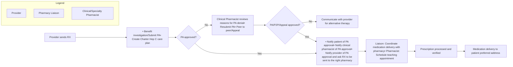

Clearway Health logo

# The Effectiveness of an Integrated Health System Specialty Pharmacy in Minimizing the Amount of Time From Prescription Requests to Verification

Edlyn Hwang, PharmD, BCPS1, Caitlin Howard, PharmD2,
Cecilia Nguyen, PharmD1, Robert Pullano, RPh1
1Clearway Health, 2Signature Health

## Introduction

Specialty medications require a high level of involvement from the time of treatment selection and throughout the duration of therapy. In a study by the *Journal of Managed Care & Specialty Pharmacy*, retail pharmacies responded that their average time to fill a prescription without interventions (clean), e.g. clinical coordination or prior authorization, was 2 days and with interventions (not clean) was 5 to 6 days.1 The implementation of a health system specialty pharmacy allows streamlined workflows that address the complexities of specialty medications.

## Objective

The purpose of this study was to investigate the impact health system specialty pharmacy has on time to prescription fill.

## Methodology

* **Study Design:** A single-center, retrospective, observational study
* **Data Source:** Pharmacy software with integrated tools for data collection, RXQ Liberty Software
* **Study Data:** Specialty medication prescriptions sent to Signature Healthcare pharmacy from June 1, 2024 to December 31, 2024
* **Statistical Analysis:** Quantitative statistics were utilized to evaluate the number of days between the prescribing and specialty medication and pharmacy verification.

## Pharmacy Operational Workflow

## Results

### Fig 1: Turn Around Time (TAT)

| Month | Clean RXs (Days) | Not clean RXs (Days) | Combined (Days) |
| ----- | ---------------- | -------------------- | --------------- |
| Jun   | 0.7              | 2.0                  | 1.2             |
| Jul   | 1.2              | 3.1                  | 1.2             |
| Aug   | 1.3              | 3.6                  | 1.8             |
| Sept  | 1.7              | 4.9                  | 2.2             |
| Oct   | 1.6              | 2.3                  | 1.7             |
| Nov   | 1.4              | 2.0                  | 1.0             |
| Dec   | 1.6              | 4.0                  | 1.4             |

### Fig 2: Time Between RX Order and Verification

| Timeframe | Jun (min) | Jul (min) | Aug (min) | Sept (min) | Oct (min) | Nov (min) | Dec (min) |
| --------- | --------- | --------- | --------- | ---------- | --------- | --------- | --------- |
| Day 0     | 35        | 25        | 35        | 35         | 40        | 35        | 35        |
| Day 1     | 135       | 145       | 25        | 25         | 25        | 32        | 38        |
| Day 2     | 52        | 85        | 15        | 15         | 15        | 25        | 28        |
| Day 3     | 15        | 12        | 10        | 10         | 17        | 10        | 10        |
| Day 4     | 8         | 8         | 8         | 10         | 8         | 8         | 8         |
| Day 5     | 5         | 5         | 5         | 5          | 5         | 5         | 5         |
| Day 6     | 2         | 2         | 2         | 2          | 2         | 2         | 2         |

### Therapeutic Distribution

| Therapeutic Distribution Month | Therapeutic Distribution Cardiology | Therapeutic Distribution Dermatology | Therapeutic Distribution Endocrinology | Therapeutic Distribution Infectious Disease | Therapeutic Distribution Neurology | Therapeutic Distribution Hem/Onc | Therapeutic Distribution Pulmonology | Therapeutic Distribution Rheumatology |
| ---------------------------------- | --------------------------------------- | ---------------------------------------- | ------------------------------------------ | ----------------------------------------------- | -------------------------------------- | ------------------------------------ | ---------------------------------------- | ----------------------------------------- |
| Jun                                | 15                                      | 20                                       | 5                                          | 10                                              | 10                                     | 15                                   | 5                                        | 20                                        |
| Jul                                | 18                                      | 22                                       | 4                                          | 8                                               | 12                                     | 14                                   | 4                                        | 18                                        |
| Aug                                | 16                                      | 25                                       | 6                                          | 12                                              | 8                                      | 12                                   | 3                                        | 18                                        |
| Sept                               | 17                                      | 24                                       | 5                                          | 10                                              | 11                                     | 13                                   | 5                                        | 15                                        |
| Oct                                | 19                                      | 21                                       | 7                                          | 9                                               | 10                                     | 14                                   | 4                                        | 16                                        |
| Nov                                | 15                                      | 26                                       | 4                                          | 11                                              | 9                                      | 12                                   | 6                                        | 17                                        |
| Dec                                | 17                                      | 23                                       | 5                                          | 10                                              | 10                                     | 13                                   | 5                                        | 17                                        |

## Discussion

This study demonstrated an average turnaround time of 1.5 days for the 948 specialty prescriptions evaluated during the 7-month review period. This turnaround time is shorter than that reported in the literature and may allow patients to start or continue critical therapy sooner, reducing delays in care and improving patient outcomes.

Clean prescriptions were those without interventions such as prior authorizations opposed to those requiring additional pharmacy follow-up, or not clean. A health system integrated specialty pharmacy assisted with workflow and clinical support. These prescriptions were ordered from nine different therapeutic areas. Over half of the prescriptions were received from three specialties, rheumatology (24%), dermatology (23.5%), and cardiology (17%).

These results show average fill times less than that reported by retail pharmacies. The pharmacy staff will continue to aim for shorter fill times, demonstrating improved efficiency that supports timely patient access to therapy.

## References

1. Gabriel MH, Kotschevar CM, Tarver D, et al. Specialty pharmacy turnaround time impediments, facilitators, and good practices. *J Manag Care Spec Pharm*. 2022 Nov;28(11):1244-1251. doi: 10.18553/jmcp.2022.28.11.1244.

## Acknowledgments

A special thank you to Donisha Lewis, PharmD, BCACP for her support.

