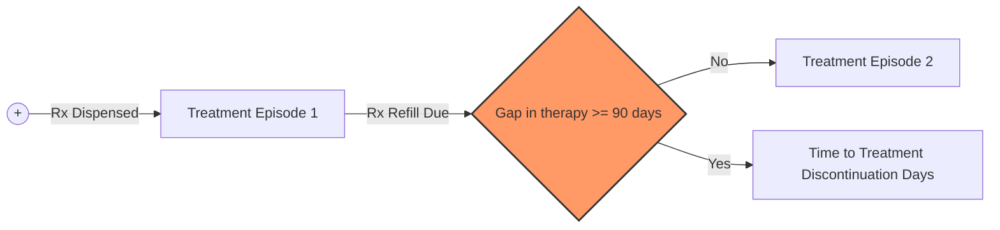
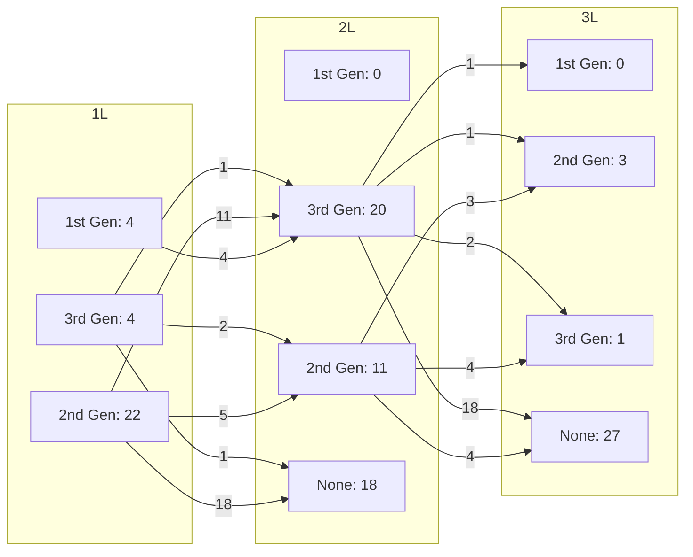

SHIELDS HEALTH SOLUTIONS logo

# Treatment utilization patterns and time to therapy discontinuation in patients with ALK+ metastatic non-small cell lung cancer

Martha Stutsky, PharmD, BCPS1; Michael Latran, PharmD, MPH2; Y. Caleb Chun, MA1; Michael Lloyd, BPharm, RPh2; Chloe Kim, PharmD, BCCP, BCPS, CSP1; Shreevidya Periyasamy, MSHIA1; Christopher Barr, BS1

1. Shields Health Solutions

2. Pfizer Inc., Medical Affairs

## BACKGROUND

Lung cancer is the second most common cancer type and the leading cause of cancer-related death in the United States.1 About 3-5% of patients with metastatic non-small cell lung cancer (mNSCLC) have anaplastic lymphoma kinase (ALK) gene rearrangements, resulting in inappropriate ALK signaling.1,2 Guidelines recommend the use of 2nd and 3rd generation ALK tyrosine kinase inhibitors (TKIs) for first line (1L) treatment of ALK+ mNSCLC, which provides the most clinical benefit and longest duration of response.1 However, high attrition rates of ALK TKI 1L therapy due to rapid clinical deterioration result in a lower use of second line (2L) therapy.3 The objective is to describe treatment utilization patterns and time to discontinuation (TTD) in patients receiving ALK TKIs for ALK+ mNSCLC.

## METHODS

**Study Design:** Multi-center, retrospective observational analysis of adult patients receiving ALK TKIs between October 2017 and April 2025.

**Inclusion Criteria:** Patients enrolled in the integrated health system specialty pharmacy (HSSP) services with ≥3 fills of the ALK TKI after the drug approval date for 1L therapy in mNSCLC were included.

**Primary Outcome:** mean time to discontinuation defined as the number of days between the first and last qualifying fill before a 90-day gap (Figure 1)
**Secondary Outcome:** medication adherence measured by the adjusted proportion of days covered (PDC), calculated by the number of days covered divided by the adjusted days of therapy

| Generation | Drug and 1L Therapy Approval Date                                |
| ---------- | ---------------------------------------------------------------- |
| 1          | Crizotinib (11/2013)                                             |
| 2          | Ceritinib (5/2017); Alectinib (11/2017); Brigatinib (5/2020) |
| 3          | Lorlatinib (3/2021)                                              |

Figure 1: Time to discontinuation calculation

**Patient Identification and Data Analysis:** Patients were identified from prescription fill records, and data extracted included demographics, prescription fill dates, insurance type, and line of therapy defined as first line (1L), second line (2L), and third line (3L).

## RESULTS

Table 1 presents the number of patients by ALK inhibitor and treatment line, average time to discontinuation, and mean adjusted PDC rates. Treatment pathways for patients with multiple lines of therapy, which only includes patients with more than one line of therapy, are depicted in Figure 3.

Table 1: Patient Characteristics

QR code to scan for more information

| Characteristic                   | 1ˢᵗ Generation (N=52) | 2ⁿᵈ Generation (N=205) | 3ʳᵈ Generation (N=71) |
| -------------------------------- | --------------------- | ---------------------- | --------------------- |
| Line of Therapy (n)              |                       |                        |                       |
| 1L                               | 52                    | 198                    | 50                    |
| 2L                               | 0                     | 11                     | 20                    |
| 3L                               | 0                     | 3                      | 1                     |
| Age at initial fill (years)\*    | 62.9                  | 59.5                   | 59.8                  |
| Sex (n, %)                       |                       |                        |                       |
| M                                | 19 (36.5)             | 103 (50)               | 28 (39)               |
| F                                | 32 (61.5)             | 99 (48)                | 43 (61)               |
| Unknown/unspecified              | 1 (2)                 | 3 (2)                  | 0 (0)                 |
| Geographic Region (n, %)         |                       |                        |                       |
| Northeast                        | 25 (48)               | 94 (46)                | 24 (34)               |
| West                             | 13 (25)               | 48 (23)                | 22 (31)               |
| South                            | 13 (25)               | 40 (20)                | 19 (27)               |
| Midwest                          | 1 (2)                 | 23 (11)                | 6 (8)                 |
| Insurance Type (n, %)\*\*        |                       |                        |                       |
| Commercial                       | 11 (21)               | 66 (32)                | 27 (38)               |
| Medicare                         | 26 (50)               | 78 (38)                | 29 (40)               |
| Medicaid                         | 11 (21)               | 55 (27)                | 13 (18)               |
| Unknown/Other                    | 8 (15)                | 28 (14)                | 5 (7)                 |
| Time to Discontinuation (Days)\* |                       |                        |                       |
| 1L                               | 281.1                 | 72.8                   | 315.8                 |
| 2L                               | -                     | 276                    | 262.4                 |
| 3L                               | -                     | 292.3                  | 201                   |
| PDC\*                            |                       |                        |                       |
| 1L                               | 93.4%                 | 95.2%                  | 96.7%                 |
| 2L                               | -                     | 96.9%                  | 95.6%                 |
| 3L                               | -                     | 93.2%                  | 100%                  |

\*Average

\*\*Patients may have more than 1 insurance type

Figure 2: Time to discontinuation based on ALK inhibitor generation and line of treatment

| Line of Therapy | 1st Gen (Days) | 2nd Gen (Days) | 3rd Gen (Days) |
| --------------- | -------------- | -------------- | -------------- |
| 1L              | 281.1          | 372.8          | 315.8          |
| 2L              |                | 276            | 262.4          |
| 3L              |                | 292.3          | 201            |

Figure 3: Treatment Pathways for Patients (n) with Multiple Lines of Therapy

\*Note: Figure 3 also includes a callout: 6 (15%)

## CONCLUSIONS

\* This analysis demonstrated a decrease in mean TTD in patients receiving ALK TKIs as the line of therapy increased. These results are consistent with national level data for mean TTD by line of therapy and by ALK TKI generation.4

\* The high PDC observed highlights effective patient management by HSSPs.

\* In the analysis, most patients did not move to a subsequent line of therapy after 1L. Most patients received 2nd generation ALK TKIs for 1L therapy due to the fact that they were approved earlier in this setting. Future analysis is needed to evaluate utilization of 3rd generation ALK TKIs since their approval for 1L therapy.

## REFERENCES

1. National Comprehensive Cancer Network. Non-Small Cell Lung Cancer (Version 6.2024 – 6/14/2024). Accessed June 26, 2024. Available at: https://www.nccn.org/professionals/physician_gls/pdf/nscl.pdf.

2. Chen R, Manochakian R, James L, et al. Emerging therapeutic agents for advanced non-small cell lung cancer. J Hematol Oncol. 2020;13(1):58.

3. Elsayed M, Bozorgmehr F, Kazdal D, et al. Feasibility and challenges for sequential treatments in ALK-rearranged non-small cell lung cancer. Front Oncol. 2021;11:670483.

4. Conducted using the IQVIA Anonymized Patient Longitudinal Dataset, an open claims dataset of fully adjudicated pharmacy and medical claims.

