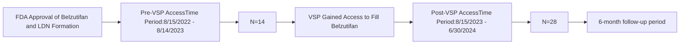

VANDERBILT HEALTH Specialty Pharmacy logo

# Impact of Expanding Belzutifan to an Integrated Health-System Specialty Pharmacy

QR Code

Brooke Looney, PharmD, CSP1; Jordan Whitehead, PharmD1; Cathy Faulkner, PharmD1; Autumn D. Zuckerman, PharmD, BCPS, CSP1; Josh DeClercq, MS2; Leena Choi, PhD2; Chelsea P. Renfro, PharmD1

1Vanderbilt Specialty Pharmacy, Vanderbilt Health; 2Department of Biostatistics, Vanderbilt University Medical Center

## HIGHLIGHTS

* Patients who filled a LDN medication once VSP gained access initiated treatment more quickly, had fewer treatment gaps, and improved adherence compared to those who began treatment before VSP gained access.

* These findings support prior studies showing HSSPs outperform non-HSSPs when managing patients on LDN medications.

## BACKGROUND

* Belzutifan is a first-in-class medication, indicated for von-Hippel Lindow (VHL) disease associated renal cell carcinoma (RCC), pancreatic neuroendocrine tumors, and central nervous system tumors

* One year after approval, Vanderbilt Specialty Pharmacy (VSP) gained access to the limited distribution network (LDN) to dispense belzutifan

## RESULTS

## METHODS

**Objective**: To determine the impact of expanding belzutifan access to VSP on time to first fill from treatment decision, number of gaps in therapy after initiation, and adherence

**Study Design**: Single-center, retrospective, cohort study

**Study Setting**: Vanderbilt Ingram Cancer Center, Integrated HSSP

**Study Sample**: Patients starting belzutifan for RCC or VHL between 8/15/2022 and 6/30/2024

**Outcomes**:
1. Time to first fill
2. Treatment gaps (>1 day without treatment) over 6 months
3. Adherence over 6 months using proportion of days covered (PDC) in patients with at least 3 fills

### Table 1. Patient Demographics (n=42)

| Characteristic                      | Pre-access n=14 | Post-access n=28 |
| ----------------------------------- | --------------- | ---------------- |
| Sex: Female, n (%)                  | 9 (64)          | 10 (36)          |
| Age (as of June 2024), Median (IQR) | 41 (34 – 52)    | 67 (58 – 70)     |
| Race, n (%)                         |                 |                  |
| Black or African American           | 2 (14)          | 1 (4)            |
| White                               | 10 (71)         | 25 (90)          |
| Other                               | 2 (14)          | 2 (7)            |
| Pharmacy insurance, n (%)           |                 |                  |
| Commercial                          | 8 (57)          | 14 (50)          |
| Medicare                            | 6 (43)          | 14 (50)          |
| Indication, n (%)                   |                 |                  |
| Renal cell carcinoma                | 0 (0)           | 22 (79)          |
| Von Hippel-Lindau disease           | 14 (100)        | 6 (21)           |

### Figure 2. Time to Initiation of Therapy (First Fill)

Median time to belzutifan first fill decreased 5 days following VSP gaining access (p=0.008)

| Group           | Median Time (days) | IQR (days) |
| --------------- | ------------------ | ---------- |
| Pre-VSP Access  | 9                  | 6-15       |
| Post-VSP Access | 4                  | 2-7        |

### Figure 1. Study Timeline and Attrition

After VSP gained access to fill belzutifan, 12/14 patients (86%) converted to filling with VSP. For this analysis, these patients were included in the pre-VSP access group.

### Figure 3. Gaps in Therapy

A greater percentage of patients experienced a treatment gap pre-access as compared to post-access (p=0.047)

| Group           | N    | Percentage (%) |
| --------------- | ---- | -------------- |
| Pre-VSP Access  | 9/14 | 64%            |
| Post-VSP Access | 9/28 | 32%            |

<u>Reasons for gaps in therapy</u>
* Patient adherence to follow-up (Pre-VSP = 3 vs Post-VSP = 0)
* Insurance delay (Pre-VSP = 2 vs Post-VSP = 7)
* Coordination of care (Pre-VSP = 0 vs Post-VSP = 1)
* Financial assistance needed (Pre-VSP = 3 vs Post-VSP = 1)
* Health (Pre-VSP = 3 vs Post-VSP = 1)

Post-VSP therapy gaps were more commonly due to non-modifiable reasons, such as insurance delay, patient adherence to follow-up, or financial assistance needed.

\* Patients could have experienced multiple reasons for the treatment gap; therefore, the number of gaps might not equal the number of reasons for the gap.

### Figure 4. Adherence

Patients who filled belzutifan prior to VSP obtaining access had a median PDC of 91% (IQR 73% - 98%, n=12) compared to a median PDC of 98% (IQR 86% - 100%, n=15) post-access (p=0.129).

| Group           | Median PDC (%) | IQR (%)    | n  |
| --------------- | -------------- | ---------- | -- |
| Pre-VSP Access  | 91%            | 73% - 98%  | 12 |
| Post-VSP Access | 98%            | 86% - 100% | 15 |

Each box represents the PDC of one patient during the 6-month follow-up period.

Abbreviations: VSP = Vanderbilt Specialty Pharmacy; HSSP = health-system specialty pharmacy; PDC = proportion of days covered; IQR = interquartile range

