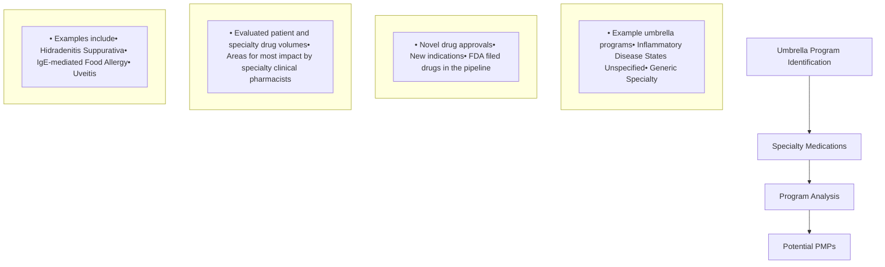

Yale New Haven Health logo

# A Model to Develop and Expand an Integrated Health System Specialty Pharmacy Patient Management Program

Sarah E. Wright, PharmD, BCACP; Michele Riccardi, PharmD, BCPS; Sarah Patterson, PharmD; John Fitzgerald, PharmD; Tina Do, PharmD, MS, BCPS
Department of Pharmacy, Yale New Haven Health

NASP 2025 logo

speaker icon

## Background

* Strategies in developing an integrated health system specialty pharmacy (HSSP) patient management program (PMP) vary widely, ranging from generalized approaches to tailoring disease-specific programs.

* The complexity of specialty medications and evolving accreditation and third-party payer requirements highlight the need for disease-specific PMPs.

* These PMPs include disease states that require complex dosing regimens or frequent lab monitoring.

* Development of a disease specific PMP ensures high quality patient-centered care.

## Objective

* To establish a systematic approach for further developing and expanding disease-specific programs within an integrated HSSP.

## Methods

Current State arrow

**Current State**

* Surveyed pharmacy staff

* Assessed specialty medication utilization to identify gaps in the PMP

* Stratified priority to develop PMP modules based on historical & current patient volumes

* Utilized standards of care and guidelines

Subsequent Analysis arrow

**Subsequent Analysis**

* Evaluated umbrella programs

* Evaluated specific disease state volumes

* Reviewed specialty drugs in pipeline

* Analyzed the need for high-touch care by a specialty clinical pharmacist

* Reviewed literature for evidenced-based therapeutic goals and outcomes

Expansion arrow

**Expansion**

* Identification of disease state PMPs to develop

## Results

Figure 1: PMP Growth

| 2020                                     | 2025           | 2030            |
| ---------------------------------------- | -------------- | --------------- |
| 15 PMP modules Initial Establishment | 52 PMP modules | >69 PMP modules |
|                                          | + 37 modules   | + 17 modules    |

Figure 2: Analysis Workflow

Figure 3: Therapeutic Goals

| Disease State        | Therapeutic Goal  |
| -------------------- | ----------------- |
| Rheumatoid Arthritis | RAPID-3 score     |
| Asthma               | ACT               |
| Oncology             | Minimize toxicity |
| Transplant           | Tacrolimus levels |
| Multiple Sclerosis   | CDC-HRQOL         |

## Discussion

* Analysis identified opportunities to provide more individualized patient care for specific disease states through PMP development.

* Established a formal, repeatable evaluation process to identify needs for PMP development.

* Evaluation of conditions in umbrella programs provided an opportunity to establish more specific PMP disease states with customized evidence-based therapeutic goals.

## Limitations/Barriers

* Complex data analysis to identify disease area opportunities

* Limited staff resources

* Limited drug distribution access played a role in determining the development of a PMP disease state

## Conclusion

* The systematic PMP development process ensured a consistent, data-driven approach to establish and expand disease-specific PMPs.

* With periodic evaluations of its PMPs, integrated HSSPs can easily meet the changing accreditation requirements, and payer expectations while providing evidence-based quality patient-centered care.

## Future Directions

* Use electronic clinical pathways that incorporate PMP disease modules into the electronic health record

* Increase analysis of measurable patient outcomes

* Enhance processes for increased cost avoidance and reduction of medication waste

## References

1. Riccardi, et al. Developing a disease state specific patient management program at an integrated health system specialty pharmacy. Poster presented at NASP Annual Meeting & Expo, Sept 18-21, 2023; Grapevine, TX.

## Acknowledgements

* We would like to thank Nawal Elmahy PharmD, and Bisni Narayanan, PharmD, MS, MBA for their contributions to the success of this project.

The authors of this presentation have nothing to disclose concerning possible financial or personal relationships with commercial entities that may have a direct or indirect interest in the subject matter of this presentation.

NASP Annual Meeting & Expo 2025. September 14-17, 2025.

