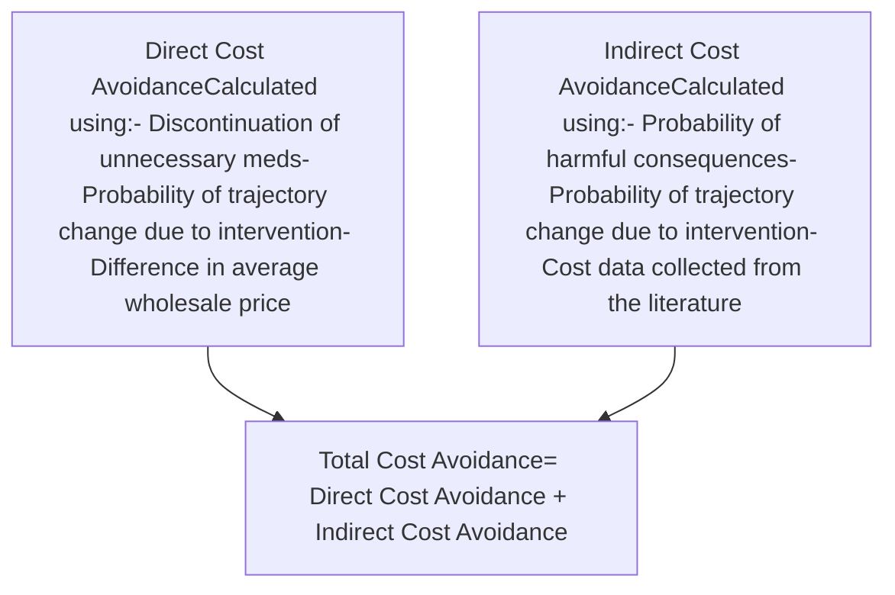
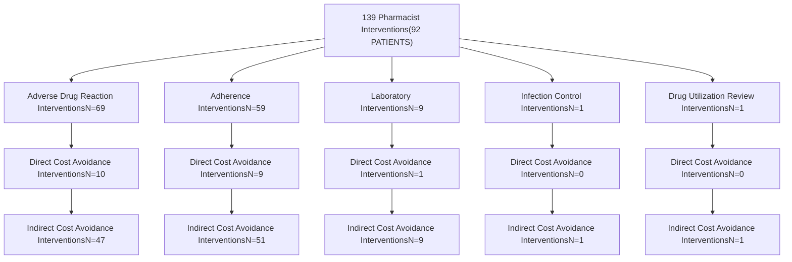

# Optimizing care and reducing cost: the impact of health-system specialty pharmacists in idiopathic pulmonary fibrosis management

Ryan VanSice, PharmD, BCPS, CSP; Nick Pham, PharmD, CSP; Casey Fitzpatrick, PharmD; Andrew Wash, PharmD, PhD; Jessica Mourani, PharmD; Ana I. Lopez-Medina, PharmD, PhD

cps logo

## Background

* Patients with idiopathic pulmonary fibrosis (IPF) are often hospitalized secondary to respiratory worsening or acute exacerbation.1

* The medical costs associated with IPF can lead to substantial economic burden, with annual estimates of around $110 million in the U.S.1

* The involvement of health-system specialty pharmacies (HSSPs) within multidisciplinary teams has demonstrated cost avoidance in other specialties.2

## Objectives

To evaluate potential costs avoided due to HSSP pharmacist interventions performed for patients diagnosed with IPF

## Methods

### Study Design

This retrospective, observational cohort study was conducted at twelve client health systems of CPS Solutions, LLC (CPS) from April 2023 to April 2024.

| Inclusion Criteria                                                  | Exclusion Criteria                                                                     |
| ------------------------------------------------------------------- | -------------------------------------------------------------------------------------- |
| \* Interventions completed for patients who were diagnosed with IPF | \* Incomplete documentation                                                            |
| \* Interventions for an IPF-related specialty therapy               | \* Duplicate Interventions                                                             |
|                                                                     | \* Interventions with insufficient documentation to accurately estimate cost avoidance |

### Outcomes

Cost avoidance was calculated using the method recommended by Patanwala et al.3

## Results

### Table 1: Patient Demographics

| Characteristics        | N=92     |
| ---------------------- | -------- |
| Age, years (Mean ± SD) | 73 ± 9.4 |
| Gender                 |          |
| Female (n (%))         | 45 (49)  |
| Male (n (%))           | 47 (51)  |

### Figure 2: Evaluated Therapies (N=139)

| Therapy     | Percentage (%) |
| ----------- | -------------- |
| NINTEDANIB  | 66             |
| PERFENIDONE | 34             |

### Figure 3: HSSP Intervention Types

## Results Cont.

### Table 2: Cost Avoidance Associated with HSSP Interventions

| Cost Avoidance           | Overall Cost | Lower Limit | Upper Limit  |
| ------------------------ | ------------ | ----------- | ------------ |
| Direct Cost Avoidance    | $191,542     | $45,649     | $215,151     |
| Indirect Cost Avoidance  | $21,879      | $1,455      | $24,054      |
| **Total Cost Avoidance** | **$213,421** | **$47,105** | **$239,211** |

## Discussion & Conclusion

* HSSP teams who provide care for patients with IPF perform clinically meaningful interventions, and this study demonstrates the impact of these services by quantifying the potential costs avoided as a result.

* Over the course of one year, HSSP interventions at IPF outpatient clinics resulted in an estimated cost avoidance of approximately $213,000.

* One limitation of this study is that pharmacists' labor costs were not accounted for, which may affect the overall estimation of total cost avoidance.

* Future studies should evaluate the financial impact of pharmacist interventions across a larger sample size and different disease states.

## References

1 Mooney JJ, Raimundo K, Chang E, Broder MS. Hospital cost and length of stay in idiopathic pulmonary fibrosis. *J Med Econ*. 2017;20(5):518-524. doi:10.1080/13696998.2017.1282864

2 Georgieva D, Markley B, DeClercq J, Choi L, Zuckerman AD. Cost avoidance from health system specialty pharmacist interventions in patients with multiple sclerosis. *J Manag Care Spec Pharm*. 2024;30(4):336-344. doi:10.18553/jmcp.2024.30.4.336

3 Patanwala AE, Narayan SW, Haas CE, Abraham I, Sanders A, Erstad BL. Proposed guidance on cost-avoidance studies in pharmacy practice. *Am J Health Syst Pharm*. 2021;78(17):1559-1567. doi:10.1093/ajhp/zxab211

