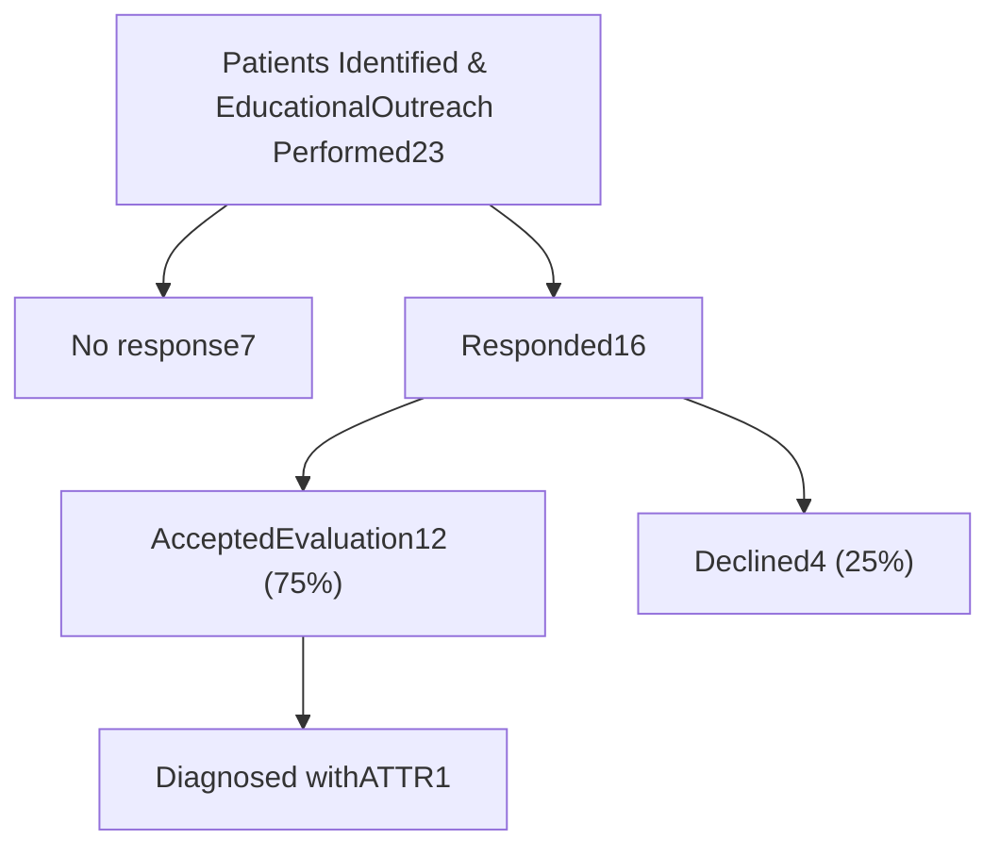

# Collaborative initiative between health system specialty pharmacy and advanced heart failure program to identify patients with transthyretin amyloidosis

Photograph of Anthony Donovan

**PRESENTER:**

Anthony Donovan,
Ambulatory Pharmacist
Program Coordinator

**BACKGROUND:**

❖ Transthyretin amyloidosis (ATTR) is a rare disease that leads to progressive neuropathy and cardiomyopathy

❖ Timely diagnosis ATTR can be challenging due ineffective system-wide screening

❖ We describe an advanced heart failure program (AHFP) and health system specialty pharmacy (HSSP) collaboration to identify at-risk patients for ATTR

**METHODS**

1. AHFP physicians, specialty pharmacy leadership, a pharmacist program coordinator, a nurse coordinator, and subject matter experts designed an algorithm and educational outreach activity

# Health system specialty pharmacies offer a unique role on multidisciplinary team-based approaches in the identification of patients at risk of ATTR

❑ HSSP created diagnosis code-based identification tool: 1) patients >40 years, 2) had an encounter at institution in past 2 years, 3) alive (on day of report), and all present:

| Bilateral Carpal Tunnel G56.03 | Neuropathy G60.\* \| G62.\* \| G63.\* \| G64.\*                                            |
| ---------------------------------- | ---------------------------------------------------------------------------------------------- |
| Spinal Stenosis M48: .00-.085. | Cardiomyopathy I42.\* \| I43.\* \| I50.33 \| I50.30 \| I50.40 \| I50.41 \| I50.43 \| I50.9 |

❑ Identified patients were targeted with an educational activity directed towards their primary care physicians (PCP)

❑ The nurse coordinator instigated all outreaches to PCP and/or patients and scheduled follow up with advanced heart failure program for evaluation

University of Nebraska Medical Center logo

Nebraska Medicine logo

# RESULTS

• **Next Steps & Opportunities**

• Wider screening algorithm and incorporation of non-diagnosis code information

• Inclusive of non-cardiomyopathy patients

• Partnering with primary care and neurology

(1) Anthony Donovan, PharmD, MPH,

(2) Nicolette Kavan, BSN, RN, CV-BC, Marshall Hyden, MD

1) Community-Based Pharmacy Services, Nebraska Medicine, Omaha, NE
2) Division of Cardiology, University of Nebraska Medical Center, Omaha, NE

**References:**

\* Karam C, Mauermann ML, Gonzalez-Duarte A, et al. Diagnosis and treatment of hereditary transthyretin amyloidosis with polyneuropathy in the United States: Recommendations from a panel of experts. Muscle Nerve. 2024;69(3):273-287. doi:10.1002/mus.28026

\* Kittleson MM, Ruberg FL, et al. 2023 ACC Expert Consensus Decision Pathway on Comprehensive Multidisciplinary Care for the Patient With Cardiac Amyloidosis: A Report of the American College of Cardiology Solution Set Oversight Committee. J Am Coll Cardiol. 2023;81(11):1076-1126. doi:10.1016/j.jacc.2022.11.022

University of Nebraska Medical Center logo

