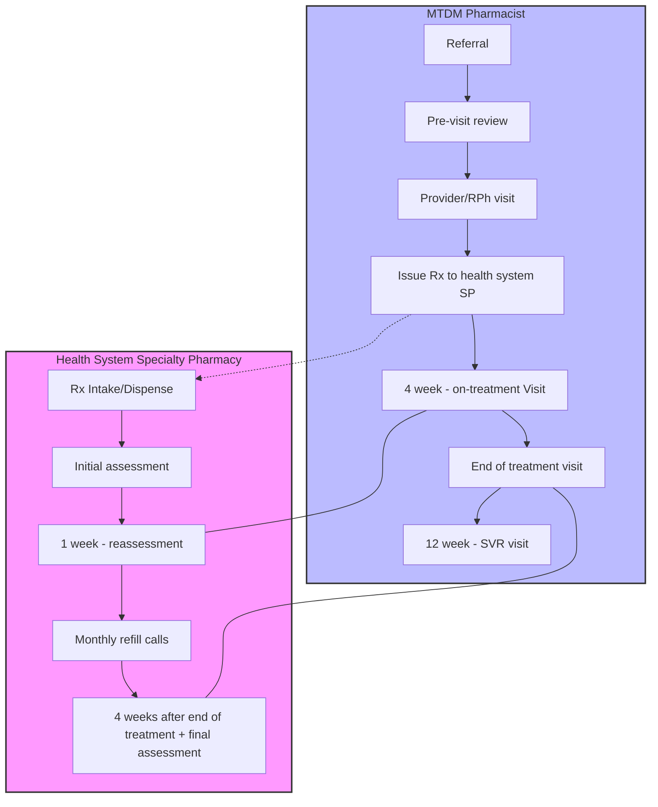
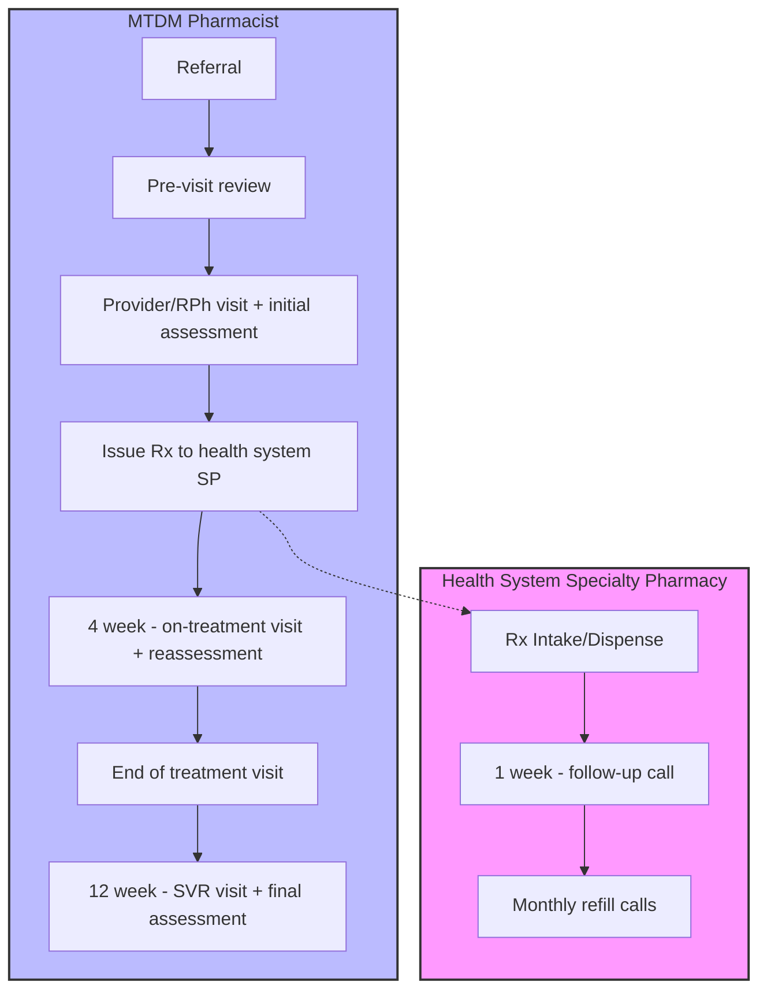

# Streamlining Hepatitis C Management: A Collaborative Approach Between Clinical Pharmacists and Specialty Pharmacies

Geisinger logo

Susanne Burns PharmD, MBA, Allyson Hess PharmD, MBA, CSP, Amanda Popko PharmD, BCACP, Sara Gaines PharmD, BCPS

Geisinger, Danville, PA

**Background/Purpose:**

* Geisinger’s Medication Therapy Disease Management (MTDM) program has played a crucial role in initiating and monitoring therapy for patients with hepatitis C since 2016.

* A 99.7% sustained virologic response (SVR) rate has been achieved using collaborative management practices among physicians and pharmacists embedded in the clinics yet care between the clinics and the in-house specialty pharmacy (SP) was redundant and fragmented.

* Integration with in-house SP services aims to streamline care and improve outcomes.

**Objectives:**

* Describe the co-management workflow of MTDM pharmacists before and after integration with the SP.

* Evaluate the impact of this integration on:

    - Time to treatment initiation

    - Patient adherence

    - Number of patient outreaches

**Baseline Metrics :**

* Data collected using data from EPIC Hyperspace and Willow Ambulatory

| Embedded Hepatology Pharmacists   | 2      |
| --------------------------------- | ------ |
| Hep C Specialty Pharmacists       | 3      |
| Average Start to Treatment (days) | 3.42   |
| Average Touchpoints per Treatment | 9      |
| Patients Managed                  | 294    |
| Proportion of Days Covered (PDC)  | 95.64% |
| SVR Rate                          | 99.7%  |

**Process:**
**Baseline:**
Independent workflows

\* Pharmacist Redundancy

**Integrated:**
Bidirectional communication between teams to reduce duplicative work

**Notable Process Changes:**

* Initial assessment completed at in-person joint visit with provider and pharmacist

* Health System SP completing 1 week follow-up call to verify patient received medication and started therapy

* Reassessment completed by embedded pharmacist with on-treatment lab visit

* Final assessment completed during visit to confirm SVR and provide end of treatment education

**Conclusions:**

* Integrating MTDM clinical pharmacist workflows with specialty pharmacy patient management programs is anticipated to streamline care.

* Minimizing delays caused by missed patient communication is expected to increase efficiency, thus resulting in quicker initiation of therapy.

* This integrated clinical management model can be applied broadly across specialties with embedded pharmacists or when designing specialty pharmacy clinical programs.

**Next Steps:**

* The effectiveness of the integrated model will be assessed by comparing the number of patient outreaches and the time to initiation of treatment.

* Adherence rates before and after implementation will be evaluated to assess the impact of fewer touchpoints.

* Pharmacist engagement will be analyzed after elimination of duplicative tasks.

**Acknowledgements:**

Alesha Lane, PharmD

Presented at 2025 National Association of Specialty Pharmacy Annual Meeting, Denver, Colorado

