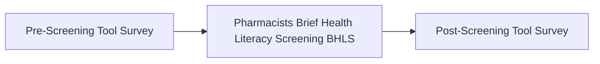

UCSF Health logo

# Health Literacy Tool For Multiple Sclerosis Patients On Specialty Medications

Danielle Muñoz, PharmD; Kathryn Gallison, PharmD Candidate; Mackenzie Clark, PharmD
Lisa Kroon, PharmD; Myra Pascua, PharmD

## Background

Health literacy is one of the main social determinants of health affecting outcomes. Low health literacy is considered a key source of economic inefficiency in the U.S. healthcare system 1. It is estimated that inadequate health literacy adds an additional 106 to $238 billion cost to the health care system 2.

* Cognitive function is associated with health literacy, independent of education and other important confounders3

* Multiple sclerosis (MS) is a progressive disease of the nervous system that causes physical and psychological debilitation and involves cognitive decline, and a decline in cognitive abilities could lead to a patient's decreased understanding of their condition and medication, impaired processing of information, and reduced ability to follow instructions

* A standardized method to identify patients with low health literacy who could benefit from additional, tailored education is lacking

## Cognitive Symptoms in MS

Memory icon Problems with memory or recall

Attention icon Loss of attention or concentration

Problem solving icon Trouble processing information
Difficulty with problem-solving or complex tasks

Visual-spatial icon Changes in visual-spatial abilities

Verbal fluency icon Issues with verbal fluency

https://www.mymsteam.com/resources/dementia-and-multiple-sclerosis-is-there-a-connection

## Objective

Develop a health literacy screening tool that focuses on the patient's understanding of their condition, other than comprehension or arithmetic, and can identify patients who may benefit from additional education

## Methodology

### Pre-screening questionnaire

1. **Do you currently assess health literacy?**: Yes/No
2. **If yes, do you use any of the following screening tools?**:
    * Chart review [ ]
    * Patient interview [ ]
    * Other (please describe):     
3. **Are you aware that the Social Drivers of Health section in APeX has a health literacy question (see screenshot)?**: Yes/No
4. **If yes, do you review the "social drivers of health" health literacy question in Apex? (See screenshot)**: Yes/No
5. **If yes, how often do you utilize this feature to determine if a patient receives tailored medication education?**:     
6. **If the health literacy question is unanswered, how often would you complete the question during a patient encounter (1-5 Likert scale: never, "rarely," "sometimes," "often," and "always")**:     
7. **Please describe how you determine when to tailor medication education for an individual patient.**:     
8. **When you tailor medication education, please describe what that entails.**:     
9. **How do you assess if the medication education tailoring is effective?**:     
10. **Please provide additional comments that you would like to shar**:     

### <u>Brief Health Literacy Screen (BHLS)</u>

1. **How confident are you in filling out medical forms by yourself?**: (1-5 Likert scale: Not at all, a little bit, somewhat, quite a bit, or extremely)
2. **How often do you have someone help you read hospital materials?**: (1-5 Likert scale: all the time, most of the time, some of the time, a little of the time, or none of the time)
3. **How often do you have problems learning about your medical condition(s) because of difficulty understanding written information?**: (1-5 Likert scale: all the time, most of the time, some of the time, a little of the time, or none of the time)

**Scoring:**
**3-9**: Limited health literacy, the patient will require additional tailored medication education or low health literacy materials
**10-12**: marginal health literacy, the patient may benefit from additional medication education
**13-15**: adequate, the patient has proficient health literacy and does not need additional education

### Post-screening questionnaire

1. **How helpful was the screening tool in identifying patients who may benefit from tailored medication education?**: (Not helpful, somewhat helpful, very helpful)
2. **How did you implement the screening tool into your patient interactions?**:     
3. **How likely are you to continue using the screening tool in your everyday practice?**: (Not likely, likely, very unlikely)

## Results

[ ] N=11 pharmacists practicing in MS clinic
[ ] 86% (n=9) of respondents currently assess health literacy
[ ] 18% (n=2) do not currently assess health literacy

**Table 1. Pre-Screening Tool Survey Responses Regarding Health Literacy Screening Practices**

| Item                                                                            | Response          | Percentage (n) |
| ------------------------------------------------------------------------------- | ----------------- | -------------- |
| Screening tools currently used                                                  | Chart review      | 83% (5)        |
|                                                                                 | Patient interview | 83% (5)        |
|                                                                                 | Other (undefined) | 17% (1)        |
| Awareness of "Social Drivers of Health" Section in APeX                         | Yes               | 12% (1)        |
|                                                                                 | No                | 88% (7)        |
| Review of "Social Drivers of Health" Section in APeX Prior to Patient Education | Yes               | 0% (0)         |
|                                                                                 | No                | 100% (1)       |
| Frequency of Answering "Social Drivers of Health" Section in APeX               | Never             | 64% (5)        |
|                                                                                 | Rarely            | 12% (1)        |
|                                                                                 | Often             | 12% (1)        |
|                                                                                 | Always            | 12% (1)        |

**Table 2. Post-Screening Tool Survey Overall Themes**

| Item                                                    | Response | Percentage (n) |
| ------------------------------------------------------- | -------- | -------------- |
| Likelihood of Using Screening Tool in Everyday Practice | Rarely   | 17% (1)        |
|                                                         | Never    | 83% (5)        |

| Theme                            | Representative Quotes                                                                                                                                                                                                                                                                                                                                                            |
| -------------------------------- | -------------------------------------------------------------------------------------------------------------------------------------------------------------------------------------------------------------------------------------------------------------------------------------------------------------------------------------------------------------------------------- |
| Lack of Supporting Resources     | 3/4 said less likely due to lack of resources, i.e., if they scored low on the assessment, aside from adjusting the consultation, what other resources do we have to support these patients? "Without materials like multilingual handouts, pictorial instructions, or a standardized follow-up plan, it's hard to apply this consistently across providers."                |
| Incomplete Workflow and Guidance | The workflow feels incomplete. While giving pharmacists discretion makes sense in theory, the lack of structured guidance, resources, or workflows creates uncertainty around how to intervene effectively after screening. "Leaving next steps up to individual judgment without direction makes it difficult for the project to gain traction or be scalable in practice." |
| Need for Standardized Follow-Up  | I'd recommend developing a basic framework or toolkit to support pharmacists once a patient with limited health literacy is identified.                                                                                                                                                                                                                                          |

## Conclusion

The findings of this study indicate that while majority of the pharmacists found the BHLS helpful, but there is the need for a standard procedure once patients are identified as having low health literacy. Development of standardized handouts or medication education materials would help guide pharmacists to provide better care for their patients. Future research should focus on addressing limitations and exploring the proposed future directions to enhance the effectiveness of the BHLS. Speaker icon

**References:**

1. Rasu RS, Bawa WA, Suminski R, Snella K, Warady B. Health literacy impact on National Healthcare Utilization and expenditure. Int J Health Policy Manag. 2015;4(11):747–55.

2. <u>https://bmchealthservres.biomedcentral.com/articles/10.1186/s12913-022-08527-9</u>. accessed 7/25/2025

3. https://www.sciencedirect.com/science/article/pii/S0168822713002179#; accessed 7/25/2025

