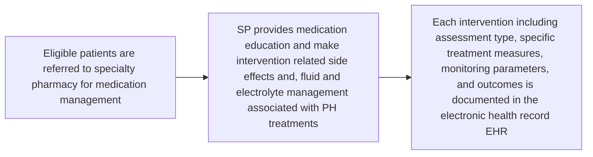

MUSC Health Medical University of South Carolina logo

# A Review of the pharmacist interventions for medication management in Pulmonary Arterial Hypertension (PAH) patients

Li J., Sigmon K., Carter J., Ritenour K., Mooney S., Sese D., Argula R.
Specialty Pharmacy and Pulmonary Vascular Disease Program, Medical University of South Carolina, Charleston, SC

## BACKGROUND

* The adverse effect profile of current PAH therapies is one of the major barriers to medication adherence in patients with WSPH group I and IV pulmonary hypertension (PH).

* Due to their frequent patient interactions, opportunities exist for specialty pharmacists (SP) integrated within the PH clinic to expand their roles in PAH patient care.

* There is a dearth of literature evaluating the impact of SP on medication adherence among patients on PAH treatment.

## OBJECTIVES

The objective of this study was to evaluate the impact of SP interventions on side effect resolution and clinical management in patients with PAH.

## METHODS

* **Study design:** single-center, retrospective descriptive study evaluated intervention data from January 2024 to April 2025

* **Study sample:** Interventions made by integrated SP for PH patients referred collaborating PH clinic providers

* **Intervention Tracked:**

    - Electrolyte abnormalities, fluid retention, medication side effects, and blood pressure management

* **Outcome:** resolution rate defined by symptom / lab normalization

* **Statistic Analysis:** descriptive statistics were used to analyze the data for this study

    - Intervention resolution rate was calculated by dividing the number of symptoms resolution by the total number of intervention documented

Figure 1. SP Intervention Process

## RESULTS

Resolution Rate Per Patient

| Category   | Percentage |
| ---------- | ---------- |
| Resolved   | 82.3%      |
| Unresolved | 17.7%      |

Types of Pharmacist Interventions for PAH Patients

| Intervention Type         | Number of Interventions |
| ------------------------- | ----------------------- |
| Electrolyte Abnormalities | 41                      |
| Fluid Retention           | 52                      |
| Medication Side Effects   | 25                      |
| Blood Pressure Issues     | 10                      |

Specialty Pharmacy Utilization in Patients who Achieved Symptom Resolution

| Pharmacy Type                              | Number of Patients |
| ------------------------------------------ | ------------------ |
| Patients Utilizing MUSC Specialty Pharmacy | 32                 |
| Patients Utilizing Outside Pharmacies      | 19                 |

* SP intervention achieved 82.3% (51 of 62 patients) symptoms resolutions

* 5 patients were lost to follow-up due to communication or lab coordination challenge

* Among 51 patients who achieved resolution, 32 patients filled their PAH medications at the MUSC Specialty Pharmacy

## CONCLUSION

* The pharmacist-led interventions has positive impact the management of medication side effects which achieved an 82.3% patient-level resolution rate on patient reported symptoms. These intervention might prevent potential PAH-related emergency room visit or hospitalizations

* Future study is needed to evaluate the impact of SP intervention on patient reported clinical outcomes and quality of life in PAH patients.

The authors have no conflicts to disclose.

