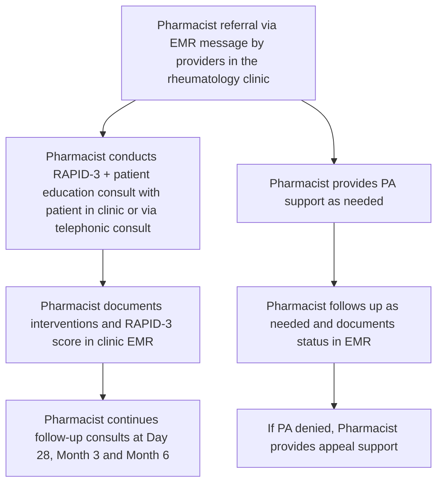

# Evaluating the impact of clinical pharmacist integration on patient care outcomes in a private rheumatology clinic
Optum logo

Jessica Lynton, PharmD, BCPS, CSP; Madana Kamineni, PharmD, MBA; Janelle Vircks, PharmD, MBA; Brittany Panico, DO; Clarisse Purvis, MS, PhD

## Background

Rheumatology patients require complex care, involving advanced therapies like biologics. Managing these therapies includes administration technique, monitoring side effects, and ensuring adherence. Current data regarding the integration of clinical pharmacists in tertiary care settings show improved provider satisfaction, clinical outcomes, adherence, and adverse effect management.1 However, there's a gap in literature surrounding private clinics.2 An accredited PGY-1 pharmacy residency program pilot integrated a pharmacist resident into the workflow of a private rheumatology clinic, Summit Rheumatology, in Gilbert, AZ to provide medication reviews, patient education, side effect management and prior authorization (PA) support documented in the clinic's electronic medical record (EMR).

## Objectives

Assess the impact of pharmacist-provider collaboration in patient care outcomes, provider satisfaction and operational efficiency.

## Methods

**Study design**: Single center, retrospective observational cohort study was deemed exempt by the UnitedHealth Group Institutional Review Board. Patient care outcomes were captured in pharmacist interventions and Routine Assessment of Patient Index Data 3 (RAPID-3)3 scores and were collected at Baseline, Day 28, Month 3, and Month 6. A provider survey was conducted at the conclusion of the pilot. Operational efficiency was measured as turnaround time (TAT).

**Inclusion criteria**: Rheumatology patients seen at the clinic and referred to the pharmacist between August 1, 2024-January 31, 2025.

**Data source**: Pharmacist interventions, RAPID-3 scores and PA data were collected from the clinic's EMR.

**Statistical analysis**: RAPID-3 score change was evaluated using Paired T-test. Alpha was set to 0.05, with a p-value of < 0.05 considered statistically significant. Descriptive statistics were used to evaluate pharmacist consults, provider satisfaction survey and PA TAT.

## Figure 1. Pharmacist workflow

## Results

Table 1. Patient baseline demographics, N= 145

| Age, years (mean +/- SD) Gender, N (%) Indication, N (%) | 48.4 +/- 15 Female: 123 (84.8)Male: 22 (15.2) Drug class\*, N (%) |
| ---------------------------------------------------------------- | ------------------------------------------------------------------------- |
| Ankylosing Spondylitis: 25 (17.2)                                | BLyS inhibitor: 6 (4.0)                                                   |
| Psoriatic Arthritis: 40 (27.6)                                   | IL-6 inhibitor: 1 (0.7)                                                   |
| Rheumatoid Arthritis: 49 (33.8)                                  | IL-17 inhibitor: 10 (6.7)                                                 |
| Systemic Lupus Erythematosus: 5 (3.4)                            | IL-23 inhibitor: 12 (8.0)                                                 |
| Multiple indications: 2 (1.4)                                    | JAK inhibitor: 22 (14.7)                                                  |
| Other: 9 (6.2)                                                   | PDE4 inhibitor: 12 (8.0)                                                  |
| Unknown: 15 (10.3)                                               | TNFα inhibitor: 77 (51.3)                                                 |
|                                                                  | T-cell inhibitor: 9 (6.0)                                                 |

\*some patients were on >1 drug class during study period
BLyS= B-lymphocyte stimulator; IL-6= Interleukin-6; IL-17= Interleukin-17; IL-23= Interleukin-23; JAK= Janus kinase; PDE4= phosphodiesterase 4; TNFα= tumor necrosis factor-alpha

## Figure 2. Clinical pharmacist interventions, N= 302 consults

2.3 interventions per consult

| Intervention Type      | Count |
| ---------------------- | ----- |
| Side-effect management | 120   |
| PA support             | 273   |
| Medication education   | 167   |
| RAPID-3 assessments    | 150   |

Table 2. Average RAPID-3 score change between initial and most recent RAPID-3 assessment, N=149

| Initial RAPID-3 score | Most recent RAPID-3 score | Difference | P-value |
| --------------------- | ------------------------- | ---------- | ------- |
| 15.9                  | 12.2                      | -3.7       | <0.0001 |

Figure 3. Prior authorization turnaround time improvement compared to literature5, N= 273 interventions

Down arrow icon **7.4 less days** (55% reduction) from prescription received until PA approved

## Figure 4. Provider satisfaction survey, N=7

| Pharmacist improved patient care quality, reduced time spent on administrative tasks and effectively supported prior authorizations and appeals | Pharmacist improved patient care quality, reduced time spent on administrative tasks and effectively supported prior authorizations and appeals |
| ----------------------------------------------------------------------------------------------------------------------------------------------- | ----------------------------------------------------------------------------------------------------------------------------------------------- |
| Strongly agree                                                                                                                                  | 71.4%                                                                                                                                           |
| Agree                                                                                                                                           | 28.6%                                                                                                                                           |

| Pharmacist impact on clinic workflow and prescription process | Pharmacist impact on clinic workflow and prescription process |
| ------------------------------------------------------------- | ------------------------------------------------------------- |
| Very positive                                                 | 71.4%                                                         |
| Somewhat positive                                             | 28.6%                                                         |

The majority also strongly agreed that the pharmacist was accessible and improved patient understanding of medications.

## Discussion

* Integration of a clinical pharmacist into a private rheumatology clinic played a critical role in ensuring medication access, educating patients on their therapies, and managing treatment-related side effects.

* This study demonstrates statistically significant improved patient outcomes and minimal clinically important improvement (MCII) with most recent RAPID-3 score.4

* On average, the PA TAT in this pilot was 7.4 days shorter than published PA TAT in other sites5, highlighting the pharmacist role in supporting more efficient initiation of specialty therapies and reduced treatment delays.

* Providers were highly satisfied with this pilot. Open-ended feedback emphasized improved efficiency, reduced workload, and enhanced patient care through direct pharmacist involvement.

## Limitations

* Population limited to a single center private clinic, and to only rheumatology patients, so results may not be generalizable.

* During study timeframe, the clinic underwent an EMR vendor change resulting in manual retrieval of legacy data.

## Future considerations

* These findings support further exploration of pharmacist integration in private clinic settings, focusing on patient reported outcomes, healthcare resource utilization, and provider administration burden evaluation.

## References

1. Vaneet Kaur Sandhu, Alexa Tuico, Jennifer Hum, et al. The impact of clinical pharmacist integration in a community rheumatology clinic. American Journal of Health-System Pharmacy. 2023 May 15; 80(10) doi:10.1093/ajhp/zxac350

2. Barat E, Soubieux A, Brevet P, et al. Impact of the Clinical Pharmacist in Rheumatology Practice: A Systematic Review. Healthcare (Basel). 2024 Jul 23;12(15):1463. doi: 10.3390/ healthcare12151463.

3. Pincus T, et al. RAPID3 (Routine Assessment of Patient Index Data 3), a rheumatoid arthritis index without formal joint counts for routine care: proposed severity categories compared to disease activity score and clinical disease activity index categories. J Rheumatol. 2008 Nov;35(11):2136-47. doi: 10.3899/jrheum.080182. Epub 2008 Sep 15.

4. Ward MM, Castrejon I, Bergman MJ, et al Clinically Important Improvement of Routine Assessment of Patient Index Data 3 in Rheumatoid Arthritis. J Rheumatol. 2019 Jan;46(1):27-30. doi: 10.3899/jrheum.180153.

5. Hecht B, Frye C, Holland W, et al. Analysis of prior authorization success and timeliness at a community-based specialty care pharmacy. J Am Pharm Assoc (2003). 2021 Jul-Aug;61(4S): S173-S177. doi: 10.1016/j.japh.2021.01.001.

## Disclosures/contact

Authors of this presentation have the following to disclose: Employees; stock holders of UnitedHealth Group
For more information, please contact Optum at clindataenablement@optum.com

© 2025 Optum, Inc. All rights reserved. WF18304309_250730 Optum logo icon

