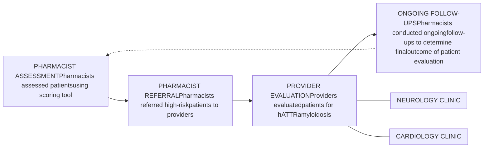
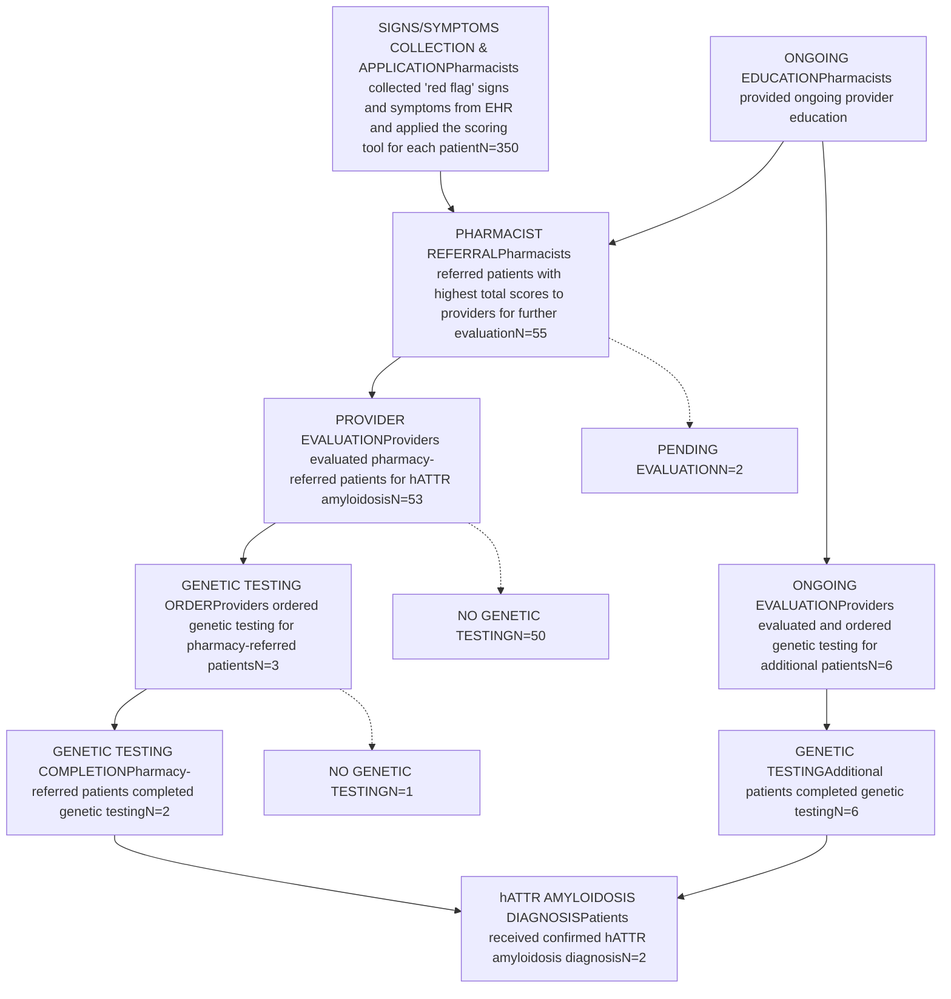

# Health-system specialty pharmacists as key players in the early identification of patients with hereditary amyloid transthyretin amyloidosis

cps logo

Steven Fosnight, PharmD; Amber Skrtic, PharmD; Kyle Snoke, PharmD; Maria Talos, PharmD; Casey Fitzpatrick, PharmD; Andrew Wash, PharmD, PhD; Jessica Mourani, PharmD; Ana Lopez Medina, PharmD, PhD; Christopher Sidun, PharmD

## Background

* Hereditary amyloid transthyretin (hATTR) amyloidosis is a rare genetic disease characterized by the deposition of insoluble amyloid fibrils in tissues around the body.1

* The five-year survival rate for patients with hATTR amyloidosis is approximately 52.8% (95% CI 45.2-60.4%).2 However, early initiation of treatment can significantly improve survival outcomes by slowing disease progression.3

* Early diagnosis remains a challenge due to the heterogenous clinical presentation patterns of hATTR amyloidosis, limited disease awareness, and the tendency for frequent misdiagnosis.3

## Objectives

To describe a health-system specialty pharmacy's role in identifying and referring patients with signs and symptoms of hATTR amyloidosis for further evaluation.

## Methods

* A quality improvement (QI) initiative was conducted from April 2024 to April 2025 at a single health system in Ohio.

* A scoring tool was developed to prioritize follow-up for patients with "red flag" signs and symptoms of hATTR amyloidosis.

1. **Baseline Cohort**: A random sample of 350 patients with carpal tunnel syndrome and progressive polyneuropathy was selected for evaluation using a specific scoring tool.

2. **Scoring Tool**: Pharmacists reviewed electronic health records (EHRs) to identify and score "red flag" signs or symptoms of hATTR amyloidosis.

3. **Risk Stratification**: Each patient received a total score, with higher scores correlating to a greater risk of having hATTR amyloidosis.

## FIGURE 1: High-Risk Patient Referral Process for Further Evaluation

## Results

## FIGURE 2: QI Initiative Workflow

## Results Cont.

## FIGURE 3: Genetic Testing One Year Before & After QI Initiative

| Period               | Number of Genetic Tests Completed |
| -------------------- | --------------------------------- |
| BEFORE QI INITIATIVE | 4                                 |
| AFTER QI INITIATIVE  | 8                                 |

QR code to read the full whitepaper

## Discussion & Conclusion

* This QI initiative successfully increased disease awareness, which led to a higher rate of genetic testing and diagnosis.

* The sustained nature of pharmacists' educational efforts played a crucial role in enhancing providers' recognition of high-risk patients and their willingness to conduct further evaluation.

* Overall, pharmacists are well positioned to strengthen these efforts by leveraging their expertise in medication management and risk assessment to support an interdisciplinary approach aimed at identifying and managing patients with rare diseases.

## References

1 Poli L, Labella B, Piccinelli SC, et al. Hereditary transthyretin amyloidosis: a comprehensive review with a focus on peripheral neuropathy. Front Neurol. 2023;14:1242815. doi:10.3389/fneur.2023.1242815

2 Antonopoulos AS, Panagiotopoulos I, Kouroutzoglou A, et al. Prevalence and clinical outcomes of transthyretin amyloidosis: a systematic review and meta-analysis. Eur J Heart Fail. 2022;24(9):1677-1696. doi:10.1002/ejhf.2589

3 Gertz M, Adams D, Ando Y, et al. Avoiding misdiagnosis: expert consensus recommendations for the suspicion and diagnosis of transthyretin amyloidosis for the general practitioner. BMC Fam Pract. 2020;21(1):198. doi:10.1186/s12875-020-01252-4

