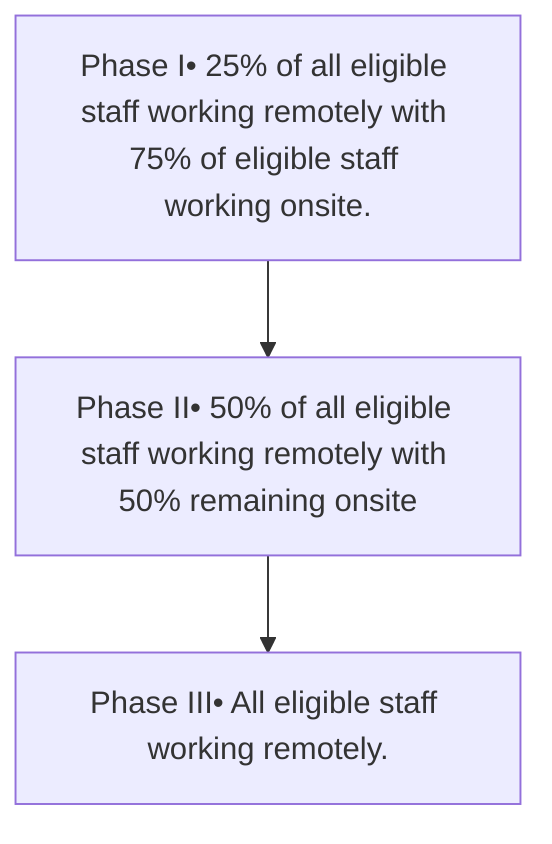

**Yale NewHaven Health**

# Alternate Work Arrangement within Specialty Pharmacy

Alijah Kosarko, BA, CPhT; Bisni Narayanan, Pharm D, MS; Mitchell DelVecchio, Pharm D, CSP;
Heather McKeon, BSHCA; Terri Sue Rubino, Pharm D, CSP; Vinay Sawant, RPh, MPH, MBA
Yale New Haven Health, Department of Pharmacy, New Haven, CT

NASP NATIONAL ASSOCIATION OF SPECIALTY PHARMACY logo

## Background

* The State of Connecticut passed the Shared Service Bill that went into effect February 18, 2022. The bill allows remote order entry and remote order entry verification.

* Call center volume at the Outpatient Pharmacy Services (OPS) at Yale New Haven Health has grown tremendously in recent years with increases in staff volume.

* We sought a cost-effective method for an alternative work arrangement to improve call center staff efficiency.

## Objectives

* To implement an alternative work arrangement for call center pharmacy staff while maintaining accreditation call center metrics.

## Methods

* We employed a phased deployment plan to maintain our call center metrics within accreditation standards (speed of answer < 20 seconds, and abandonment rate < 2%)

* Eligible employees, staff in their current roles for more than 6 months were given the equipment and allowed one remote test shift prior to commencing the phased deployment.

## Results

### Phase I-III Average Call Center Metrics

| Phase     | Average Speed of Answer (seconds) | Goal Speed of Answer < 20 secs | Average Abandonment % |
| --------- | --------------------------------- | ------------------------------ | --------------------- |
| Phase I   | 20                                | 20                             | 1.5                   |
| Phase II  | 14                                | 20                             | 1.2                   |
| Phase III | 15                                | 20                             | 1.1                   |

### Call Center Metrics Prior to Deployment

| Month     | Average Speed of Answer (seconds) | Goal Speed of Answer < 20 secs | Average Abandonment % |
| --------- | --------------------------------- | ------------------------------ | --------------------- |
| June      | 15                                | 20                             | 1.0                   |
| July      | 14                                | 20                             | 1.1                   |
| August    | 16                                | 20                             | 1.2                   |
| September | 23                                | 20                             | 1.8                   |
| October   | 21                                | 20                             | 1.6                   |
| November  | 22                                | 20                             | 1.7                   |

## Phase I

Phase I Staff Work Arrangement

| Category | Percentage |
| -------- | ---------- |
| Onsite   | 88         |
| offsite  | 12         |

### Phase I Call Center Metrics

| Date       | Speed of Answer (seconds) | Goal Speed of Answer < 20 secs | Abandonment % |
| ---------- | ------------------------- | ------------------------------ | ------------- |
| 12/5/2022  | 25                        | 20                             | 2.0           |
| 12/12/2022 | 22                        | 20                             | 1.8           |
| 12/19/2022 | 20                        | 20                             | 1.5           |
| 12/26/2022 | 18                        | 20                             | 1.2           |
| 1/2/2023   | 28                        | 20                             | 2.5           |
| 1/9/2023   | 15                        | 20                             | 1.0           |
| 1/16/2023  | 22                        | 20                             | 1.8           |
| 1/23/2023  | 15                        | 20                             | 1.2           |
| 1/30/2023  | 14                        | 20                             | 1.0           |
| 2/6/2023   | 12                        | 20                             | 0.8           |
| 2/13/2023  | 22                        | 20                             | 1.8           |
| 2/20/2023  | 12                        | 20                             | 0.8           |

## Phase II

Phase II Staff Work Arrangement

| Category | Percentage |
| -------- | ---------- |
| Onsite   | 72         |
| offsite  | 28         |

### Phase II Call Center Metrics

| Date      | Speed of Answer (seconds) | Goal Speed of Answer < 20 secs | Abandonment % |
| --------- | ------------------------- | ------------------------------ | ------------- |
| 2/27/2023 | 12                        | 20                             | 0.8           |
| 3/6/2023  | 11                        | 20                             | 0.7           |
| 3/13/2023 | 12                        | 20                             | 0.8           |
| 3/20/2023 | 11                        | 20                             | 0.7           |
| 3/27/2023 | 15                        | 20                             | 1.2           |
| 4/3/2023  | 11                        | 20                             | 0.7           |
| 4/10/2023 | 12                        | 20                             | 0.8           |
| 4/17/2023 | 11                        | 20                             | 0.7           |
| 4/24/2023 | 12                        | 20                             | 0.8           |
| 5/1/2023  | 13                        | 20                             | 0.9           |

## Phase III

Phase III Work Arrangement

| Category | Percentage |
| -------- | ---------- |
| Onsite   | 30         |
| offsite  | 70         |

### Phase III Call Center Metrics

| Date      | Speed of Answer (seconds) | Goal Speed of Answer < 20 secs | Abandonment % |
| --------- | ------------------------- | ------------------------------ | ------------- |
| 5/8/2023  | 14                        | 20                             | 1.0           |
| 5/15/2023 | 15                        | 20                             | 1.1           |
| 5/22/2023 | 14                        | 20                             | 1.0           |
| 5/29/2023 | 13                        | 20                             | 0.9           |
| 6/5/2023  | 15                        | 20                             | 1.1           |
| 6/12/2023 | 14                        | 20                             | 1.0           |
| 6/19/2023 | 15                        | 20                             | 1.1           |
| 6/26/2023 | 14                        | 20                             | 1.0           |

## Discussion

* We observed an increase in the average speed of answer and abandonment rate during Phase I. We extended Phase I for an additional 4 weeks to rule out the holiday increase in call volumes.

* With the remote deployment of staff, and constant hiring of new technicians who were on-site, we revised the pharmacist schedule to include an onsite rotation once in four weeks to maintain the pharmacist to technician ratio.

* Phase I to Phase III, we were able to see a 43% improvement in our average speed of answer and a 30% improvement in our average abandonment rate %.

## Barriers/Limitations

* Call center staff movement into other positions within the health system created a need for opening requisitions and backfilling positions. Our ratio for onsite: remote staff was affected by this.

* Operational closures due to holidays created an influx of incoming calls.

* Budget for equipment for deployment

## Future Directions

* Adaption of the remote work model for all retail pharmacy locations within the health system.

## Conclusions

* Maintaining call center metrics while transitioning to an alternative work arrangement can be successful with a phased-out approach

## References

Regulation of the Department of Consumer Protection Concerning Shared Pharmacy Service, Secretary of State File Number 6357

Disclosure: The authors of this presentation have the following to disclose concerning possible financial or personal relationships with commercial entities that may have a direct or indirect interest in the subject matter of this presentation; Alijah Kosarko, BA, CPhT; Bisni Narayanan, Pharm D, MS; Mitchell DelVecchio, Pharm D, CSP; Heather McKeon, BSHCA; Terri Sue Rubino, Pharm D, CSP; Vinay Sawant, RPh, MPH, MBA nothing to disclose.

NASP Annual Meeting & Expo 2023. September 19-21, 2023

