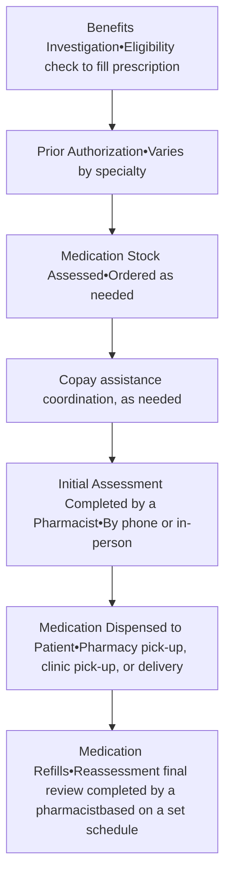
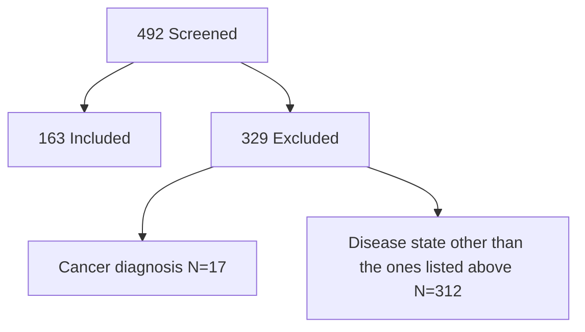

UNIVERSITY of FLORIDA The Foundation for The Gator Nation logo

# Medication Adherence Post-Implementation of a PMP

Lydia Halim Girgis, PharmD
Lanh Dang, PharmD, BCACP
UF Health Jacksonville

UFHealth UNIVERSITY OF FLORIDA HEALTH logo

# Background

* Non-adherence is a multifactorial issue that relates to behaviors surrounding medication adherence, such as accessibility, education, and the wide variety of reporting strategies, each with their own limitations 1-3

$$ PDC = \frac{\text{Days Supply of Medication Dispensed to the Patient}}{\text{Total number of days}} $$

* Proportion of Days Covered (PDC) is endorsed by the Pharmacy Quality Alliance (PQA) and the National Quality Forum (NQF) and is used by the Centers for Medicare and Medicaid Services (CMS) in their Star Rating methodology, which defines medication adherence as more than 0.8 or 80% of days covered, as specified in the relevant performance measures 4

* The specialty pharmacy at UF Health Jacksonville is URAC (Utilization Review Accreditation Commission) accredited

## Figure 1. Specialty Pharmacy Workflow

# Purpose

To evaluate the impact of the Patient Management Program (PMP) on optimizing patient care and PDC

# Objectives

## <u>Primary</u>

* Percentage of specialty pharmacy patients with a PDC ≥ 80% post-implementation of the Patient Management Program at UF Health Jacksonville Ambulatory Pharmacy

## <u>Secondary</u>

* Compare and analyze PDC of specialty pharmacy patients pre- and post- PMP implementation

* Quantify number of times patients were contacted by a pharmacy team member

* Categorize the types of non-adherence

* Describe the percent compliance with UF Health Jacksonville policy on timing of PMP initiation and reassessment notes

### Table 1. Reassessment Schedule

| Chronic therapy (> 6 months)     | Short-term therapy (≤ 6 months)  |
| -------------------------------- | -------------------------------- |
| 4 weeks in to treatment ± 7 days | 4 weeks in to treatment ± 7 days |
| Every 6 months ± 14 days         | With each refill                 |

# Methods

A single-center, retrospective observational cohort study describing the PDC of specialty pharmacy patients post-implementation of the PMP at UF Health Jacksonville Ambulatory Pharmacy from August 1, 2018 to March 30, 2020

## Inclusion Criteria

* Adults 18 years or older
* Have a specialty medication for gastroenterology, hepatology, neurology, or rheumatology
* The post PMP group was included from 08/01/2018 – 03/30/2020.

## Exclusion Criteria

* Concomitant cancer diagnosis
* Being a specialty pharmacy patient for a disease state other than the ones listed in the inclusion criteria

# Results

## Figure 2. Patient Selection

### Table 2. Baseline Characteristics

| Mean Age, years (range)          | 53 (20 – 73) |
| -------------------------------- | ------------ |
| Gender n, (%)                    |              |
| Female                           | 102 (63)     |
| Race n, (%)                      |              |
| Black or African American        | 89 (55)      |
| White                            | 58 (36)      |
| Other/ Unknown                   | 13 (8)       |
| Asian                            | 2 (1)        |
| American Indian or Alaska Native | 1 (1)        |
| Insurance Type n, (%)            |              |
| Medicare                         | 65 (40)      |
| Commercial                       | 52 (32)      |
| Medicaid                         | 29 (18)      |
| Charity                          | 17 (10)      |

### Table 3. Breakdown of Disease State Category

| Disease State    | Category n, (%) |
| ---------------- | --------------- |
| Hepatology       | 76 (47)         |
| Rheumatology     | 45 (28)         |
| Gastroenterology | 25 (15)         |
| Neurology        | 17 (10)         |

## Primary Outcome:
95% of patients (155/163) had PDC ≥ 80%

## Figure 3. Mean Duration and Pharmacy Contact

Mean duration of time in the PMP program during the study period
* 137 days (Range 28 – 629)

Mean number of times contacted by a pharmacy team member
* 3 per patient (Range 0 – 14)

## Figure 4. Note Timing and Reason for Inappropriateness

| Category                     | Percentage |
| ---------------------------- | ---------- |
| Note Timing                  |            |
| Yes                          | 36%        |
| No                           | 64%        |
| Reason for Inappropriateness |            |
| Early                        | 25%        |
| Late                         | 59%        |
| Both                         | 6%         |
| Note missed                  | 10%        |

# Discussion

* Findings supported collaboration with pharmacy informatics to build a Patient Management Program workflow in Epic

* Staff were re-educated regarding appropriate timing for follow up

* The Patient Management Program has been well received by patients and providers and encouraged expansion into other disease states such as oncology and dermatology

* Non-compliance is multifactorial and the PMP bridges many of those gaps to promote adherence and overall patient well being

* Limitations of the project included:

    * Small sample size

    * Inconsistencies in documentation during the early stages of the program which also made it challenging to identify reasons for non-adherence as it was a small number of subjects

    * Lack of a comparator group for pre and post analysis which was a secondary outcome

    * Data likely skewed due to majority of patients being in the hepatology subgroup

# References

1. Osterberg L, Blaschke T. Adherence to medications. N Engl J Med. 2005; 353:487-497

2. Patton D, Hughes C, Cadogan C, et al. Theory-based interventions to improve medication adherence in older adults prescribed polypharmacy: A systematic review. Drugs Aging. 2017; 34(2): 97–113

3. Vrijens B, Geest S, Hughes D, et al. A New Taxonomy for Describing and Defining Adherence to Medications. Br J Clin Pharmacol. 2012 May; 73(5): 691–705

4. Centers for Disease Control and Prevention. Calculating proportion of days covered (PDC) for antihypertensive and antidiabetic medications: an evaluation guide for grantees. Atlanta, GA: Centers for Disease Control and Prevention, U.S. Department of Health and Human Services; 2015. https://www.cdc.gov/dhdsp/docs/med-adherence-evaluation-tool.pdf. Accessed July 8, 2020

# Disclosures

The authors of this presentation have nothing to disclose concerning possible financial or personal relationships with commercial entities

**Contact**: Lanh.Dang@jax.ufl.edu

