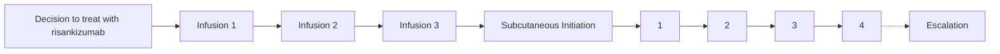

VANDERBILT Vanderbilt Health logo HEALTH | Specialty Pharmacy

QR Code

# Risankizumab Dose Escalation in Patients with Crohn’s Disease

Patrick Nichols, PharmD, CSP, Jessica Fann, PharmD, Miranda Kozlicki, PharmD, CSP, Autumn Zuckerman, PharmD, BCPS, CSP, Robin Dalal, MD

## Key Findings

* Heavily treatment-experienced patients with previous dose escalations and severe CD may require risankizumab dose escalation
* Additional insurance authorization is commonly required for escalated doses
* Most patients improved or remained stable on the escalated dosing, showing promise for risankizumab dose escalation outcomes
* As of 12/12/2023, there have been 50 additional referrals for escalated dosing at the study site

## BACKGROUND

* Patients who do not achieve optimal response at standard dosing of biologic therapies or lose response over time often benefit from escalated doses of biologic therapies to manage moderate to severe Crohn’s disease (CD).

* Currently, no data exists on dose escalating risankizumab, an interleukin-23 inhibitor recently approved for the treatment of moderate to severe CD.

## PURPOSE

This cohort study aimed to describe patient characteristics, insurance access, and response to therapy in patients prescribed risankizumab more frequently than the FDA-approved subcutaneous (SQ) maintenance dosing of 180mg or 360mg every 8 weeks.

## RESULTS

### Table 1. Cohort Characteristics

| ID | Gender | Age (yrs) | BMI (kg/m²) | Prior Surgical Intervention | Advanced Therapies Tried (#) | Previously Escalated Medications (#) | Years Since Diagnosis | Dosing Frequency | Reason for Escalation              | Response to Therapy |
| -- | ------ | --------- | ----------- | --------------------------- | ---------------------------- | ------------------------------------ | --------------------- | ---------------- | ---------------------------------- | ------------------- |
| 1  | Female | 22        | 23.5        | Yes                         | 2                            | 0                                    | 15                    | Q4W              | High fecal cal, pouch inflammation | No                  |
| 2  | Female | 24        | 21.1        | No                          | 5                            | 3                                    | 15                    | Q6W              | Persistent symptoms                | Improved            |
| 3  | Male   | 30        | 21          | Yes                         | 6                            | 3                                    | 6                     | Q6W              | Persistent symptoms                | Improved            |
| 4  | Male   | 30        | 25.1        | No                          | 2                            | 1                                    | 7                     | Q4W              | Persistent symptoms                | Improved            |
| 5  | Female | 36        | 22.1        | No                          | 6                            | 1                                    | 17                    | Q6W              | Inflammation on endoscopy          | Stable              |
| 6  | Female | 38        | 34.9        | Yes                         | 4                            | 1                                    | 27                    | Q4W              | Flare requiring hospitalization    | No                  |
| 7  | Female | 45        | 24.7        | No                          | 3                            | 2                                    | 13                    | Q6W              | Persistent symptoms                | No                  |
| 8  | Female | 51        | 25.3        | No                          | 1                            | 1                                    | 17                    | Q6W              | Moderate colitis on pathology      | Improved            |
| 9  | Female | 52        | 30.1        | No                          | 2                            | 2                                    | 3                     | Q4W              | Inflammation on endoscopy          | Improved            |
| 10 | Male   | 52        | 26.7        | Yes                         | 4                            | 1                                    | 18                    | Q4W              | High fecal cal, pouch inflammation | Stable              |
| 11 | Female | 64        | 29.2        | Yes                         | 6                            | 2                                    | 11                    | Q6W              | Inflammation on endoscopy          | Stable              |
| 12 | Male   | 69        | 20.9        | Yes                         | 4                            | 2                                    | 48                    | Q6W              | Inflammation on CTE, symptoms      | Improved            |

Abbreviations: yrs: years; BMI: body mass index, Q6W, every 6 weeks; Q4W, every 4 weeks; CTE, computed tomography enterography; cal, calprotectin

### Figure 1. Previous Medication Upset Plot

| Medication         | Set Size |
| ------------------ | -------- |
| Trial drug\*       | 1.0      |
| Upadacitinib       | 1.0      |
| Cetrolizumab pegol | 1.0      |
| Tofacitinib        | 1.0      |
| Vedolizumab        | 4.0      |
| Adalimumab         | 6.0      |
| Infliximab         | 7.0      |
| Ustekinumab        | 10.0     |

* Infliximab, adalimumab, and ustekinumab were commonly tried and failed prior to dose escalation
* Patients had tried and failed a median of 4 (IQR 2-5) advanced therapies
* \*Pizzicato Trial

## METHODS

| Setting     | Vanderbilt Inflammatory Bowel Disease Clinic- large academic medical center in the Southeastern United States serving approximately 10,000 patients                |
| ----------- | ------------------------------------------------------------------------------------------------------------------------------------------------------------------ |
| Design      | Retrospective single-center cohort study                                                                                                                           |
| Sample      | Patients with CD initiated on and received at least one escalated dose of risankizumab between June 2022 and July 2023 with follow-up evaluation before 10/03/2023 |
| Data Source | Electronic Heath Record - Epic                                                                                                                                     |

| Category                                                         | Count |
| ---------------------------------------------------------------- | ----- |
| Patients initiated on risankizumab                               | 211   |
| Patients with at least 2 doses of escalated dosing by 10/03/2023 | 12    |

### Figure 2. Dose Escalation Timing

**Number of SQ Maintenance Doses Prior to Escalation**
* 0-1 Previous Medications Escalated icon **0-1 Previous Medications Escalated**
* 2 Previous Medications Escalated icon **2 Previous Medications Escalated**
* 3 Previous Medications Escalated icon **3 Previous Medications Escalated**

### Figure 3. Medication Access Pathway

Medication Access Pathway Diagram showing Insurance Approval without PA, Prior Authorization Needed (Approved/Denied), Appeal/Peer-to-Peer, and Patient Assistance Program for Commercial, Medicare, and Tricare

### Figure 4. Response to Therapy (n=12)

| Response    | 1-2 Advanced Therapy Failures | 3-4 Advanced Therapy Failures | 5-6 Advanced Therapy Failures |
| ----------- | ----------------------------- | ----------------------------- | ----------------------------- |
| No Response | 1                             | 1                             | 1                             |
| Stable      | 0                             | 1                             | 2                             |
| Improved    | 2                             | 1                             | 3                             |

* Median follow-up from escalation was 88 days (IQR 71-103)

Disclosures: Drs. Nichols, Fann and Dalal have received consulting fees from AbbVie. No other authors have relevant financial relationships to disclose. Logos

