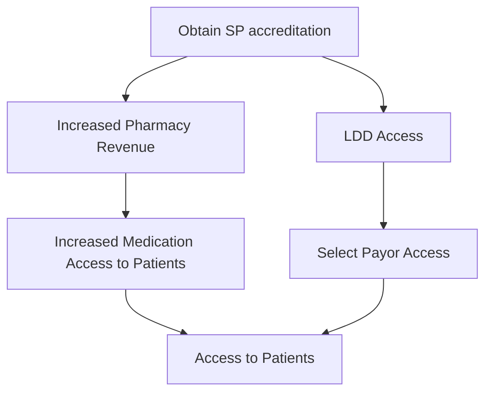

SHIELDS HEALTH SOLUTIONS logo

# Revenue and Patient Volume Associated with Accreditation-Restricted Limited Distribution Drugs in Health-System Specialty Pharmacies

Lauren Babits, PharmD, BCNSP; Patrick Ryan PharmD, BCCCP; Kate Campagnola, PharmD; Adam Cosby, PharmD, CSP; Megan Henry, PharmD, BCSCP, CSP

## BACKGROUND

* Specialty pharmacy (SP) accreditation is a requirement to participate in select payor and limited distribution drugs (LDDs) networks. URAC and ACHC are two prominent organizations that provide SP accreditation.

* Access to LDDs allows health-system pharmacies to offer the full services of integrated SP care to more patients. See Figure 1. Studies show integrated care provided by health-system SP lowers the total cost of care by 13%.1

Figure 1: SP Accreditation Pathway to Payor, LDD, and Patient Access

## METHODS

* A retrospective analysis was conducted on 25 LDDs identified that require SP accreditation to obtain access.

* Aggregated fill data for all SP medications on the Shields Health Solutions (SHS) Specialty Drug List (SDL) for calendar year 2023 and 2024 were analyzed.

* The data included all SHS supported Health System pharmacies (N= 35) with at least one SP accreditation, excluding children’s hospitals and pharmacies undergoing initial SP accreditation.

* Primary endpoints included revenue, number of fills, and number of patients serviced.

* All values are reported as weighted averages across the two-year period.

* While all included pharmacies held at least one SP accreditation, access to certain LDDs may have required dual accreditation or specific payor network participation. These factors were not independently stratified in this analysis.

## RESULTS

The 25 accreditation-restricted LDDs represented 7.3% of the total specialty drugs dispensed, accounting for 3.6% of specialty prescriptions filled and 3.4% of patients serviced. These drugs contributed 9.4% of total specialty pharmacy revenue. See Figures 2 – 5 for a “Comparison of Revenue per Fill to Key Dispensing Metrics for Accreditation-Restricted LDDs (2023-2024)”. Figure 2: Percentage of Total Medications Dispensed; Figure 3: Percentage of Total Fills Dispensed; Figure 4: Percentage of Total Unique Prescriptions Dispensed; Figure 5: Percentage of Total Patients Receiving a Specialty Medication

Figure 2: Percent Revenue Per Fill vs. Total Medications Dispensed

| Year  | Medications (%) | Revenue per Fill (%) |
| ----- | --------------- | -------------------- |
| 2023  | 7.4             | 11.0                 |
| 2024  | 7.1             | 9.8                  |
| Total | 7.2             | 10.3                 |

Figure 3: Percent Revenue Per Fill vs. Total Fills Dispensed

| Year  | # of Fills (%) | Revenue per Fill (%) |
| ----- | -------------- | -------------------- |
| 2023  | 3.4            | 11.0                 |
| 2024  | 3.7            | 9.8                  |
| Total | 3.6            | 10.3                 |

Figure 4: Percent Revenue Per Fill vs. Total Prescriptions Dispensed

| Year  | Unique RXs (%) | Revenue per Fill (%) |
| ----- | -------------- | -------------------- |
| 2023  | 3.1            | 11.0                 |
| 2024  | 3.2            | 9.8                  |
| Total | 3.1            | 10.3                 |

Figure 5: Percent Revenue Per Fill vs. Total Patients Receiving a Specialty Medication

| Year  | Patients (%) | Revenue per Fill (%) |
| ----- | ------------ | -------------------- |
| 2023  | 3.3          | 11.0                 |
| 2024  | 3.5          | 9.8                  |
| Total | 3.4          | 10.3                 |

## CONCLUSIONS

* Specialty pharmacy accreditation through URAC or ACHC enables access to a subset of LDDs that contribute meaningfully to patient care and revenue. Although these drugs account for a small percentage of total volume, they represent nearly 10% of revenue, underscoring their financial significance.

* Accreditation positions health-system SPs to expand access to high-value medications and supports integrated care models shown to reduce healthcare costs. Future studies should explore pre- and post-accreditation access, the role of payor network restrictions, and comparisons with non-accreditation-restricted LDDs to further quantify the impact of accreditation.

* Future analyses should consider stratifying outcomes by accreditation type and payor-specific access requirements to further delineate their impact on revenue and patient volume.

## DISCLOSURES

The authors of this presentation have nothing to disclose concerning possible financial or personal relationships with commercial entities that may have a direct or indirect interest in the subject matter of this presentation

## REFERENCES

1Hellems SS et al. J Manag Care Spec Pharm 2022;28(2):244-54

QR Code

SCAN ME icon

QR Code

