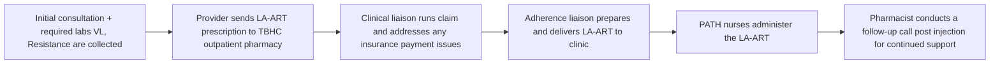

Clearway Health logo

# One Shot at a Time: Pharmacy Team Driven Implementation of Long-Acting Antiretroviral Therapy for HIV Management and PrEP

Siham Romahi, PharmD, Raven Heslop, CPhT; Jean Estime, PharmD
Clearway Health

## Introduction

Between 2018 and 2022, the United States had an estimated 12% decrease in new HIV infections.1 Currently, approximately 1.2 million individuals are living with HIV across the country.2 The goal is to reduce HIV infection by 90% by 2030.3 The development of long-acting (LA) antiretroviral (ART) are critical to achieving this target. LA-ART address key barriers including daily pill fatigue, social stigma, and inconsistent access to medication. However, LA-ARTs are difficult medications to gain access to due to high cost. Most prescriptions require additional steps such as prior authorization, copay assistance, and financial support programs. This can cause delays in care. Additionally, LA-ARTs require close monitoring to assess patients for adherence and address any adverse events.

Specialty pharmacy services help to overcome these financial and adherence limitations. Pharmacists and pharmacy liaisons have the resources and experience to lower expenses. They manage prior authorizations and enroll patients in coupon relief programs. This expedites prescription fulfillment and reduces the time to initiate therapy. At The Brooklyn Hospital Center (TBHC), a coordinated multidisciplinary model has been established to enhance HIV and PrEP management. Pharmacist and pharmacy liaisons work directly with HIV clinic providers to provide patients with direct access too education and support. This approach has demonstrated improvements in medication access, adherence rates, and overall clinical outcomes.

## Objective

This study examines how a team of pharmacists and liaisons facilitated the adoption of LA-ARTs, improved medication access, adherence, and optimized treatment outcomes for HIV management and PrEP.

## Methodology

* Study Design: Single center, retrospective, observational study

* Data Source: Collected through EHR review and specialty pharmacy patient management tool dashboard at Clearway Health Brooklyn client

* Study Population: Any adult patient who started LA-ART from January 2023 to December 2024 at the Brooklyn client site

* Exclusion: Patients who transitioned care to other clinics

* Statistical Analysis: Descriptive analysis was conducted to present results proportionally

## Workflow

## Results

### Table 1. Baseline Demographics

| Characteristics        | N=141     |
| ---------------------- | --------- |
| Age year-median (IQR)  | 37        |
| Male n (%)             | 101 (72%) |
| Female n (%)           | 40 (28%)  |
| Race                   |           |
| African American n (%) | 107 (76%) |
| Hispanic n (%)         | 17 (12%)  |
| Caucasian n (%)        | 7 (5%)    |
| Others n (%)           | 10 (7%)   |

### Patients Started LA-ART Between Jan 2023-DEC 2024

| Category | Percentage |
| -------- | ---------- |
| HIV      | 80         |
| PrEP     | 20         |

Prior Authorization turnaround time <1 day 100% icon

PDC 100% icon

Persistency 100% icon

Average Co-pay $0 icon

### Initial Consult to RX Fulfillment

| Timeframe      | Percentage |
| -------------- | ---------- |
| Same Day       | 36         |
| Next Day       | 6          |
| Within a Week  | 11         |
| Within a Month | 20         |
| 1 Month        | 7          |
| Unknown        | 20         |

### % of Patients LWHIV Who Achieved VL Suppression

| Timeframe             | Percentage |
| --------------------- | ---------- |
| At Time of Transition | 80         |
| At End of Study       | 99         |

## Conclusion

A total of 141 were initiated on LA-ART at TBHC, with 51 (36.2%) receiving their first dose on the same day as their initial consultation. An additional eight patients returned the following day for treatment. This was made possible through the involvement of a specialty pharmacy, ensuring timely access to medication and care.

Patients who initiated therapy past the two day mark did so due to clinically uncontrolled reasons. This included transition of care (e.g. patient already receiving LA-ART and not yet due for the next dose), uncertainty about switching to LA-ART (required multiple consultations), or changes in insurance or employment status.

The integration of a specialty pharmacy service significantly improved medication access and patient support, contributing to a 99% viral load suppression rate following the switch to LA-ART.

This study highlights that incorporating specialty pharmacy service during the LA-ART transition process enhances both provider and patient satisfaction, while leading to improved patient care and clinical outcomes.

## References

1. Fast facts: HIV in the United States. Centers for Disease Control and Prevention. Accessed July 21, 2025. https://www.cdc.gov/hiv/data-research/facts-stats/index.html.

2. HIV/AIDS in the U.S. amfAR, The Foundation for AIDS Research. January 21, 2025. Accessed July 21, 2025. https://www.amfar.org/about-hiv-aids/hiv-aids-in-the-us/#:~:text=Nearly%201.2%20million%20people%20in,in%20the%20U.S.%20in%202022.

3. Ehe Overview. HIV.gov. Accessed July 21, 2025. https://www.hiv.gov/federal-response/ending-the-hiv-epidemic/overview.

4. Ma A, Chen DM, Chau FM, Saberi P. Improving adherence and clinical outcomes through an HIV pharmacist's interventions. AIDS Care. 2010 Oct;22(10):1189-94. doi: 10.1080/09540121003668102. PMID: 20640958.

## Acknowledgments

A special thanks to Donisha Lewis, PharmD, BCACP and Amanuel Kehasse PharmD, PhD for their support and guidance.

