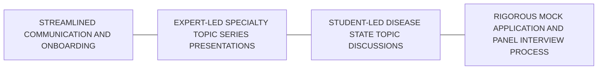

Photograph of pharmacy-related items: books, pills, syringe, and notepad

# EVALUATING THE SPECIALTY APPE EXPERIENCE: SATISFACTION FROM STUDENT AND PRECEPTOR PERSPECTIVES

Nicole L. Miracle, PharmD, MPH, CSP
Addison South, PharmD, MPA
Amelia Le, PharmD
Adrienne Matson, PharmD, BCPS
Tera McIntosh, PharmD, BCACP
Janet Mills, PharmD, BCPS, CDCES
Holly Divine, PharmD, BCACP, BCGP, CDCES, FAPhA

## BACKGROUND

* Advanced Pharmacy Practice Experiences (APPEs) are essential for pharmacy students to apply knowledge in real-world settings

* A health system specialty pharmacy (HSSP) introduced a site coordinator to enhance student and preceptor experiences by streamlining current components and implementing new core program components focused on specialty pharmacy

* Challenges in APPEs have been identified, but gaps remain in optimizing specialty pharmacy APPEs.

## OBJECTIVES

1. Assess student pharmacist and preceptor satisfaction with the UK Specialty Pharmacy and Infusion Services (UKSPIS) APPE Program

2. Identify areas of strength and weakness within the UKSPIS APPE Program

3. Explore areas of opportunity for program expansion

4. Determine the impact of a newly implemented site coordinator on the student and preceptor experience

## METHODS

* A questionnaire was developed in REDCap and disseminated via email to APPE preceptors and student pharmacists completing a rotation at the health system specialty pharmacy (HSSP) during the 2024-2025 academic year.

* The questionnaire collected (1) demographic information, (2) opinions regarding satisfaction with the HSSP APPE Program and its core components (Figure 1), and (3) Perceived program benefits for student development and experiential education.

* Invitations were distributed to students at the conclusion of each rotation block, with 2 reminder invitations being sent out at 1-week intervals after the initial invitation.

* Preceptors were invited to participate following the completion of their last scheduled APPE block of the academic year.

* For analysis, descriptive statistics were used to categorize responses.

Figure 1. UKSPIS APPE Program Core Components

## RESULTS

* 23 student pharmacists responded to the survey (76.7%) with 20 (66.7%) completing all questionnaire components

* 7 preceptors responded to the survey (77.8%) and completed all questionnaire components

A. Overall Satisfaction With UKSPIS APPE Program

| Satisfaction Level | Preceptor (%) | Student (%) |
| ------------------ | ------------- | ----------- |
| Very Dissatisfied  | 0             | 0           |
| Dissatisfied       | 0             | 0           |
| Neutral            | 0             | 10          |
| Satisfied          | 28            | 28          |
| Very Satisfied     | 72            | 62          |

B. "Disease State Topic Discussions aided in my NAPLEX preparation."

| Agreement Level   | Percentage (%) |
| ----------------- | -------------- |
| Strongly Agree    | 35             |
| Agree             | 48             |
| Neutral           | 12             |
| Disagree          | 5              |
| Strongly Disagree | 0              |

C. "The Mock Interview process prepared me for future job/postgraduate training applications and interviews."

| Agreement Level   | Percentage (%) |
| ----------------- | -------------- |
| Strongly Agree    | 55             |
| Agree             | 42             |
| Neutral           | 3              |
| Disagree          | 0              |
| Strongly Disagree | 0              |

Figure 2. Survey responses regarding A) Overall Satisfaction, B) Student NAPLEX Preparation, and C) Job/Postgraduate Training Application Preparation

Image Source: Adobe Stock

| Statement                                                                                                           | Strongly Agree (%) | Agree (%) | Neutral (%) | Disagree (%) | Strongly Disagree (%) |
| ------------------------------------------------------------------------------------------------------------------- | ------------------ | --------- | ----------- | ------------ | --------------------- |
| Communication with my site coordinator was adequate.                                                                | 95                 | 5         | 0           | 0            | 0                     |
| Communication with my primary preceptor was adequate.                                                               | 95                 | 5         | 0           | 0            | 0                     |
| The site coordinator helped me streamline my APPE rotation experience.                                              | 85                 | 15        | 0           | 0            | 0                     |
| Recording of presentations, interviews, Disease State Topic Discussions, and/or Specialty Topic Series was helpful. | 65                 | 20        | 15          | 0            | 0                     |
| The rotation(s) met my educational expectations.                                                                    | 68                 | 27        | 0           | 5            | 0                     |
| The topics covered during the Specialty Topic Series helped me learn more about specialty pharmacy.                 | 65                 | 35        | 0           | 0            | 0                     |
| The Day 1 Orientation helped prepare me for my rotation.                                                            | 58                 | 37        | 5           | 0            | 0                     |
| The Specialty Topic Series presentations were interesting and engaging.                                             | 50                 | 45        | 5           | 0            | 0                     |
| The information available in CORE ELMS on the rotation was helpful in making my rotation selection.                 | 50                 | 35        | 10          | 5            | 0                     |

Figure 3. Student Pharmacist Perspectives of APPE Rotation Experiences and Support (N=18)

| Statement                                                                                                               | Strongly Agree (%) | Agree (%) | Neutral (%) | Disagree (%) | Strongly Disagree (%) |
| ----------------------------------------------------------------------------------------------------------------------- | ------------------ | --------- | ----------- | ------------ | --------------------- |
| Communication with my site coordinator was adequate.                                                                    | 85                 | 15        | 0           | 0            | 0                     |
| The site coordinator helped streamline my APPE rotation experience.                                                     | 85                 | 15        | 0           | 0            | 0                     |
| Recording of presentations, interviews, Disease State Topic Discussions, and/or Specialty Topic Series was helpful.     | 45                 | 40        | 15          | 0            | 0                     |
| The Specialty Topic Series are valuable for APPE students.                                                              | 58                 | 42        | 0           | 0            | 0                     |
| The APPE Day 1 Orientation successfully introduced and prepared my student for the learning experience.                 | 85                 | 15        | 0           | 0            | 0                     |
| I received adequate support from the UK College of Pharmacy Office of External Studies regarding my APPE preceptorship. | 85                 | 15        | 0           | 0            | 0                     |

Figure 4. Preceptor Perspectives of APPE Rotation Experiences and Support (N=7)

## CONCLUSION

The official implementation of the UKSPIS APPE Program shows promise within its first year to contribute to student success and support preceptor needs. Results from the survey of both student pharmacists and preceptors suggest that the utilization of a site coordinator within an organized APPE Program can help not only with operational efficiency, but support student learning needs.

UK HealthCare Specialty Pharmacy & Infusion Services logo

UK College of Pharmacy Office of External Studies logo

Interested in Learning More?

QR Code

