UVAHealth logo

# The Role of Specialty Pharmacy in Coordinating and Monitoring Gene Therapy for Duchenne Muscular Dystrophy: The Elevidys® Experience at a Single Integrated Delivery Network Medical Center
Emily Chen, PharmD, BCPPS; Alisha Atchison, CPhT; Nathan Hart, PharmD; Angela Holian, PharmD, BCPS, MSCS; Joshua Weber, PharmD, MBA-HCM, CSP
University of Virginia Health, Charlottesville, Virginia

NASP NATIONAL ASSOCIATION OF SPECIALTY PHARMACY logo

## BACKGROUND

* Duchenne muscular dystrophy (DMD) is a progressive genetic disorder caused by mutations in the dystrophin gene, leading to muscle dysfunction and premature mortality.

* Delandistrogene moxeparvovec-rokl (Elevidys®; DELA), delivers a functional copy of the dystrophin gene via an adeno-associated viral vector leading to microdystrophin expression, aiming to delay disease progression.

* DELA therapy carries significant off-target effects that require rigorous pre- and post-infusion monitoring.

* Specialty Pharmacy staff at UVA Health play a critical role in ensuring the safe and cost-effective administration of DELA throughout all stages of therapy.

## OBJECTIVE

* Describe the effort and outcomes of specialty pharmacy staff involvement in the coordination execution, and monitoring of DELA therapy for pediatric patients with DMD at a single academic institution.

## METHODS

* Observational study conducted at UVA Health between March 1, 2024 and June 30, 2025, which included all patients who completed a DELA infusion.

## RESULTS

| Characteristic                                                 | Value                                                               |
| -------------------------------------------------------------- | ------------------------------------------------------------------- |
| Total Patients                                                 | 3                                                                   |
| Median Age (range)                                             | 5 (4 to 12)                                                         |
| Median Dosing Weight, kg (range)                               | 23 (21 to 45)                                                       |
| Ambulatory at baseline                                         | 3                                                                   |
| Left ventricular ejection fraction at baseline                 | 62% to 70%,                                                         |
| Baseline motor function \*North Star Ambulatory Assessment | 15 to 24/34                                                         |
| Median baseline LFTs (range) \*Units reported in U/L       | AST 189 (109 to 363) ALT 399 (216 to 519) GGT 15 (10 to 16) |
| Dystrophin gene exon deletions                                 | 48-50 45-50 49-50                                           |

## RESULTS

### Elevidys Gene Therapy Process Map for an IDN Academic Medical Center Health System

```mermaid
graph TD
    subgraph Pre_Infusion_Phase ["Pre-Infusion Phase (≥ 3 Months Prior to Infusion)"]
        A[Eligibility & Benefits Investigation] --> B[Specialty Pharmacy Medication Access Team]
        B --> C[Patient enrollment into EHR Clinical Monitoring Program]
        C --> D[Complete Benefits Investigation w/ Payer]
        D --> E[Initial medical benefit prior authorization]
        E --> F[Appeal]
        F --> G[Peer Review]
        G --> H[External Review]
        E --> I[Completed as needed]
        I --> J[Execute Single Case Agreement w/ Payer & Health System Managed Care Team]
        J --> K[Provider & Specialty Pharmacist]
        K --> L[Lab Testing & Review]
        L --> M["Genetic testing to confirm pathogenic hemizygous DMD deletion"]
        L --> N["Baseline labs: Comprehensive Metabolic Panel, LFTs, GGT, TBili, Troponin-I, Complete Blood Count"]
        L --> O[Anti-AAVrh74 antibody titers]
        K --> P["Vaccination Review: Ensure age-appropriate vaccinations are completed at least 4 weeks before infusion"]
        K --> Q["Confirm ERX build needs in EPIC/EHR for weight-based NDC"]
    end

    subgraph Gene_Therapy_Team_Activation ["Gene Therapy Team Activation (30 Days Prior to Infusion)"]
        R[Activate Gene Therapy Team] --> S["Providers, Nursing, Pharmacy (Specialty, Supply Chain & Inpatient/Infusion), Revenue Cycle"]
        S --> T[Specialty Pharmacist conducts pre-treatment initial assessment]
        T --> U[Document initial assessment in EHR STM platform]
        U --> V[Meet with patient and family to review therapy plan]
        V --> W[Confirm pre-infusion lab status and steroid regimen]
        W --> X[Corticosteroid Initiation & Dosing]
        X -- Steroid-naive? --> Y{No}
        X -- Steroid-naive? --> Z{Yes}
        Y --> AA["Patient already on steroids: Prednisone-equivalent 1 mg/kg/day starting 1 day prior to infusion"]
        Z --> AB["Steroid-naive: Prednisone-equivalent 1.5 mg/kg/day starting 1 week prior to infusion"]
        AA --> AC["Duration: 60 days post-infusion with tapering over 2-4 weeks or as clinically indicated"]
        AB --> AC
    end

    subgraph Drug_Procurement_and_Supply_Chain ["Drug Procurement & Supply Chain (≥ 14 Days Prior to Infusion)"]
        AD[Pharmacy Supply Chain & Specialty Pharmacy] --> AE[Dosing Weight confirmed & Supply Chain submits drug order for procurement]
        AE --> AF[Confirms patient's ongoing eligibility and payer authorization]
        AF --> AG[Ensure pre-infusion steroids and supportive medications are accessible]
        AG --> AH[Dosing Weight Confirmed & Locked]
    end

    subgraph Infusion_Day ["Infusion Day"]
        AI[Pre-infusion evaluation by clinical team] --> AJ[Assess for signs of infection or recent illness]
        AJ --> AK[Confirm steroid dosing completion]
        AK --> AL[Specialty Pharmacist meets with patient/family for final education]
        AL --> AM[Infusion & Immediate Monitoring]
        AM --> AN[Inpatient infusion pharmacy preps medication for administration]
        AN --> AO[Nursing team completes IV access]
        AO --> AP[Medication administered per institutional protocols and site of care considerations]
        AP --> AQ[Monitor for infusion-related reactions]
        AQ --> AR["Hypersensitivity reactions, Nausea, vomiting, Monitor patient for at least 3 hours post-infusion"]
        AR --> AS[Specialty Pharmacist documents reassessment in EHR STM]
    end

    subgraph Post_Infusion_Phase ["Post-Infusion Phase (Weeks 5-9 Months Post-Infusion)"]
        AT["Short-Term Monitoring (First 4 Weeks)"] --> AU[Specialty Pharmacist-Weekly follow-up assessments]
        AU --> AV[Lab Monitoring & Clinical Review]
        AV --> AW["LFTs/GGT/TBili every week for 12 weeks, Troponin-I weekly for 4 weeks, Platelets biweekly for 2 weeks, Other labs as needed (i.e. CKs)"]
        AU --> AX[Access for early adverse events]
        AX --> AY["Myositis (muscle pain, difficulty swallowing/breathing), Myocarditis (chest pain, shortness of breath), Hepatic impairment (elevated LFTs, tbili, GGT)"]
        AU --> AZ[Steroid regimen adherence]
        AT --> BA["Long-Term Monitoring (Weeks 5-9 Months Post-Infusion)"]
        BA --> BB[Specialty Pharmacist follow-up assessments]
        BB --> BC[Continue steroid taper per clinical response and monitor adherence]
        BC --> BD{Hepatic impairment occurs?}
        BD -- Yes --> BE[Increase to 2-2.5 mg/kg/day prednisone if LFTs worsen]
        BD -- No --> BF[Continue to taper steroids]
    end
```

CK-Creatinine Kinase, EHR-Electronic Health Record, GGT-Gamma Glutamyl Transferase, ERX-Electronic Prescription Record, IV-Intravenous, LFT-Liver Function Tests, NDC-National Drug Code, STM-Specialty Therapy Management Program (e.g, Compass Rose)

This structured process ensures a seamless transition from pre-infusion preparation through post-infusion monitoring while aligning with payer requirements, clinical protocols, and patient safety considerations. This process map serves as a foundational workflow that is continuously refined in the evolving landscape of gene therapy

Disclosures: The authors of this presentation have nothing to disclose concerning possible financial or personal relationships with commercial entities that may have a direct or indirect interest in the subject matter of this presentation.

## RESULTS

* Median time from prior authorization initiation to infusion administration is 128 days (53 to 214 days)

* Mean number of pharmacists visits per patient is 6.6 (5 to 7)

* Mean number of interventions per patient is 14 (12 to 17)

* No episodes of immune mediated myositis

* No episodes of acute liver failure

* All patients were on post-infusion prednisone for at least 60 days

### Pharmacist Interventions by Type

| Intervention Type          | Percentage | Count |
| -------------------------- | ---------- | ----- |
| Lab Monitoring             | 34         | 15    |
| Patient Education          | 23         | 10    |
| Therapy Recommendation     | 18         | 8     |
| Drug-Drug/Food Interaction | 9          | 4     |
| Dosage Adjustment          | 9          | 4     |
| Immunization Review        | 7          | 3     |

## CONCLUSIONS

* DELA therapy implementation necessitates intensive pharmacy involvement across all stages of treatment acquisition and management.

* This model may serve as a replicable framework for institutions implementing high-touch, high-risk therapies.

## NEXT STEPS

* Recent sentinel events have prompted reconsideration of supportive care protocols.

* Ongoing research focuses on optimizing supportive care regimens to improve the safety of DELA infusions.

## REFERENCES

1. Mendell JR, et al. Practical considerations for delandistrogene moxeparvovec gene therapy in patients with Duchenne muscular dystrophy. Pediatric Neurology, 153, 11-18. <u>https://doi.org/10.1016/j.pediatrneurol.2024.01.003</u>

2. Zaidman CM, et al. Delandistrogene moxeparvovec gene therapy in ambulatory patients (aged ≥ 4 to < 8 years) with Duchenne muscular dystrophy: 1-year interim results from Study SRP-9001-103 (ENDEAVOR). Annals of Neurology, 94, 955-968. <u>https://doi.org/10.1002/ana.26755</u>

3. Mendell JR, et al. AAV gene therapy for Duchenne muscular dystrophy_ the EMBARK phase 3 randomized trial. Nature Medicine, 31, 332-341. <u>https://doi.org/10.1038/s41591-024-03304-z</u>

