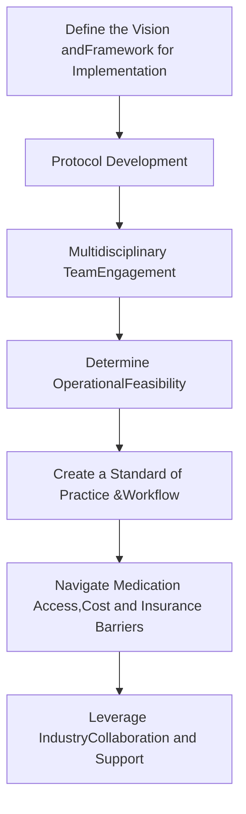

UVAHealth logo
# Enhancing Specialty Medication Delivery Through Pharmacist-Led Integration of Subcutaneous Injection Therapy in a Neurology Clinic
NASP National Association of Specialty Pharmacy logo

Angela H. Holian, PharmD, BCPS, MSCS; Linda L. Morris, CPhT; Emily A. Chen, PharmD, BCPPS; Jacqueline L. Garrett, RN; Nathan D. Hart, PharmD, Robert K. Shin, MD
University of Virginia Health, Charlottesville, Virginia

## BACKGROUND

* Ocrelizumab/hyaluronidase is an FDA-approved combination of ocrelizumab, a widely used anti-CD20 B-cell depleting monoclonal antibody used as a disease-modifying therapy for treatment of multiple sclerosis (MS), and hyaluronidase, an enzyme that increases the absorption of drugs into tissue.

* Ocrelizumab/hyaluronidase is a 10-minute subcutaneous injection that can be administered in the clinic as an alternative to intravenous administration in an infusion center, allowing for increased patient convenience, decreased visit times, and reduced infusion center capacity constraints.

* The implementation of a subcutaneously administered injection process for a first-of-its-kind MS therapy in a neurology clinic has the potential to generate cost savings for both the patient and health system.

## OBJECTIVES

* Our aim was to Improve patient access, experience, and clinical outcomes in multiple sclerosis care by implementing an in-clinic subcutaneous treatment model as an alternative to traditional IV infusions. This approach could reduce travel and scheduling burdens, enhances operational efficiency by optimizing clinic resources, and fosters collaboration among neurology providers, pharmacists, nurses, and administrative teams. The project also aims to streamline reimbursement processes through established protocols for insurance coverage and billing, demonstrate potential cost savings for both patients and the health system, and evaluate real-world outcomes through patient-reported experience and injection administration tolerability data.

## METHODS

* We identified the demand for an in-clinic subcutaneous ocrelizumab/hyaluronidase administration pathway to enhance patient convenience, reduce infusion center chair time, and improve resource utilization.

* A multidisciplinary team—including neurology providers, nurses, specialty pharmacists, pharmacy technicians, operations staff, and patient access coordinators—was engaged with clearly defined roles for each member.

* A standardized protocol was developed, including pre-treatment screening, patient counseling, and an emergency management plan for hypersensitivity or injection-related reactions.

* Electronic Health Record (EHR) integration involved building the medication (ERX) in EPIC, securing formulary addition, and creating standardized order sets with dosing, pre-medication, and monitoring instructions, as well as documentation templates for nursing and pharmacist notes.

* Staff training included targeted education on injection technique, safety monitoring, and emergency management, supported by simulation-based drills.

* Patient access processes were established to verify insurance coverage, obtain prior authorizations, determine appropriate billing under medical or pharmacy benefits, and coordinate medication supply.

* Clinic workflow mapping optimized patient flow from arrival through discharge, including a defined observation period and structured follow-up.

* Patient-reported outcomes were collected at baseline, immediately post-treatment, and 72 hours post-treatment, with a planned 6-month follow-up, focusing on satisfaction, side effects, and willingness to continue therapy.

## RESULTS

Figure 1: Flow Chart of Process Implementation

* Recognize the clinical and operational benefit of switching from IV to SC administration
    - Improved access, faster administration, fewer infusion-related reactions
    - Evaluate patient preferences, logistical barriers to infusion centers, and potential cost savings.

* Present proposal to: Neurology providers, clinical nursing leadership, pharmacy team (inpatient and Specialty teams), clinic operations/administration teams, prior authorization team
    - Incorporate feedback and address concerns

* Create a **Standard of Practice (SOP)** detailing:
    - Patient selection process, shared decision making, patient education
    - Step-by-step injection administration process and observation period
    - Pre-medication and emergency protocols
    - Electronic Medical Record (EMR) documentation requirements
    - Staff training modules and mock drills

* Engage with industry partners for clinical education, reimbursement navigation, implementation resources
    - Utilize available tools such as patient education materials, clinician training
    - Understand coverage pathways and access programs

* Create a **Standard of Practice (SOP)**
    - Medication and electronic medical record (EMR) Integration
        - eRx Build in EMR
        - Ensure ordering process with accurate dosing, frequency, route, and administration instructions
    - Formulary addition process
        - P&T approval
        - Coordination with pharmacy leadership for medication ordering and storage
    - Link order to preconfigured billing process

* Model after existing programs, e.g. Botox administration
    - Assess clinic space, equipment needs (infusion pump, e.g. Alaris)
    - Identify appropriate days and times for injection visits, ideally starting with one day of the week
    - Medication storage: Automated dispensing system (e.g. Pyxis) with refrigeration

* Verify benefit coverage (medical vs pharmacy benefits)
    - Work with payers to ensure site-of-care approval
    - Appointment scheduling: Injection visit + physician visit using a modifier 20 code for same-day visits
    - Clarify billing codes and revenue cycle processes
    - Partner with manufacturer for prior authorization support and any needed financial assistance

| Cost Category                   | Intravenous Infusion (IV Center)                                              | Subcutaneous Injection                                                 | Estimated Savings             |
| ------------------------------- | ----------------------------------------------------------------------------- | ---------------------------------------------------------------------- | ----------------------------- |
| Facility/Infusion Center Fees   | High (facility fee, infusion suite charge)                                    | Minimal (clinic visit fee)                                             | Significant                   |
| Nursing Time                    | 4-6+ hours RN time                                                            | 30 - 60 minutes RN time                                                | Significant                   |
| Medication Administration Time  | \~4 hours + pre/post monitoring                                               | \~70 - 75 min (first injection) \~25 min (subsequent injections)   | Major time savings            |
| Patient Time Commitment         | \~6-8 hours total (travel + infusion + monitoring)                            | \~1-1.5 hours total (depending on travel + injection + provider visit) | Significant                   |
| Travel Costs                    | 1 full day off work                                                           | 0.5 day or less off work                                               | Moderate                      |
| Pre-medication use              | IV steroids, antihistamines, antipyretics administered at the infusion center | Oral pre-medications that can be administered before clinic visit      | Mild                          |
| Monitoring Costs                | Prolonged monitoring for infusion reactions                                   | Short observation post-injection                                       | Moderate                      |
| Risk of Infusion Reactions      | Higher (especially with first dose)                                           | Lower with subcutaneous administration                                 | Clinical benefits             |
| Patient Satisfaction            | Lower (time burden)                                                           | Higher (convenience, comfort)                                          | Non-monetary, high importance |
| Total Direct and Indirect Costs | High                                                                          | Lower                                                                  | Substantial                   |

* **Direct Cost Savings**: Facility fee reductions, shorter nursing time, fewer infusion center resources
* **Indirect Savings**: Less time off work, less travel/childcare costs, improved patient convenience/satisfaction
* **Clinical Efficiency**: Combining subcutaneous injection + provider follow-up visit into a single clinic trip prevents duplication of travel of time and costs

Table 1. Potential Impact on Cost

## PATIENT FEEDBACK

* "It's really easy and great. It was very fast, painless and a big improvement over the regular IV procedure."
* "It's fantastic compared to any of the other medications I've ever done."
* "Itching and redness that appeared a few min after and went away in 2 hrs; slight bruising the next day and gone in 48 hrs."
* <mark>"Tender, bruising, immediate, skin surface felt numb and tender"</mark>
* "Felt bruised for 24-48 hours, but by 72 hours it was totally gone. First night was a little sore."
* "Very quick and very little discomfort"
* **"Much more convenient than other treatments"**
* "ALMOST NO PAIN AT THE TIME OF INFUSION; PAIN AND PUFFINESS 1-2 DAYS AFTER."
* "No chills-had chills with IV; Insertion of needle was so easy; time was great-before I knew it was over."
* "Slept better after this appointment; Day 2 was the worst of it."
* "I liked it because it was faster, and we didn't have to call the IV team."
* "I used numbing cream afterwards."
* **"Recommend shaving the area."**
* "If I could have won the lottery it would have been perfect."
* \*DONT EVER PUT ME BACK ON THE INFUSION. PLEASE DO THIS EVERY TIME I'M VERY GRATEFUL FOR OCREVUS.
* "Redness and swelling within 24-48 hours"

| Satisfaction Level | Immediately After Treatment (%) | 72-hr After Treatment (%) |
| ------------------ | ------------------------------- | ------------------------- |
| Very Positive      | 78.41                           | 75.00                     |
| Positive           | 9.09                            | 10.23                     |
| Neutral            | 12.50                           | 12.50                     |
| Somewhat Negative  | 0.00                            | 2.27                      |
| Negative           | 0.00                            | 0.00                      |

Figure 2. Patient-reported experience following treatment with ocrelizumab/hyaluronidase injection in the clinic setting

## DISCUSSION

Transitioning from infusion center-based administration to a clinic-based subcutaneous model significantly reduces treatment time, offers the potential for meaningful cost savings for patients, and enhances the overall treatment experience by delivering a highly effective therapy with minimal discomfort or side effects.

Multidisciplinary collaboration, including neurology providers, clinic nurses, pharmacy staff, administrators, and access teams, was critical to aligning workflows and refining the process for in-clinic ocrelizumab/hyaluronidase subcutaneous administration. Embedded Specialty Pharmacists played a central role by identifying gaps in access, safety, and delivery, and by leading the design and coordination of the new workflow—demonstrating the value of their clinical expertise and the potential for expanded roles within specialty pharmacy.

## CONCLUSION

* A multidisciplinary approach is essential to the successful implementation of new clinic processes. Each team member brings a unique perspective, contributing valuable insights that enhance decision-making, uncover potential challenges, allowing for more collaborative, comprehensive patient-centered care.

* Clinic-embedded Specialty Pharmacists are uniquely positioned to lead the design, coordination, and implementation of innovative clinical workflows-demonstrating the integral value of their role in advancing patient care and operational efficiency within the clinic setting.

* Ocrelizumab/hyaluronidase subcutaneous injection is an effective and valuable treatment option for patients with multiple sclerosis, demonstrating high levels of patient satisfaction and preference.

## REFERENCES

* OCREVUS [ocrelizumab] Full Prescribing Information. Genentech, Inc., 2024.

* OCREVUS [ocrelizumab] Summary of Product Characteristics. Roche Pharma AG, 2022.

* Hauser SL, et al. ECTRIMS Meeting 2024;Poster P300.

Disclosures: A Holian received consultancy fees for scientific advisory boards from Genentech, Inc., and TG Therapeutics; R Shin receives consultant fees from Genentech, TG Therapeutics, Novartis. All other authors of this presentation have nothing to disclose concerning possible financial or personal relationships with commercial entities that may have a direct or indirect interest in the subject matter of this presentation.

