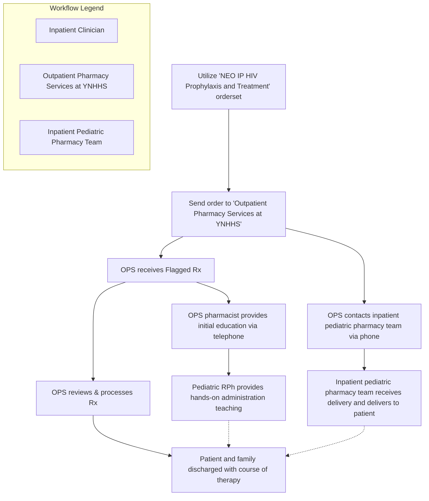

Yale New Haven Health logo

# Clinical Continuity Intervention for Newborns Exposed to Maternal HIV Infection

Aislinn Devoe, RN, MSN, CMSRN, CV-BC; Mark D’Ambrosi, RPh, CSP; Natalie Amendola BS, CPhT; Michele Riccardi, PharmD, BCPS; Nadia Yohannes, RPh; Tina Do, PharmD, MS, BCPS; Terri Sue Rubino, PharmD, CSP; Vinay Sawant, RPh, MPH, MBA

## Background

* The risk of transmission of the human immunodeficiency virus (HIV) from mother to newborn can be significantly mitigated by appropriate medication management and adherence after birth.

* Failure to adhere with the full course of therapy or inappropriate administration of medications can lead to enhanced opportunity of disease spread from mother to infant.

* The course of complete therapy ranges from four to six weeks.

* At Yale New Haven Health, barriers to achieving optimal outcomes in the peri-discharge setting included interruptions in therapy and poor health literacy.

## Objective

To improve the clinical continuity for newborns exposed to maternal HIV infection by supplying full course of therapy to patient regardless of insurance status upon discharge from hospital.

## Methods

* Identified and engaged key stakeholders: clinicians, nursing leadership, care management, financial access counselors, inpatient pediatric pharmacy team, and IT
* Engaged IT to enhance ordering process
* Determined billing process

Figure 1: Admission Orders

Screenshot of NEO IP HIV Prophylaxis and Treatment admission orders in electronic health record

## Methods (continued)

Figure 2: Workflow

\*OPS= Outpatient Pharmacy Services at YNHHS

## Results

Figure 3: Infant Antiviral Orders by Year

| Year | Captured (n) | Not Captured (n) | Capture Rate (%) |
| ---- | ------------ | ---------------- | ---------------- |
| 2021 | 1            | 16               | 6%               |
| 2022 | 0            | 14               | 0%               |
| 2023 | 5            | 0                | 100%             |

Figure 4: Patient Outcomes

| Metric                      | Value |
| --------------------------- | ----- |
| Adherence Rate              | 100%  |
| Completed Course of Therapy | 100%  |
| Transmission Rate           | 0%    |

\*Clinical Continuity Intervention ongoing; multiple newborns remain on antiviral therapy. (n=5\*)

## Discussion

* Involvement of the integrated health system specialty pharmacy team can be an essential component to addressing barriers to achieving optimal outcomes in the peri-discharge setting, including interruptions in therapy and poor health literacy.

* Secondary endpoints are being collected on a rolling basis. These include disease state specific clinical outcomes as well as overall outcomes such as transmission rates, medication adherence and confirmation of completion of course of therapy.

## Barriers/Limitations

### Barriers

* Collaborating on workflow with stakeholders with competing priorities
* Electronic health record restrictions

### Limitations

* Workflow supported by highly integrated electronic health record and dispensing system

* Leveraged existing specialty pharmacy team dedicated to managing infectious disease medications

## Conclusions

Expansion of relationships between the neonatal units and the integrated health system specialty pharmacy enables the opportunity to increase clinical continuity within a health system and improve patient outcomes.

## Future Directions

* Expand to remaining delivery networks within the Yale New Haven Health System.

* Implementation of CarePathway will assist to streamline the ordering process for health system and community clinicians.

* Evaluate long term clinical outcomes including rate of infant HIV seroconversion.

The authors of this presentation have nothing to disclose concerning possible financial or personal relationships with commercial entities that may have a direct or indirect interest in the subject matter of this presentation.

