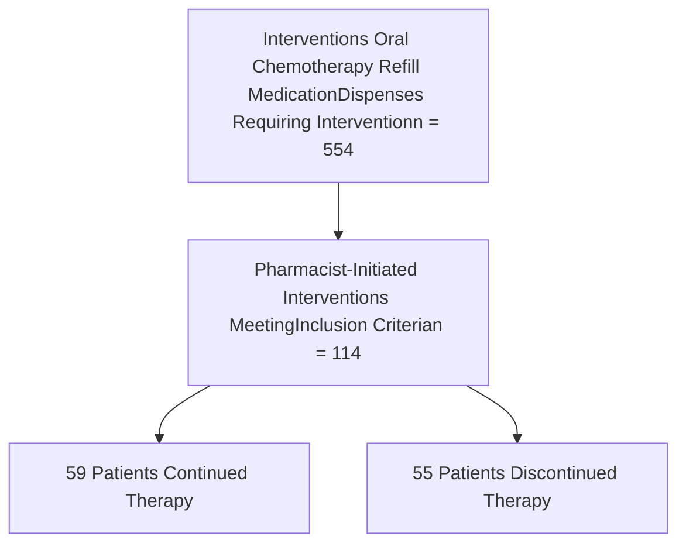

Contact Information
Keeyan.davis@uchospitals.edu

# Specialty Pharmacy Impacts Oral Chemotherapy Cost

Keeyan Davis, Pharm.D., Pauline Lee, Pharm.D., BCOP, Monika Lach, Pharm.D., MBI, BCPS
The University of Chicago Medicine

UChicago Medicine logo

## Background

* Health-system specialty pharmacies (HSSPs) are quickly emerging as the trajectory of specialty pharmaceutical approvals continue to skyrocket.

* HSSPs serve an important role in improving medication adherence, provider collaboration, and reducing overall healthcare costs.

* The University of Chicago Medicine (UCM) Specialty Pharmacy has an established service line within oncology with dedicated clinical pharmacists providing comprehensive patient care.

* To ensure appropriateness of each dispense, every oncology refill is evaluated by a clinical pharmacist which may lead to improved adherence, decreased medication waste, and reduced pharmacy costs.

## Objective

The purpose of this study is to demonstrate the impact an integrated HSSP can have on decreasing payer cost through appropriate dispenses.

## Methods

* Retrospective single-center chart review of pharmacy interventions impacting oral chemotherapy dispenses
* Inclusion Criteria:

    * Oral chemotherapy refill due at the University of Chicago Medicine Specialty Pharmacy

    * Study Duration:
        * February 1, 2020 - August 31, 2020

    * Pharmacist-initiated intervention required prior to refill

* **Primary Endpoint**: Estimated payer cost avoidance due to held dispenses as a result of pharmacist interventions

* **Secondary endpoints**: Duration therapy is held, reason for holding therapy, and therapy continuation.

* Interventions that resulted in therapy discontinuation were excluded in the cost avoidance analysis.

* Data was collected using Therigy® and Epic Willow

## Results

### Reasons for Holding Therapy (n=114)

| Reason                                      | Therapy Continued | Therapy Discontinued |
| ------------------------------------------- | ----------------- | -------------------- |
| Pending Office Visit                        | 9                 | 17                   |
| Laboratory Monitoring                       | 5                 | 17                   |
| Potential Therapy Change or Discontinuation | 18                | 2                    |
| Hospitalization                             | 13                | 5                    |
| Side Effects                                | 5                 | 9                    |
| Procedure                                   | 3                 | 5                    |
| Dose Adjustment                             | 2                 | 4                    |

### Cost Avoidance for Patients Whose Therapy was Continued After Holding

| Drug Name     | Number of Patients (n=59) | Sum of Days Dispense Held\* | Cost Avoidance### |
| ------------- | ------------------------- | --------------------------- | ----------------- |
| Palbociclib   | 7                         | 209                         | 95,249.28         |
| Lenvatinib    | 4                         | 118                         | 69,699.83         |
| Venetoclax    | 15                        | 330                         | 33,252.74         |
| Acalabrutinib | 3                         | 71                          | 25,949.97         |
| Rucaparib     | 1                         | 46                          | 19,496.34         |
| Ibrutinib     | 3                         | 43                          | 19,392.37         |
| Osimertinib   | 2                         | 37                          | 19,136.86         |
| Pazopanib     | 2                         | 50                          | 17,266.64         |
| Othera        | 22                        | 376                         | 113,699.28        |
| **Total**     | **59**                    | **1,280**                   | **413,143.31**    |

\*Days elapsed between expected refill due date and date prescription was actually refilled.

###Cost avoidance calculated using manufacturer average wholesale price (AWP). Calculated specific to each patient’s dose and sig.

## Conclusions

* Integrated HSSPs are able to ensure continuation of therapy is appropriate prior to patient refill calls.

    * Working alongside providers with access to EMR demonstrates the benefit of this model versus non-integrated specialty pharmacies.

**61 % of interventions** for holding therapy were identified by the integrated health system pharmacist. Pharmacy icon

Calendar icon Refill dispenses were held for a sum of **1,280 days** in response to pharmacist intervention.

For patients continued on therapy, cost avoidance due to holding dispenses was **$413,143.31**. Money icon

## Limitations

* Data does not capture all dose adjustments and therapy changes. Changes that occur in real time may not have had an intervention documented.

* All pharmacist interventions are proactive. This does not mean that a patient would not have intervened during the refill call.

* Next step: Calculate the proportion of days covered (PDC) for all patients whose therapy was continued after holding. This analysis only assessed days elapsed between expected refill due date and date prescription was actually refilled.

## References

1. Fein AJ. Hospitals Continue Their Startling Expansion into Specialty Pharmacy. Drug Channels Institute. August 2020. Available at: https://www.drugchannels.net/2020/08/hospitals-continue-their-startling.html. Accessed February 24, 2021.

2. Bagwell A, Kelley T, Carver A, et al. Advancing Patient Care Through Specialty Pharmacy Services in an Academic Health System. J Manag Care Spec Pharm. 2017;23(8):815-20.

## Disclosures

The authors of this presentation have no financial interests with commercial entities that may have a direct or indirect interest in the subject matter of this presentation.

