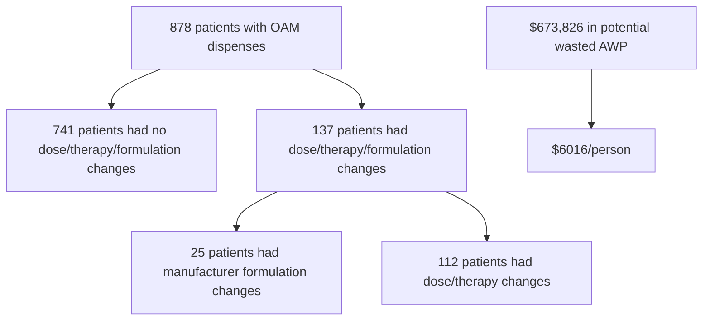

Yale New Haven Health logo

# Oral oncology waste in an integrated health system specialty pharmacy

Bisni Narayanan, PharmD, MBA, MS; Kimhouy Tong, PharmD, BCPS; Terri Sue Rubino, PharmD, CSP; Vinay Sawant, RPh, MPH, MBA
Department of Pharmacy, Yale New Haven Health

NASP ANNUAL MEETING & EXPO 2024 logo

## Background

* Oral anti-cancer medication (OAM) costs have skyrocketed leading to significant financial toxicity for patients.

* Assistance options are limited. Patients with Medicare prescription drug benefits do not qualify for manufacturer copay programs.

* As of September 2023, 44 states have laws establishing prescription drug repository programs in which unused medications can be donated and re-distributed to qualified patients. Of these, only 14 states have OAM focused programs.

* While Connecticut residents may donate unused OAMs to national drug repositories, the state does not have an active oral oncology drug repository program from which they can receive donated therapies.

* The potential benefit of health system specialty pharmacies (HSSPs) to identify and triage OAM waste in Connecticut is not well understood

## Objective

* To quantify oral oncology waste and opportunity in an integrated HSSP to advocate for the creation of a Connecticut oral oncology drug repository program.

## Methods

Pill bottle icon Oral oncology medications filled at the HSSP Sept 2022 through Sept 2023 were retrieved.

Band-aid icon Patient charts were reviewed for dose changes and clinically required therapy switches. Manufacturer driven switches were excluded.

Plus sign icon Waste was calculated as the last dispensed quantity minus the quantity used at first fill of the new prescription

Dollar sign icon Wasted healthcare dollars was calculated using the average wholesale price

Heart icon Oral anticancer medications paid by grants and free drugs were tracked at the same time

## Results

Figure 1: Patients with wasted medications by insurance type

| Insurance Type   | Percentage |
| ---------------- | ---------- |
| Medicare alone   | 38%        |
| MAP+ Medicare    | 25%        |
| Medicaid         | 18%        |
| Commercial       | 15%        |
| 340b cash        | 3%         |
| Copay card alone | 1%         |

Figure 2: Wasted medication percentage split by therapy/dose change

| Change Type     | Percentage |
| --------------- | ---------- |
| Therapy changes | 44.88%     |
| Dose changes    | 55.12%     |

Figure 3: Top 10 wasted medications

| Medication   | Percentage |
| ------------ | ---------- |
| ibrutinib    | 14.76%     |
| ruxolitinib  | 13.29%     |
| lenvatinib   | 8.28%      |
| abemaciclib  | 5.60%      |
| dasatinib    | 4.78%      |
| enzalutamide | 4.40%      |
| cabozantinib | 4.18%      |
| venetoclax   | 3.86%      |
| pacritinib   | 3.84%      |
| alpelisib    | 3.04%      |

Figure 4: Medication assistance from Sept 2022- Sept 2023

| Metric           | Value        |
| ---------------- | ------------ |
| Patients         | 24K+         |
| Scripts          | 28K+         |
| Total Assistance | $3.4 million |

AWP (average wholesale price); MAP (medication assistance program); OAM (oral anticancer medication)
NASP Annual Meeting & Expo 2024. October 6-9, 2024

## Discussion

* As patients face financial challenges, a proportion of OAMs are wasted from frequent dose or therapy changes in this population.

* OAM waste averages $6000 per patient, presenting incredible untapped resource to mitigate financial toxicity to patients in their cancer treatment journey.

* A remarkable 88% of patients prescribed ibrutinib, ruxolitinib, lenvatinib, abemaciclib or dastatinib who reported difficulty affording medications received financial assistance. However, approximately 6% of patients were not eligible for any assistance. The most common reasons were due to lack of available programs or exceeding the income limit.

* Public health insurance programs funded by state and federal programs accounted for majority of wastage (71%), with 18% of Medicare patients securing some sort of financial assistance.

## Limitations

* Our integrated dispensing and clinical documentation platform enables tracking of medication assistance outcomes which may not be feasible at other health systems.

## Future Directions

* Refine calculated opportunity to reduce waste to account for waste that cannot be redirected (e.g. expired medications, tampered products).

* Creation of an active oral drug repository program in Connecticut encompassing all healthcare systems in the state.

## Conclusion

HSSPs can serve as a hub to collect unused OAMs for redistribution to Connecticut patients experiencing financial toxicity via an oral oncology drug repository program.

## References

1. Medha Sharath, Scott F. Huntington, Stephanie Halene, Osama Abdelghany. Oral cancer drug repositories: Challenges and solutions. Presented at ASCO Annual Meeting 2024, Chicago, IL.

## Acknowledgements

We would like to thank Sam Abdelghany for providing his invaluable expertise on the oral oncology drug repository programs and Andrew Cadorette for his assistance with reporting.

The authors of this presentation have nothing to disclose concerning possible financial or personal relationships with commercial entities that may have a direct or indirect interest in the subject matter of this presentation.

