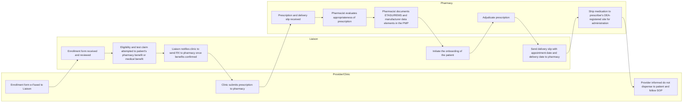

SHIELDS HEALTH SOLUTIONS logo

# Specialty Pharmacy Responds to Opioid Crisis

Kristen Ditch, PharmD, BCCCP; Kerry Mello-Parker, PharmD; Jennifer L. Donovan, PharmD, Brian S. Smith, PharmD; Stacy Walton, RN, BSN; Kate Smullen, PharmD, CSP, MSCS; Jack Donahue, Mytsie Thevenin, CPhT; Chris Conboy, PharmD

## Background

* The national opioid crisis requires a collaborative approach by health systems to prevent opioid misuse and overdose deaths while expanding access to treatments to address opioid addiction

* Buprenorphine ER injection is a Schedule III controlled substance indicated for adults with opioid addiction and is available through a restricted distribution program through the FDA REMS

* The buprenorphine ER injection ETASU REMS requirements are essential for patient safety, yet pose compliance challenges specific to health system controlled substance chain of custody and storage

* Specialty pharmacies must comply with regulatory and manufacturer contractual requirements while developing a comprehensive care model to support drug access and manage patients receiving this healthcare provider administered medication

* The objective is to describe the process of implementing a comprehensive program to safely manage patients receiving buprenorphine ER injection while satisfying the regulatory and manufacturer requirements

## Methods

* The pharmacy contacted the manufacturer in January 2018 to obtain a data contract to dispense buprenorphine ER injection

* FDA and DEA regulatory requirements were compiled and assessed for inclusion into a buprenorphine ER injection program

* Data elements required by the manufacturer, commercial payers and accreditation standards pertaining to specialty pharmacy, were reviewed and assessed for inclusion into a buprenorphine ER injection program

* These regulatory and contractual requirements were built into an internal patient management platform (PMP) utilized by pharmacy liaisons and specialty pharmacists to track patient outcomes and to perform patient outreach while implementing customized care plans and managing product chain of custody

* Training of pharmacy liaisons and specialty pharmacists on the regulatory requirements as well as clinical best practices for the safe use of buprenorphine ER injection occurred through the organization's learning platform. Training consisted of ETASU REMS requirements, Pharmacovigilance and Product Quality Complaint Reporting and Standard Operating Procedures (SOP)

## Results

* The timeline from securing a drug distribution & data contract to the first dispense was 21 months due to extensive requirements for program infrastructure. The PMP was customized to include the regulatory and manufacturer requirements in **Table 1** and workflow for the comprehensive care model was established per **Figure 1**

* Reported adverse events were managed by a pharmacist through a multidisciplinary approach resulting in customized patient care plans

| Table 1.                                            | ETASU REMS Requirements                               | ETASU REMS Requirements                        |
| --------------------------------------------------- | ----------------------------------------------------- | ---------------------------------------------- |
| Designated authorized representative                | Healthcare setting and pharmacy enrollment            | Staff training                                 |
| Processes for dispensing to the healthcare provider | Notify healthcare provider not to dispense to patient | Change in authorized representative procedures |
| Distribution, selling and loaning restrictions      | Records maintenance                                   | Audit compliance                               |
| Manufacturer Requirements                           |                                                       |                                                |
| Shipping label requirements                         | Distribution, selling and loaning restrictions        | Shipment and delivery tracking                 |
| Receipt of delivery confirmation                    | Processes for wrong or unsuccessful deliveries        | Dispensing data file submissions               |
| Reporting on license and registration changes       | Reporting on investigations                           | Pharmacy benefit vs. medically billed          |
| Adverse event reporting                             | Product quality complaint reporting                   | Reporting on non-compliance events             |

Policies and procedures for: a.) Verifying prescriber DATA-2000 waiver b.) Not dispensing to a patient c.) Verifying shipping location matches DEA-registered location for administration d.) Notifying prescriber not to dispense to a patient

**Workflow Figure 1.**

## Conclusions

* The provider-liaison-pharmacist care model achieved compliance with REMS, DEA, health-system and manufacturer requirements while expanding access to buprenorphine ER injection and enhancing patient care

* Integrated specialty pharmacies are ideally positioned to manage the complex requirements to safely dispense buprenorphine ER injection and provide coordinated care to address the opioid overdose epidemic

## References

Understanding the Epidemic. Centers for Disease Control and Prevention. Published March 2021; Accessed July 2021. Available at [https://www.cdc.gov/opioids/basics/epidemic.html](https://www.cdc.gov/opioids/basics/epidemic.html)

Data Brief: Opioid-Related Overdose Deaths among Massachusetts Residents. Published May 2021; Accessed July 2021. Available at [https://www.mass.gov/lists/current-opioid-statistics](https://www.mass.gov/lists/current-opioid-statistics)

Issue brief: Nation's drug-related overdose and death epidemic continues to worsen. American Medical Association. Published August 2021; Accessed September 2021. Available at [https://www.ama-assn.org/system/files/issue-brief-increases-in-opioid-related-overdose.pdf](https://www.ama-assn.org/system/files/issue-brief-increases-in-opioid-related-overdose.pdf)

One in five pharmacies blocks access to key medication to treat addiction. OHSU News. Published April 2021; Accessed August 2021. Available at [https://news.ohsu.edu/2021/04/26/one-in-five-pharmacies-blocks-access-to-key-medication-to-treat-addiction](https://news.ohsu.edu/2021/04/26/one-in-five-pharmacies-blocks-access-to-key-medication-to-treat-addiction)

Approved Risk Evaluation and Mitigation Strategies (REMS) Sublocade (buprenorphine extended-release). U.S. Food & Drug Administration. Published December 2020. Accessed December 2020. Available at [https://www.accessdata.fda.gov/scripts/cder/rems/index.cfm?event=IndvRemsDetails.page&REMS=376#tabs-2](https://www.accessdata.fda.gov/scripts/cder/rems/index.cfm?event=IndvRemsDetails.page&REMS=376#tabs-2)

## Disclosures

The authors of this presentation have nothing to disclose concerning possible financial or personal relationships with commercial entities that may have a direct or indirect interest in the subject matter of this presentation

QR Code

SHIELDS HEALTH SOLUTIONS logo

SCAN ME icon

Virtual poster at NASP 2021 Annual meeting

