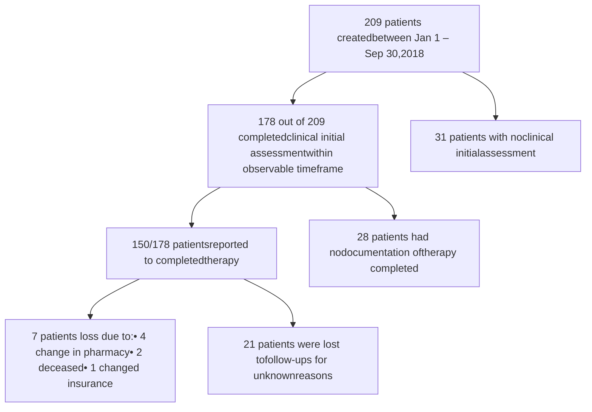

# Coupling Patient Care Management Operations with Technology and Data Platform to Optimize Hepatitis C Therapy Outcomes

Matthew Malachowski, PharmD, BCPS
Lily Duong, PharmD, RPh
Khang Tran, PharmD
Abbas Dewji, PharmD
therigy UBMEDICINE logo

## Background

* Chronic hepatitis C viral infection is estimated to affect 2.4 million people in the United States. If left untreated the infection can cause serious liver damage and is currently the leading cause of liver transplants in the US.

* HCV treatment regimens, with the introduction of direct-acting antiviral in recent years, have become simpler, safer, and more effective. Clinical trials have demonstrated sustain virologic response (SVR) rates higher than 90%. However, given the cost of treatment and the importance of adherence in order to achieve and maintain SVR, patients need to be appropriately managed.

* Specialty pharmacies are uniquely suited to optimize therapy and improve the overall journey for hepatitis C patients.

* TherigySTM is a patient-focused specialty therapy management software. The platform equips pharmacies with the tools to standardize patient management programs and to capture value-based outcomes.

## Objective

To demonstrate the cure rate measurement possible with standardized pharmacy clinical operations supported by a technology platform.

## Methods

* Establish a standard of practice for the patient-care process of hepatitis C patients

- Pharmacist to collaborate with clinic to optimize HCV treatment regimen based upon clinical guidelines and insurance coverage

- Initial assessment and patient education are documented and provided in clinic

- A monthly monitoring plan was established for each patient to cover adherence and side effect management strategies

* TherigySTM is utilized to facilitate clinical operations, ensure consistency of patient care, and capture outcome measures.

* Analyzed aggregated data of 209 hepatitis C patients managed by University of Alabama Specialty Pharmacy between 01/01/2018 – 09/30/2018 which included: treatment history, liver status, genotype, viral load, therapy completion, end-of-treatment labs, and SVR12. (Fig. 1)

## Fig. 1 Patient Selection Flow Chart in TherigySTM

## Fig. 2

### THERAPY OUTCOMES N=178

| Category                                                        | Count | Percentage |
| --------------------------------------------------------------- | ----- | ---------- |
| Lost to follow-up                                               | 28    | 16         |
| Completed therapy with NO lab collected 12 weeks post-treatment | 46    | 26         |
| Completed therapy with lab collected 12-week post-treatment     | 104   | 58         |

## Fig. 3 SVR12 Outcomes

| Outcome           | Patient Count |
| ----------------- | ------------- |
| Achieved SVR12    | 102 (98%)     |
| Treatment Relapse | 2 (2%)        |

## Fig. 4 SVR12 by Medications

| Medication                                   | Sustained Viral response | Treatment relapse |
| -------------------------------------------- | ------------------------ | ----------------- |
| EPCLUSA or sofosbuvir/velpatasvir            | 26                       | 0                 |
| HARVONI or ledipasvir/sofosbuvir             | 59                       | 2                 |
| MAVYRET (glecaprevir/pibrentasvir)           | 11                       | 0                 |
| VOSEVI (sofosbuvir/velpatasvir/voxilaprevir) | 6                        | 0                 |

## Fig. 5 SVR12 by Genotype

| Genotype | Sustained Viral response | Treatment relapse |
| -------- | ------------------------ | ----------------- |
| 1        | 1                        | 1                 |
| 2        | 11                       | 0                 |
| 3        | 9                        | 0                 |
| 4        | 2                        | 0                 |
| 1a       | 66                       | 1                 |
| 1b       | 13                       | 0                 |

## Fig. 6 HCV Challenges/Outcomes

| Category   | Item                                     | Count |
| ---------- | ---------------------------------------- | ----- |
| Challenges | Therapeutic dosage                       | 1     |
|            | Side effect management                   | 1     |
|            | Duration of therapy                      | 2     |
|            | Drug interaction                         | 8     |
|            | Dosage adjustment                        | 1     |
|            | Does not meet treatment guidelines       | 1     |
|            | Appropriate drug administration          | 2     |
| Outcomes   | Resolved side effect challenges          | 1     |
|            | Prevented therapy complications          | 3     |
|            | Prevented premature therapy...           | 2     |
|            | Potentially improved therapy adherence   | 1     |
|            | Elimination of therapy inappropriateness | 3     |
|            | Elimination of drug interaction          | 5     |

## Results

* See Figure 1-2 for a breakdown of patients included in the cohort

* In the final study cohort, 84% of patients reported therapy completion and 16% were unknown/lost to follow-up in TherigySTM. Actual therapy completion rate confirmed by dispensing data was 99%.

* SVR12 lab results were available for 69% of patients who reported completed therapy, yielding a cure rate 98%. (Fig. 3-5)

* Patient management demonstrated by interventions/outcomes (Fig. 6)

## Conclusion

In this observational study of standardized clinical pharmacy operations provided in a medical clinic supported by a pharmacy technology platform it was demonstrated that the pharmacy care process can be streamlined between the numerous steps and become a dynamic patient management operation. In addition, the study demonstrated that an intuitive and robust data platform can greatly improve longitudinal follow-up and HCV cure rate measurement.

References

\* “Hepatitis C Guidance 2018 Update: AASLD-IDSA Recommendations for Testing, Managing, and Treating Hepatitis C Virus Infection.” Clinical Infectious Diseases, vol. 67, no. 10, Dec. 2018, pp. 1477–1492., doi:10.1093/cid/ciy585.

\* NCHHSTP. “U.S. 2016 Surveillance Data for Viral Hepatitis | Statistics & Surveillance | Division of Viral Hepatitis | CDC.” Centers for Disease Control and Prevention, Centers for Disease Control and Prevention, www.cdc.gov/hepatitis/statistics/2016surveillance/index.htm.

