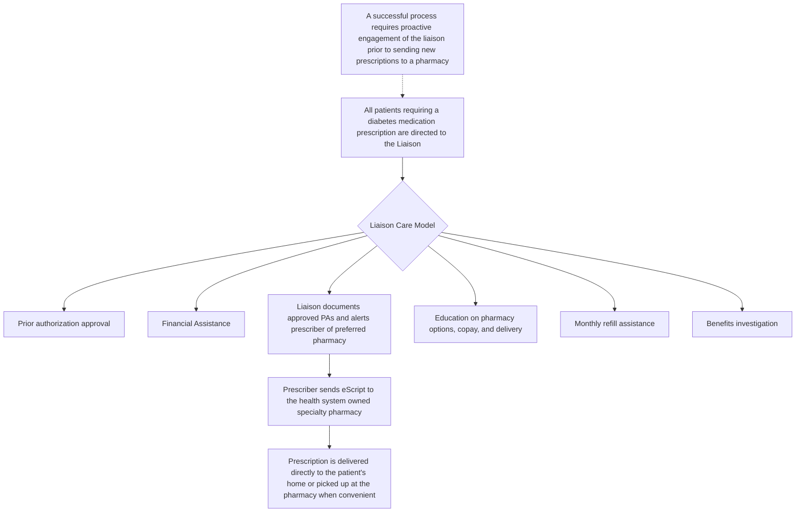

SHIELDS HEALTH SOLUTIONS logo Berkshire Health Systems logo

# Impact of Integrating a Pharmacy Liaison-Managed Care Model within a Diabetes Population

David MacHaffie, RPh1; Lillian Piz, MS2; Nicholas Bull, PharmD2; Shreevidya Periyasamy, MSHIA2, Martha Stutsky, PharmD2;

1 Berkshire Health Systems

2 Shields Health Solutions

QR code to scan

Poster Presented at NASP Annual Meeting 2023

## Background

* The impact of pharmacist-managed services on diabetes outcomes is well documented, however limited evidence supports the effect of pharmacy liaisons on the challenges faced by patients with diabetes.1

* Patients with diabetes face numerous challenges, including medication affordability issues, barriers to adherence, and the complexity of managing their disease.

* Systematic reviews show widely variable adherence rates to both insulin and oral antidiabetic drugs, ranging from 36% to 93%.2,3

* Objective: To describe an observational analysis of a pharmacy liaison-managed care model for patients with diabetes and its impact on medication access, adherence, and changes in HbA1c.

## Methods

* An integrated model for the medication management of patients with diabetes was designed and implemented within target adult endocrinology clinics starting in October 2018 at Berkshire Health Systems. This was one of the first implemented Shields diabetes program.

* A liaison-managed diabetes pharmacy care model involves:

✓ Investigation of pharmacy and medical benefits, completion of prior authorizations, and identification of financial assistance

✓ Monthly coordination of medication and durable medical equipment refills

* Observed outcomes data of the diabetes pharmacy model are from April 2022 to March 2023.

* Changes in HbA1c were measured starting up to 60 days prior to the patient’s onboarding date, through the following six months after enrollment. Data account for patients on service through March 2023.

## Results

**Figure 1.** Investigation of average HbA1c reduction for a sample of n=325 patients on service for a minimum of 6 months was evaluated, demonstrating a 0.8% average reduction. **Figure 2.** Illustration of the Liaison Care Model workflow and resulting outcomes, including total patients on specialty pharmacy service, average prior authorization turnaround time (days), average proportion of days covered (PDC), and per script copay (85th percentile).

### Figure 1
#### 0.8% Reduction in HbA1c
(for patients with recorded HbA1cs who were on service for a minimum of 6 months)

| Characteristic             | n=325     |
| -------------------------- | --------- |
| Age (years)¹               | 63        |
| Male sex (%)               | 54%       |
| Days on Service²           | 756       |
| Baseline HbA1c (%)¹        | 8.7%      |
| Presence of insulin, n (%) | 120 (37%) |
| Presence of CGM, n (%)     | 259 (80%) |

1 Mean
2 Median

### Figure 2

| Patients enrolled to-date | Average turnaround time (days) | Average PDC\* | Per script copay (85th pct) |
| ------------------------- | ------------------------------ | ------------- | --------------------------- |
| 591                       | <1                             | 92%           | $10                         |

\*Calculated only for those patients evaluated in the A1C patient cohort

## Conclusions

* Implementation of a pharmacy liaison-managed diabetes care model was associated with positive outcomes for patients as demonstrated by high PDC, HbA1c reduction, quick prior authorization turnaround time, and lower medication copays.

* The 0.8% HbA1c reduction in the study cohort has potential implications for total medical expenditures.4

* This model can be adapted to other health systems to simplify care and improve health outcomes for patients with diabetes.

## DISCLOSURES

The authors of this presentation have nothing to disclose concerning possible financial or personal relationships with commercial entities that may have a direct or indirect interest in the subject matter of this presentation.

## REFERENCES

1. Benedict AW, Spence MM, Sie JL, et al. Evaluation of a pharmacist-managed diabetes program in a primary care setting within an integrated health care system. JMCP. 2018;24:114-122.

2. Cramer JA. A systematic review of adherence with medications for diabetes. Diabetes Care 2004;27:1218–1224.

3. Krass I, Schieback P, Dhippayom T. Adherence to diabetes medication: a systematic review. Diabet Med. 2015;32(6):725-37.

4. Lage M, Boye K. The relationship between HbA1c reduction and healthcare costs among patients with type 2 diabetes: evidence from a U.S. claims database. Current Medical Research and Opinion 2020; 36(9): 1441–1447.

