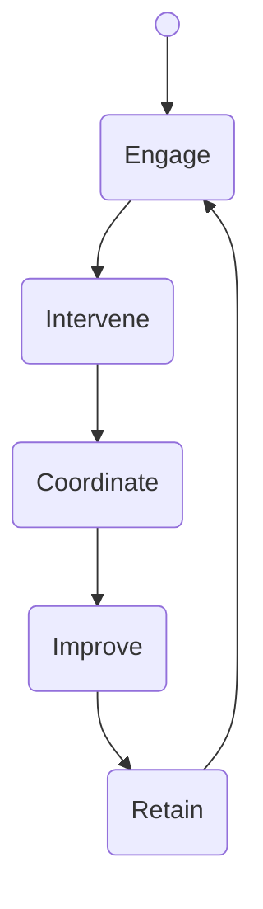

SHIELDS HEALTH SOLUTIONS logo

# Pharmacist Interventions in Specialty Pharmacy

Kristen Ditch, PharmD, BCCCP; Jennifer L. Donovan, PharmD, Kate Smullen, PharmD, CSP, MSCS; Christopher Barr

## Background

* Shields Health Solutions partners with Health-Systems to offer an integrated specialty pharmacy program. The care model includes patient risk stratification, board certified clinical pharmacists, full EMR integration, a clinical patient management platform (PMP) to standardize workflows, and clinic embedded liaisons to provide adherence management and enhanced onboarding of patients

* The integrated care model includes in-clinic and centralized clinical pharmacists to provide medication therapy management (MTM) through patient engagements and intervene with the provider to proactively mitigate drug-drug interactions, address adherence concerns, and offer side effect management while optimizing the patient care plan

* The objective is to evaluate the likely outcome of pharmacist interventions across all disease states within health system specialty pharmacies and quantify the cost avoidance associated with the intervention

## Methods

* This was a retrospective, observational study that captured pharmacist interventions for patients on specialty medications from 1/1/2020 to 12/31/2020 across 26 health system specialty pharmacies and who were enrolled into the clinical program

* The integrated specialty pharmacy model focused on a range of disease states including infectious diseases, inflammatory conditions, neurologic conditions, oncology, cardiology, bleeding disorders and others

* Standardized clinical outcomes were selected for all disease states within the PMP to document the outcome of the pharmacists’ clinical interventions

* These standardized clinical outcomes were matched to cost avoidance figures reported in the literature to calculate total cost avoidance

## Results

Standardized clinical outcomes are seen in Table 1 and were available within the PMP for the pharmacist to select when determining the likely outcome of the intervention(s). Overall intervention type and overall acceptance rate are seen in Figure 1. The top 5 therapeutic categories with the most interventions, and associated cost avoidance, are seen in Figure 2

| Table 1. Standardized Clinical Outcomes       | Table 1. Standardized Clinical Outcomes  |
| --------------------------------------------- | ---------------------------------------- |
| Elimination of duplicative therapy            | Prevented therapy complications\*        |
| Elimination of drug interaction               | Prevented ER/Hospital/Urgent care visits |
| Elimination of therapy inappropriateness\*    | Prevented an unplanned MD visit          |
| Potentially improved therapy adherence\*      | Reduction in medication dosage           |
| Prevented premature therapy discontinuation\* | Reduction in drug wastage                |
| Prevented a serious adverse drug reaction     | Resolved side effect challenges\*        |

\* Indicates one of the top 5 outcomes reported across all disease states

## Figure 1

**Intervention Types**

| Category  | Percentage |
| --------- | ---------- |
| Physician | 53.0%      |
| Patient   | 44.8%      |
| Other HCP | 2.2%       |

**Acceptance Rate: 95.2%**

| Status       | Percentage |
| ------------ | ---------- |
| Accepted     | 95.2%      |
| Not Accepted | 4.8%       |

## Figure 2: Top 5 Therapeutic Categories

| Therapeutic Category         | Number of Interventions | Cost Avoidance | Average Cost Avoidance |
| ---------------------------- | ----------------------- | -------------- | ---------------------- |
| Oncology                     | 2,819                   | $5,684,405     | $2,016                 |
| Rheumatoid Arthritis         | 743                     | $1,496,593     | $2,014                 |
| HIV                          | 529                     | $1,128,832     | $2,133                 |
| Hepatitis C                  | 484                     | $831,922       | $1,718                 |
| Rare Inflammatory Conditions | 282                     | $754,683       | $2,676                 |

## Conclusions

* Interventions were part of the clinical pharmacist standard workflow to ensure patients have the knowledge they need to handle and administer their medications safely while addressing optimal disease state management

* An integrated health system specialty pharmacy with pharmacist-led interventions is associated with favorable clinical and economic benefits that can improve patient care, mitigate total medical expenditures, and support delivery of quality care with a total cost avoidance of $15,292,883 across all disease states

## References

Jacob S, et al. Economic Outcomes Associated with Safety Interventions by a Pharmacist-Adjudicated Prior Authorization Consult Service. J Manag Care Spec Pharm. 2019;25(3):411-16

Cutler R et al. Economic impact of medication non-adherence by disease groups: a systematic review. BMJ Open 2018; 8:e016982. doi:10.1136/bmjopen-2017-016982

Poon S et al. Trends in Visits to Acute Care Venues for Treament of Low-Acuity Conditions in the United States from 2008 to 2015. JAMA Intern Med. 2018;178(10):1342-1349.

Watanabe J, et al. Cost of Prescription Drug-Related Morbidity and Mortality. Annals of Pharmacotherapy, 2018, Vol. 52(9) 829–837

Lada P, Delgado G. Documentation of pharmacists’ interventions in an emergency department and associated cost avoidance. Am J Health-Syst Pharm 2007;64:63-8.

Hammond D, et al. Scoping Review of Interventions Associated with Cost Avoidance Able to Be Performed in the Intensive Care Unit and Emergency Department. Pharmacotherapy 2019;39(3):215–231

HCUP National Inpatient Sample (NIS). Healthcare Cost and Utilization Project (HCUP). 1994-2017. Agency for Healthcare Research and Quality, Rockville, MD. www.hcup-us.ahrq.gov/nisoverview.jsp

## Disclosures

The authors of this presentation have nothing to disclose concerning possible financial or personal relationships with commercial entities that may have a direct or indirect interest in the subject matter of this presentation

QR code to scan
SHIELDS HEALTH SOLUTIONS logo

Virtual Poster at NASP 2021 Annual Meeting & Expo

