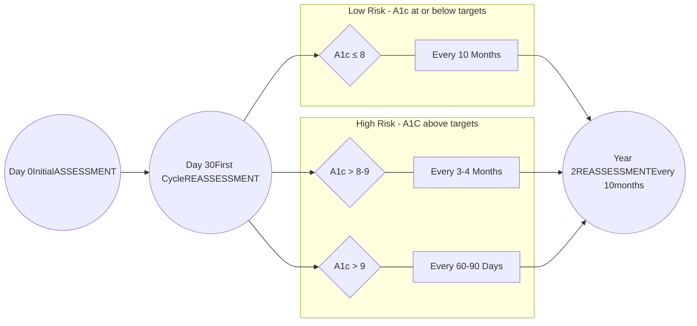

SHIELDS HEALTH SOLUTIONS logo

NYU Langone Health logo

# Implementation of ambulatory clinical pharmacist type 2 diabetes care services within an integrated health-system specialty pharmacy

Sharon Zhu, PharmD; Veronica Sozio, PharmD, BCPS; Rachel Quinn, PharmD, BCACP, AE-C; Kathleen Horan, PharmD, BCACP; Kate Smullen, PharmD, MSCS, Martha Stutsky, PharmD, BCPS; Ameet Wattamwar, PharmD; Kenny Yu, PharmD, MBA, ACE

SCAN ME QR code

Poster at NASP 2023 Annual Meeting

## BACKGROUND

* Health-system specialty pharmacy (HSSP) models have shown improved benefits in specialty medication access, medication adherence, and clinical outcomes in specialty disease states.1

* Although type 2 diabetes mellitus (T2D) is not typically considered to be a specialty pharmacy disease state, it presents challenges and barriers that have similar demands as traditional specialty pharmacy. As a result, an integrated HSSP clinical program provided Ambulatory Clinical Pharmacist (ACP) support to expand services in the T2D population.

* The purpose of this report is to describe the impact of implementation of ACP-led medication management services specializing in diabetes care within an integrated HSSP.

## METHODS

* **Inclusion Criteria**: Patients aged 18 years and older who were filling new or existing prescriptions for GLP-1RA and SGLT-2i for the treatment of T2D between August 2022 and February 2023, had at least two clinical encounters with an ACP, a baseline hemoglobin A1C (A1C) (collected no more than three months prior to enrollment), and at least one subsequent A1C collected since starting pharmacy services were included.

* **Primary outcome**: Change in A1C after clinical encounters with an ACP

* **Secondary outcomes**: Weight reduction, percentage of patients achieving target A1C < 7%, and the percentage of accepted clinical interventions

* **Analysis**: Descriptive statistics were used to report outcomes.

# RESULTS

**Figure 1.** Overview of ACP Diabetes Mellitus (DM) Clinical Services **Table 1.** Primary and secondary outcomes: Baseline A1C compared with A1C after clinical encounters with ACP and baseline weight compared with weight after clinical encounters with ACP

### Figure 1: ACP DM Clinical Services

### Table 1: Primary and Secondary Outcomes
1 Mean, 2 Range

| Primary Objectives                    | Controlled T2D(A1c < 7%) Primary Objectives | Uncontrolled T2D(A1c ≥ 7%) Primary Objectives | Total Patients Primary Objectives |
| ------------------------------------- | ----------------------------------------------- | ------------------------------------------------- | ------------------------------------- |
| Patients (n, %)                       | 40 (39.8)                                       | 63 (61.2)                                         | 103                                   |
| Age (years)¹                          | 54.45                                           | 56.11                                             | 55.47                                 |
| Baseline A1C (%)¹                     | 6.3                                             | 8.4                                               | 7.6                                   |
| Post-ACP A1C (%)¹                     | 6.2                                             | 7.5                                               | 7.0                                   |
| A1C Reduction (%)¹                    | -0.08                                           | -0.85                                             | -0.55                                 |
| % change                              | -1%                                             | -11%                                              | -8%                                   |
| Secondary Objectives                  |                                                 |                                                   |                                       |
| Baseline patients at goal A1C (n, %)  | 40 (38.8)                                       | --                                                | 40 (38.8)                             |
| Post-ACP patients at goal A1C (n, %)  | 35 (87.5)                                       | 20 (31.7)                                         | 55 (53.4)                             |
| Baseline Weight (kg)¹                 | 97.3                                            | 94.98                                             | 95.89                                 |
| Post-ACP Weight (kg)¹                 | 96.3                                            | 92.47                                             | 93.97                                 |
| Weight Variance (kg)                  | -1.0                                            | -2.5                                              | -1.9                                  |
| Length of time on service (months)1,2 | 7.27 (6)                                        | 7.25 (7)                                          | 7.26 (7)                              |

| Metric                                | Value       |
| ------------------------------------- | ----------- |
| A1C REDUCTION in high-risk patients   | 0.85%       |
| Clinical Interventions Accepted       | 97% (81/83) |
| Uncontrolled T2D at goal A1C post ACP | 32%         |

## CONCLUSIONS

* Data suggest the implementation of ACP-led medication management services specializing in diabetes care within an integrated HSSP has a positive impact improving outcomes for T2D population and its complications.

* These findings support integration of ACP has a significant role in improving the management of T2D.

REFERENCES

1. Zuckerman AD, Whelchel K, Kozlicki M, et al. Health-system specialty pharmacy role and outcomes: A review of current literature. Am J Health Syst Pharm. 2022;79(21):1906-1918. doi:10.1093/ajhp/zxac212

