# AI Chatbot Provides Efficiency and Convenience

Using technology to provide specialty pharmacy level of care to patients at retail

Author: Robin M. Coulter, PharmD, MBA, BCPS – UPMC Enterprises

## Background icon Background

UPMC Enterprises, in collaboration with UPMC Community Provider Services’ Retail Pharmacy Network, conducted a pilot program utilizing an AI-driven chatbot to provide automated follow-up clinical screenings to patients receiving certain specialty medications from TJC-accredited, health-system owned retail pharmacies. In order to meet accreditation and payer requirements, the retail pharmacies were responsible for providing regular patient outreach to patients on Hepatitis C treatment and post-transplant immunosuppressants. The follow-up assessments, prior to the pilot, were completed telephonically by pharmacy staff members. The patients receiving the qualifying medications were tracked, manually, on a spreadsheet and/or paper calendar.

## Objectives icon Objectives

The goal of the study was to show how the use of chatbot technology could offload manual phone calls from retail pharmacy staff for specialty patients.

## Methods icon Methods

By integrating with the pharmacy dispensing software, fills for a list of Hepatitis C and transplant GCNs were queried daily. Based on the sold date of the specified medications from participating pharmacies, tickets were automatically created in the Pharmacy CRM (customer relationship management) system and set to be due every 7 days after the sold date. When tickets were due, SMS messages were automatically sent to patients and prompted them to answer specific questions around side effects and medication adherence. The patient responses were logged, and based on the patient data, the tickets would behave in various ways. If the patients were experiencing side effects, the tickets would change to “Pharmacist Requested” and a manual outreach call would be prompted. If the patients were not experiencing side effects, no call was warranted. If the patients responded that their dosing regimen had changed, the tickets would change to “Pharmacist Requested” and a manual outreach call would be prompted. If the patients’ regimen had not changed, no call was warranted. The patients were also prompted to self-report the number of doses they had on hand. If a patient reported less than a 10 days’ supply, then the tickets would change to “Refill Requested” and a manual outreach call would be prompted. If the patients reported greater than 10 days’ supply, no call was warranted.

## Chatbot Dialogues icon Chatbot Dialogues and Ticket Behavior

```mermaid
graph TD
    subgraph HCV
        HCV_Q1["Q1: Are you experiencing any side effects from your specialty medication that you would like to speak to a pharmacist about (Y/N)?"]
        HCV_Q1_Y["Yes = Ticket status changes to 'Pharmacist Requested'"]
        HCV_Q1_N["No = No manual outreach prompted"]
        HCV_Q2["Q2: How many days' supply of your specialty medication do you have remaining (0-28)?"]
        HCV_Q2_10_28["10-28: No manual outreach prompted"]
        HCV_Q2_LT10["< 10: Ticket status changes to 'Refill Requested'"]

        HCV_Q1 --> HCV_Q1_Y
        HCV_Q1 --> HCV_Q1_N
        HCV_Q1_N --> HCV_Q2
        HCV_Q2 --> HCV_Q2_10_28
        HCV_Q2 --> HCV_Q2_LT10
    end

    subgraph TRANSPLANT
        TX_Q1["Q1: Are you experiencing any side effects from your specialty medication that you would like to speak to a pharmacist about (Y/N)?"]
        TX_Q1_Y["Yes = Ticket status changes to 'Pharmacist Requested'"]
        TX_Q1_N["No = No manual outreach prompted"]
        TX_Q2["Q2: Has your dosing regimen changed since your last fill (Y/N)?"]
        TX_Q2_Y["Yes = Ticket status changes to 'Pharmacist Requested'"]
        TX_Q2_N["No = No manual outreach prompted"]
        TX_Q3["Q2: How many days' supply of your specialty medication do you have remaining (0-28)?"]
        TX_Q3_10_28["10-28: No manual outreach prompted"]
        TX_Q3_LT10["< 10: Ticket status changes to 'Refill Requested'"]

        TX_Q1 --> TX_Q1_Y
        TX_Q1 --> TX_Q1_N
        TX_Q1_N --> TX_Q2
        TX_Q2 --> TX_Q2_Y
        TX_Q2 --> TX_Q2_N
        TX_Q2_N --> TX_Q3
        TX_Q3 --> TX_Q3_10_28
        TX_Q3 --> TX_Q3_LT10
    end
```

## Results icon Results

| Metric                                     | HCV | TRANSPLANT |
| ------------------------------------------ | --- | ---------- |
| Dialogues Started                          | 191 | 823        |
| Patients Responded                         | 76  | 356        |
| Dialogues Completed                        | 66  | 218        |
| # of Patients Identifying Side Effects     | 18  | 22         |
| # of Patients Experiencing No Side Effects | 58  | 333        |
| # of Patients Reporting Regimen Change     |     | 49         |
| # of Patients Reporting No Regimen Change  |     | 2,357      |
| # of Patients Self-Reported Doses on Hand  | 67  | 217        |

**Able to offload roughly 300 manual phone calls from pharmacy staff over a four-month period.**

## Conclusion icon Conclusion

By integrating with the dispensing software and deploying the AI-driven chatbot, UPMC retail pharmacies dispensing specialty medications for Hepatitis C and transplant were able to offload roughly 300 manual phone calls from pharmacy staff over a four-month period and automatically track patient reported data. Clinical efforts could be reserved for those patients who specifically identified experiencing side effects, had a regimen change, or were nearing the end of their medication supply.

