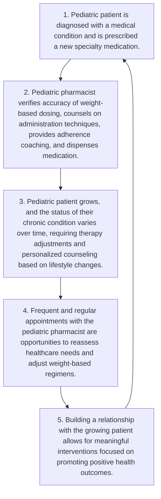

# Big Interventions for Little Patients - A Review of Pediatric Pharmacist Interventions within Health-System Specialty Pharmacy cps logo

Jonathan Weil, PharmD | Carly Giavatto, PharmD | Mindy Roselli, PharmD | Casey Fitzpatrick, PharmD, BCPS | Andrew Wash, PharmD, PhD | Ana I. Lopez-Medina, PharmD, PhD | Jessica Mourani, PharmD

## BACKGROUND

* Pediatric patients are a vulnerable population at risk for medication errors and side effects due to unique medication considerations such as weight-based dosing, frequent dose adjustments, and special administration techniques.1,2

* Pediatric pharmacists must provide critical attention to detail when reviewing medication orders and providing counseling as patient factors vary based on a patient's age and weight.3

* Pediatric pharmacists within health-system specialty pharmacies (HSSPs) offer high-touch care allowing for clinical monitoring of specialty medications for various chronic conditions throughout the patients' journey as patient-specific factors continuously change with a patient's age and weight.

* Frequent touchpoints allow HSSP pharmacists to identify and intervene on medication-related issues to proactively promote good medication practices.

## OBJECTIVES

To describe pharmacist interventions completed for pediatric patients within HSSP.

## METHODS

lightbulb icon This retrospective, multicenter, descriptive study evaluated intervention data documented from January 2019 to January 2024.

people icon Interventions made by pediatric pharmacists within 15 CPS-managed HSSPs across the US were evaluated for patients less than 18 years of age who were enrolled in HSSP services. Interventions with missing data were excluded.

calculator icon Descriptive statistics were used to analyze data. An intervention acceptance rate was calculated by dividing the number of accepted interventions by the total number of interventions.

## DATA COLLECTION AND ENDPOINTS

**Intervention:**

* Interventions were completed by HSSP pharmacists within the patient management system (PMS). Interventions were documented by type, such as: adherence, adverse drug reaction (ADR), drug information, drug utilization review (DUR), hospitalization, infection control, lab, linkage to care, product issue, referral of service, regimen, or vaccine.

**Recommendation:**

* A recommendation was often provided to the patient, their caregiver, and/or a provider. These were categorized by type, such as: change regimen, consult with healthcare team, continue to monitor, recommend lab, provide personalized adherence counseling, or provide disease/drug education.

**Response:**

* Some recommendations may have required outreach to patient, caregiver, and/or provider. Interventions requiring a response were documented in the PMS as accepted or declined.

## RESULTS

A total of 1363 interventions for 703 pediatric patients met inclusion criteria.

| INTERVENTION CHARACTERISTICS | INTERVENTION CHARACTERISTICS N=1,363 (100%) |
| ---------------------------- | ----------------------------------------------- |
| Female sex                   | 710 (52%)                                       |
| Age                          |                                                 |
| 0 – 4 years                  | 114 (8%)                                        |
| 5 – 9 years                  | 295 (22%)                                       |
| 10 – 14 years                | 485 (36%)                                       |
| 15 – 17 years                | 469 (34%)                                       |
| Stateᵃ                       |                                                 |
| Florida                      | 609 (45%)                                       |
| Oregon                       | 304 (22%)                                       |
| New York                     | 230 (17%)                                       |
| Disease statesᵃ              |                                                 |
| Neurology                    | 373 (27%)                                       |
| Autoimmune                   | 347 (25%)                                       |
| Endocrinology                | 211 (15%)                                       |

\* Other categories each ≤10% of total

### Pediatric Pharmacist Interventions

| Intervention Type   | Count |
| ------------------- | ----- |
| DUR                 | 435   |
| Regimen             | 344   |
| Adherence           | 310   |
| Drug Information    | 79    |
| ADR                 | 76    |
| Hospitalization     | 36    |
| Product Issue       | 35    |
| Lab Required        | 25    |
| Referral of Service | 10    |
| Linkage to Care     | 6     |
| Vaccine Required    | 5     |
| Infection Control   | 2     |

### Pediatric Pharmacist Recommendations

| Recommendation Type          | Count |
| ---------------------------- | ----- |
| Continue Therapy             | 505   |
| Adherence Counseling         | 236   |
| Change Regimen               | 233   |
| Consult with Healthcare Team | 196   |
| Disease/Drug Education       | 177   |
| Recommend Lab                | 16    |

### Response Rate

| Response | Percentage |
| -------- | ---------- |
| Accepted | 98         |
| Declined | 2          |

460 interventions resulted in recommendations requiring a response. 98% were accepted by the patient, caregiver, and/or provider.

## DISCUSSION AND CONCLUSION

* The high-touch HSSP model led to many meaningful interventions prompting therapy adjustments, drug information consultations, and personalized counseling.

* Interventions were aimed to improve the patient journey, particularly in a delicate population.

* Pediatric pharmacists embedded within care clinics streamlined provider-pharmacist communication and facilitated collaboration within the interdisciplinary team, which is evident by a high intervention acceptance rate.

### Meaningful Interventions

icon

## FUTURE DIRECTIONS

There is an opportunity to further evaluate the impact that pediatric HSSP pharmacists have on adherence, persistence, and long-term health outcomes.

## REFERENCES

1. Pediatric Weight is Crucial to Perfecting the Dose. Pharmacy Times. 2024. https://www.pharmacytimes.com/view/pediatric-weight-is-crucial-to-perfecting-the-dose

2. Lubsch L, Kimler K, Passerrello N, Parman M, Dunn A, Meyers R. Patient Weight Should Be Included on All Medication Prescriptions. J Pediatr Pharmacol Ther. 2023;28(4):380-381. doi: 10.5863/1551-6776-28.4.380

3. What every pharmacist should know about pediatric pharmacy. Pharmacy Times. 2017. https://www.pharmacytimes.com/view/what-every-pharmacist-should-know-about-pediatric-pharmacy

