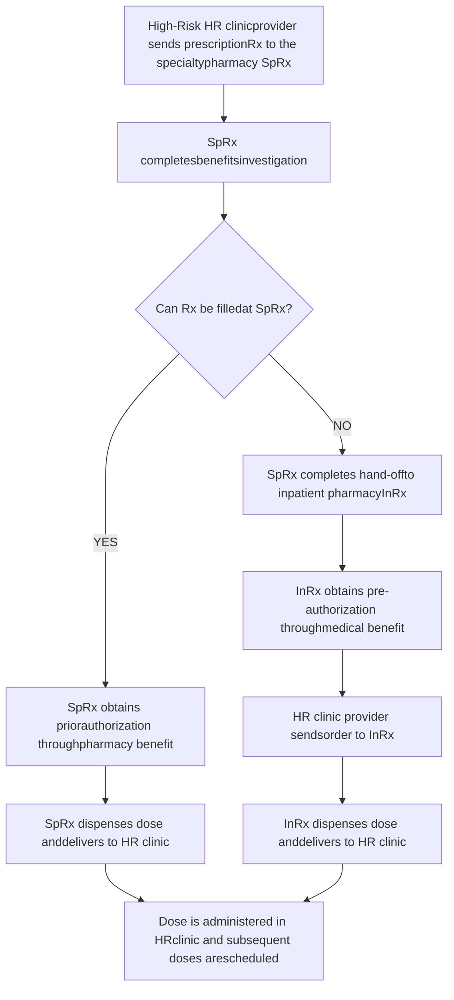

Driscoll Children's Hospital logo
# Respiratory Syncytial Virus (RSV) Protection: A Pan-Pharmacy Approach

Authors: Carrie Gatzke, PharmD, CSP; Jenny Carr, APRN, NNP-BC; Jessy Thomas, PharmD, MBA; and Morgan Osborn, PharmD

## BACKGROUND

RSV is a potentially serious respiratory illness in high-risk pediatric patients, such as premature infants and those with severe lung disease, congenital heart disease, or compromised immune systems. Palivizumab is a monthly injection indicated for RSV prophylaxis in high-risk patients. Eligible patients can receive up to five doses of palivizumab during the RSV season.

Driscoll Children’s Hospital (DCH) is the only free-standing children’s hospital in South Texas, providing care across 31 counties and 33,000 square miles. Prior to the 2022-23 winter RSV season, pediatricians throughout this region were tasked with obtaining and administering palivizumab. However, many high-risk patients did not receive prophylactic therapy as indicated. The DCH pharmacy department, consisting of an inpatient pharmacy and a recently opened specialty pharmacy, worked with the hospital’s High-Risk clinic to address this unmet need.

## OBJECTIVE

To provide RSV prophylaxis to eligible high-risk patients by developing a dual-pharmacy dispensing process.

## METHODOLOGY

Figure 1: Palivizumab Dispensing Workflow

## RESULTS

Table 1: Patient Demographics

| Baseline Characteristics (n = 132) | Baseline Characteristics (n = 132) % (n) |
| ---------------------------------- | -------------------------------------------- |
| Gender                             |                                              |
| Male                               | 55 (73)                                      |
| Female                             | 45 (59)                                      |
| Ethnicity                          |                                              |
| Hispanic                           | 84 (111)                                     |
| Non-Hispanic, White                | 12 (16)                                      |
| Non-Hispanic, Black                | 3 (4)                                        |
| Other                              | 1 (1)                                        |
| Diagnosis                          |                                              |
| Prematurity (Pre)                  | 20 (26)                                      |
| Chronic Lung Disease (CLD)         | 12 (16)                                      |
| Congenital Heart Disease (CHD)     | 38 (50)                                      |
| Pre/CLD                            | 26 (35)                                      |
| CLD/CHD                            | 1 (1)                                        |
| Neuromuscular Disease              | 3 (4)                                        |
| Insurance Type                     |                                              |
| Medicaid                           | 92 (121)                                     |
| Commercial                         | 8 (11)                                       |

Figure 3: Palivizumab Doses Received

| # of Doses | # of Patients |
| ---------- | ------------- |
| One        | 26            |
| Two        | 13            |
| Three      | 20            |
| Four       | 37            |
| Five       | 20            |

During the winter RSV season (October 17, 2022 through March 1, 2023), High-Risk clinic providers sent 378 palivizumab prescriptions to the specialty pharmacy.

A total of 362 (96%) palivizumab doses were dispensed by the combined pharmacy department. The specialty and inpatient pharmacies filled 326 (90%) and 36 (10%) doses, respectively. Sixteen palivizumab doses were not administered due to insurance denial or parent choice.

Figure 2: Palivizumab Doses Dispensed

| Dispensing Pharmacy                             | Percentage |
| ----------------------------------------------- | ---------- |
| Specialty Pharmacy Dispensed (Pharmacy Benefit) | 90         |
| Inpatient Pharmacy Dispensed (Medical Benefit)  | 10         |

Figure 4: Palivizumab Revenue

| Revenue Source                                | Percentage |
| --------------------------------------------- | ---------- |
| Specialty Pharmacy Revenue (Pharmacy Benefit) | 36         |
| Inpatient Pharmacy Revenue (Medical Benefit)  | 64         |

High-Risk clinic providers identified 132 potential palivizumab patients, and 116 eligible patients received at least one dose of palivizumab during their clinic visits. Ninety-one (78%) patients received their maximum-allowable number of doses during the winter RSV season, and 20 (17%) patients received a full 5-dose course of palivizumab.

## DISCUSSION

Palivizumab is a medication that can be covered as a pharmacy benefit or medical benefit. While palivizumab is covered under the pharmacy benefit for our state Medicaid plans, commercial plans vary in their benefit coverage decisions.

Specialty pharmacies and inpatient pharmacies utilize two different payer models. Because of this, we were able to establish a new RSV prophylaxis service line that addressed the needs of our high-risk patient population. In the future, this dual-pharmacy process could be used to dispense other dual-benefit medications.

## CONCLUSION

Developing a process which leverages both specialty and inpatient pharmacies enables more high-risk patients to receive beneficial RSV prophylaxis.

Driscoll Specialty Pharmacy logo

Disclosures: The authors have no financial relationships to disclose.

