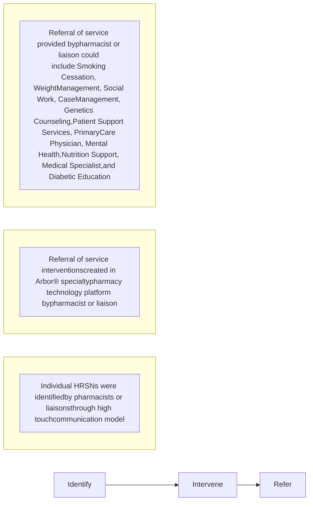

# Addressing Social Determinants of Health: A Health System Specialty Pharmacy Initiative cps logo

Carly Giavatto, PharmD; Jacob Deisenroth BS, CPhT; Casey Fitzpatrick, PharmD, BCPS; Jessica Mourani, PharmD; Ana Lopez Medina, PharmD

## BACKGROUND

* The World Health Organization defines social determinants of health (SDoH) as the conditions in which people are born, live, learn, play, worship, and age that affect health and quality of life outcomes 1

* SDoH factors have been reported to impact health outcomes by 47%, whereas clinical care has been estimated to impact health outcomes by 16% 2

* Health system specialty pharmacy (HSSP) teams play an important role in identifying barriers that patients face, including addressing SDoH by identifying individual health-related social needs (HRSNs) to improve therapy success

* Integration of HSSP pharmacists and liaisons within outpatient clinics allows the pharmacy team to address burdens that patients face, ultimately working toward improving the healthcare access and quality domain of SDoH

## OBJECTIVES

To describe the impact HSSP pharmacists and liaisons play in improving the healthcare access and quality domain of SDoH by evaluating referral of service interventions, medication access, and medication adherence

## METHODS

### Study Design  Subjects

A retrospective, multi-centered, descriptive study from June 2019 to March 2023 was conducted to evaluate the role of HSSP pharmacists and liaisons in increasing patient access to healthcare by connecting patients to medical, financial, and social services  During the study period, patients were referred by their providers and opted into clinical or dispensing pharmacy services. Patients were included in the study if they were enrolled in either of these services

## DATA COLLECTION AND ENDPOINTS

### Data Collection and Analysis

* Data was collected from Arbor specialty pharmacy technology platform

* Results were analyzed using count (N) and percentage (%)

### Endpoints

| Primary Endpoint                         | Secondary Endpoint                                          |
| ---------------------------------------- | ----------------------------------------------------------- |
| \* Referral of service intervention type | \* Financial assistance secured                             |
|                                          | \* Prior authorization turnaround time                      |
|                                          | \* Medication adherence by proportion of days covered (PDC) |

## RESULTS

Table 1: Baseline Characteristics  FIGURE 1: Referral of Service by Role

| BASELINE CHARACTERISTICS, N (%) | N=574       |
| ------------------------------- | ----------- |
| **Gender:**                     |             |
| Male                            | 314 (55%)   |
| Female                          | 259 (45%)   |
| Female assigned at birth        | 1 (0.2%)    |
| **Age (years):** Mean (SD)      | 49 (16.6)   |
| **Race and Ethnicity:**         |             |
| Not specified                   | 299 (52.1%) |
| White, Non-Hispanic             | 147 (25.6%) |
| Black, Non-Hispanic             | 109 (19%)   |
| Hispanic                        | 11 (2%)     |
| Asian/Pacific Islander          | 2 (0.4%)    |
| American Indian/Alaskan Native  | 1 (0.2%)    |
| Other                           | 5 (0.9%)    |
| **Medical Insurance:**          |             |
| Medicaid                        | 236 (41.1%) |
| Medicare                        | 129 (22.5%) |
| Commercial                      | 81 (14.1%)  |
| Other                           | 5 (0.9%)    |
| Unknown                         | 123 (21.4%) |

| Role       | Percentage |
| ---------- | ---------- |
| Liaison    | 7%         |
| Pharmacist | 93%        |

| Service Type             | Count |
| ------------------------ | ----- |
| Case Management          | 110   |
| Medical Specialist       | 108   |
| Primary Care Physician   | 102   |
| Mental Health            | 61    |
| Patient Support Services | 55    |
| Social Work              | 47    |
| Diabetic Education       | 40    |
| Smoking Cessation        | 17    |
| Undescribed              | 15    |
| Nutrition Support        | 9     |
| Weight Management        | 5     |
| Access Difficulties      | 4     |
| Genetics Counseling      | 1     |

Table 2: HSSP in Increasing Medication Access and Adherence

| Prior Authorization (PA) PA icon | From April 2022 to March 2023, PA Turnaround Time                                                                                |
| -------------------------------- | -------------------------------------------------------------------------------------------------------------------------------- |
|                                  | \* Referral Date to PA Submission: 97% in < 1 business day \* Referral Date to Approval: 2.5 days                            |
| Financial Assistance (FA)        | From June 2019 to March 2023, US Dollars Secured                                                                                 |
|                                  | \* > $500 million                                                                                                                |
| Medication Adherence             | PDC from September 2022 to March 2023, all patients who are enrolled in dispensing services, across all therapeutic drug classes |
|                                  | \* 91%                                                                                                                           |

## DISCUSSION AND CONCLUSION

Due to the high-touch, embedded model, HSSP pharmacists and liaisons are ideally positioned to identify and address SDoH-related factors and individual HRSNs to increase access to high quality health care

### Referral of Service

Referral icon
* Referral of service interventions made by HSSP pharmacists and liaisons provide patients access to an array of services and programs that address many underlying, individual HRSNs which may otherwise go unresolved
* Pharmacy liaisons are highly trained and credential team members who have demonstrated a role in increasing patient access to health care services through referral of services
* In our study, pharmacy liaisons most frequently provided referrals for patient support services which included ride service coordination to appointments while pharmacists most often referred patients to case management

### Medication Access

Medication Access icon
* The embedded HSSP model empowers pharmacy professionals to guide patients in need through complex challenges on the path to starting a specialty therapy
* As identified in this study, an HSSP team well versed in the challenges that typically extend the period between a medication being prescribed and therapy being started significantly reduces prior authorization turnaround time

### Medication Adherence

Medication Adherence icon
* The maintenance of uninterrupted therapy is an equally vital service provided through the tracking and anticipating of insurance hurdles that would otherwise cause gaps or delays for patients who have begun therapy
* SDoH and individual HRSNs can be a limiting factor for medication adherence. HSSP teams provide frequent touch points to identify these factors and link with supportive services, which helps ensure patients who gain access to therapy to stay on therapy without interruption

## FUTURE DIRECTIONS

1. HSSP pharmacists can have a more standardized role in addressing SDoH by implementing screening tools and disease state-specific standardized questionnaires to assess individual HRSNs upon therapy initiations and throughout treatment duration

2. HSSP pharmacy liaisons can provide questionnaires to identify individual HRSNs and have an increased role in making referrals

## REFERENCES

1. Social Detriments of Health. Office of Disease Prevention and Health Promotion, U.S. Department of Health and Human Services. https://health.gov/healthypeople/priority-areas/social-determinants-health.

2. Hood CM, Gennuso KP, Swain GR, Catlin BB. County Health Rankings: Relationships Between Determinant Factors and Health Outcomes. Am J Prev Med. 2016;50(2):129-35. doi: 10.1016/j.amepre.2015.08.024. Reference icon

# Addressing Social Determinants of Health: A Health System Specialty Pharmacy Initiative cps logo

Carly Giavatto, PharmD; Jacob Deisenroth BS, CPhT; Casey Fitzpatrick, PharmD, BCPS; Jessica Mourani, PharmD; Ana Lopez Medina, PharmD

## BACKGROUND

* The World Health Organization defines social determinants of health (SDoH) as the conditions in which people are born, live, learn, play, worship, and age that affect health and quality of life outcomes 1

* SDoH factors have been reported to impact health outcomes by 47%, whereas clinical care has been estimated to impact health outcomes by 16% 2

* Health system specialty pharmacy (HSSP) teams play an important role in identifying barriers that patients face, including addressing SDoH by identifying individual health-related social needs (HRSNs) to improve therapy success

* Integration of HSSP pharmacists and liaisons within outpatient clinics allows the pharmacy team to address burdens that patients face, ultimately working toward improving the healthcare access and quality domain of SDoH

## OBJECTIVES

To describe the impact HSSP pharmacists and liaisons play in improving the healthcare access and quality domain of SDoH by evaluating referral of service interventions, medication access, and medication adherence

## METHODS

### Study Design | Subjects

A retrospective, multi-centered, descriptive study from June 2019 to March 2023 was conducted to evaluate the role of HSSP pharmacists and liaisons in increasing patient access to healthcare by connecting patients to medical, financial, and social services. During the study period, patients were referred by their providers and opted into clinical or dispensing pharmacy services. Patients were included in the study if they were enrolled in either of these services.

## DATA COLLECTION AND ENDPOINTS

### Data Collection and Analysis

* Data was collected from Arbor specialty pharmacy technology platform

* Results were analyzed using count (N) and percentage (%)

### Endpoints

| Primary Endpoint                        | Secondary Endpoint                                         |
| --------------------------------------- | ---------------------------------------------------------- |
| • Referral of service intervention type | • Financial assistance secured                             |
|                                         | • Prior authorization turnaround time                      |
|                                         | • Medication adherence by proportion of days covered (PDC) |

## RESULTS

Table 1: Baseline Characteristics

| BASELINE CHARACTERISTICS, N (%) | N=574       |
| ------------------------------- | ----------- |
| **Gender:**                     |             |
| Male                            | 314 (55%)   |
| Female                          | 259 (45%)   |
| Female assigned at birth        | 1 (0.2%)    |
| **Age (years):** Mean (SD)      | 49 (16.6)   |
| **Race and Ethnicity:**         |             |
| Not specified                   | 299 (52.1%) |
| White, Non-Hispanic             | 147 (25.6%) |
| Black, Non-Hispanic             | 109 (19%)   |
| Hispanic                        | 11 (2%)     |
| Asian/Pacific Islander          | 2 (0.4%)    |
| American Indian/Alaskan Native  | 1 (0.2%)    |
| Other                           | 5 (0.9%)    |
| **Medical Insurance:**          |             |
| Medicaid                        | 236 (41.1%) |
| Medicare                        | 129 (22.5%) |
| Commercial                      | 81 (14.1%)  |
| Other                           | 5 (0.9%)    |
| Unknown                         | 123 (21.4%) |

FIGURE 1: Referral of Service by Role

| Role       | Percentage (%) |
| ---------- | -------------- |
| Pharmacist | 93%            |
| Liaison    | 7%             |

FIGURE 2: Referral of Services

| Service Type             | Count |
| ------------------------ | ----- |
| Case Management          | 110   |
| Medical Specialist       | 108   |
| Primary Care Physician   | 102   |
| Mental Health            | 61    |
| Patient Support Services | 55    |
| Social Work              | 47    |
| Diabetic Education       | 40    |
| Smoking Cessation        | 17    |
| Undescribed              | 15    |
| Nutrition Support        | 9     |
| Weight Management        | 5     |
| Access Difficulties      | 4     |
| Genetics Counseling      | 1     |

Table 2: HSSP in Increasing Medication Access and Adherence

| Prior Authorization (PA)  | From April 2022 to March 2023, PA Turnaround Time • Referral Date to PA Submission: 97% in < 1 business day • Referral Date to Approval: 2.5 days |
| ------------------------- | --------------------------------------------------------------------------------------------------------------------------------------------------------- |
| Financial Assistance (FA) | From June 2019 to March 2023, US Dollars Secured                                                                                                          |
|                           | • > $500 million                                                                                                                                          |
| Medication Adherence      | PDC from September 2022 to March 2023, all patients who are enrolled in dispensing services, across all therapeutic drug classes                          |
|                           | • 91%                                                                                                                                                     |

## DISCUSSION AND CONCLUSION

Due to the high-touch, embedded model, HSSP pharmacists and liaisons are ideally positioned to identify and address SDoH-related factors and individual HRSNs to increase access to high quality health care

### Referral of Service
Referral of Service icon
* Referral of service interventions made by HSSP pharmacists and liaisons provide patients access to an array of services and programs that address many underlying, individual HRSNs which may otherwise go unresolved
* Pharmacy liaisons are highly trained and credential team members who have demonstrated a role in increasing patient access to health care services through referral of services
* In our study, pharmacy liaisons most frequently provided referrals for patient support services which included ride service coordination to appointments while pharmacists most often referred patients to case management

### Medication Access
Medication Access icon
* The embedded HSSP model empowers pharmacy professionals to guide patients in need through complex challenges on the path to starting a specialty therapy
* As identified in this study, an HSSP team well versed in the challenges that typically extend the period between a medication being prescribed and therapy being started significantly reduces prior authorization turnaround time

### Medication Adherence
Medication Adherence icon
* The maintenance of uninterrupted therapy is an equally vital service provided through the tracking and anticipating of insurance hurdles that would otherwise cause gaps or delays for patients who have begun therapy
* SDoH and individual HRSNs can be a limiting factor for medication adherence. HSSP teams provide frequent touch points to identify these factors and link with supportive services, which helps ensure patients who gain access to therapy to stay on therapy without interruption

## FUTURE DIRECTIONS

1. HSSP pharmacists can have a more standardized role in addressing SDoH by implementing screening tools and disease state-specific standardized questionnaires to assess individual HRSNs upon therapy initiations and throughout treatment duration

2. HSSP pharmacy liaisons can provide questionnaires to identify individual HRSNs and have an increased role in making referrals

## REFERENCES

1. Social Detriments of Health. Office of Disease Prevention and Health Promotion, U.S. Department of Health and Human Services. https://health.gov/healthypeople/priority-areas/social-determinants-health.

2. Hood CM, Gennuso KP, Swain GR, Catlin BB. County Health Rankings: Relationships Between Determinant Factors and Health Outcomes. Am J Prev Med. 2016;50(2):129-35. doi: 10.1016/j.amepre.2015.08.024.

